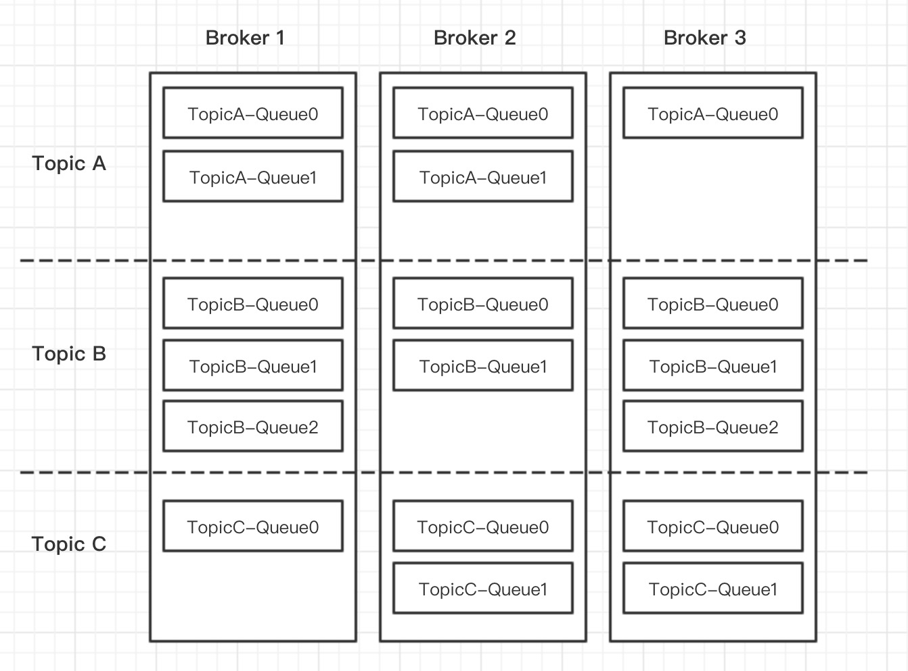
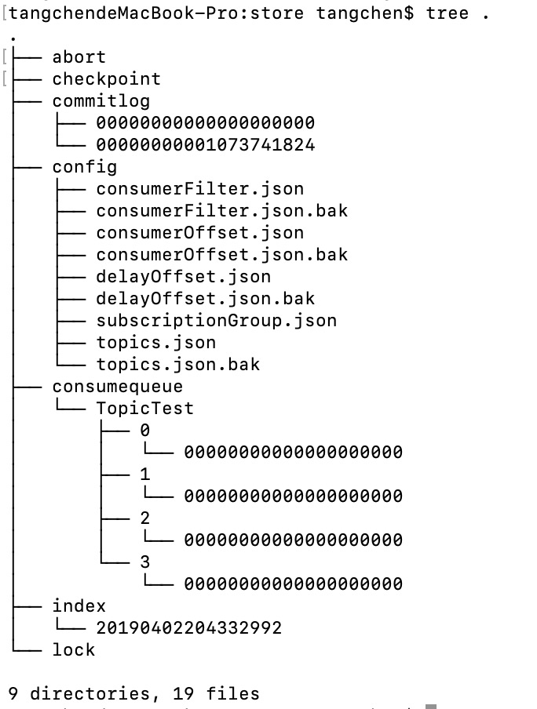
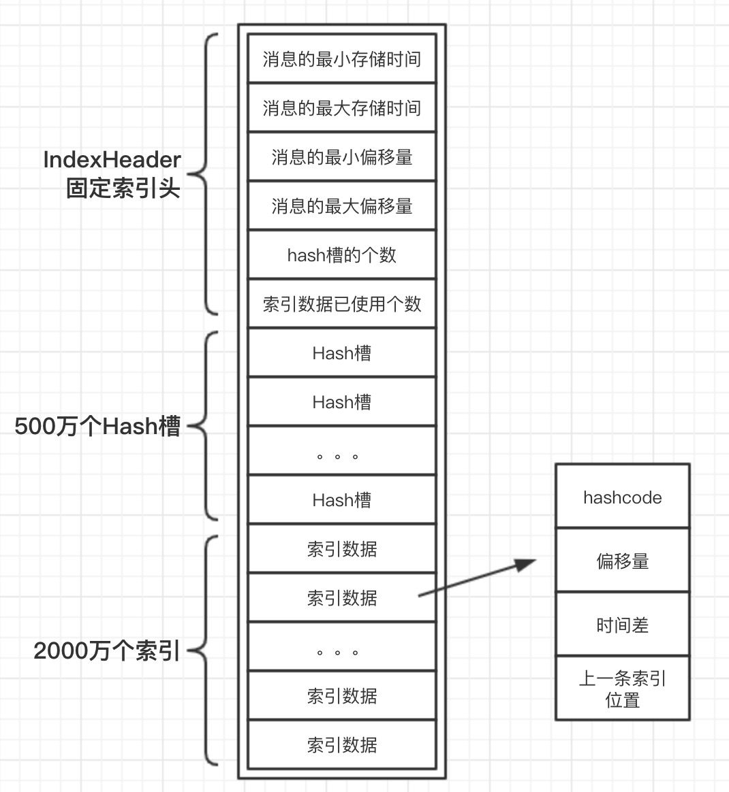

# 消息中间件——RocketMQ

## 1. 整体介绍

RocketMQ是一个低延迟、高可靠、可伸缩、易于使用的分布式消息中间件，经过阿里巴巴多年双11验证，由阿里巴巴开源捐献给Apache的顶级项目。

### 应用场景

- 削峰填谷

  诸如秒杀、抢红包、企业开门红等大型活动时皆会带来较高的流量脉冲，或因没做相应的保护而导致系统超负荷甚至崩溃，或因限制太过导致请求大量失败而影响用户体验，消息队列 RocketMQ 版可提供削峰填谷的服务来解决该问题。

- 异步解耦

  交易系统作为淘宝/天猫主站最核心的系统，每笔交易订单数据的产生会引起几百个下游业务系统的关注，包括物流、购物车、积分、流计算分析等等，整体业务系统庞大而且复杂，消息队列 RocketMQ 版可实现异步通信和应用解耦，确保主站业务的连续性。

- 顺序收发

  细数日常中需要保证顺序的应用场景非常多，例如证券交易过程时间优先原则，交易系统中的订单创建、支付、退款等流程，航班中的旅客登机消息处理等等。与先进先出（First In First Out，缩写 FIFO）原理类似，消息队列 RocketMQ 版提供的顺序消息即保证消息 FIFO。

- 分布式事务一致性

  交易系统、支付红包等场景需要确保数据的最终一致性，大量引入消息队列 RocketMQ 版的分布式事务，既可以实现系统之间的解耦，又可以保证最终的数据一致性。

- 大数据分析

  数据在“流动”中产生价值，传统数据分析大多是基于批量计算模型，而无法做到实时的数据分析，利用阿里云消息队列 RocketMQ 版与流式计算引擎相结合，可以很方便的实现将业务数据进行实时分析。

- 分布式缓存同步

  天猫双 11 大促，各个分会场琳琅满目的商品需要实时感知价格变化，大量并发访问数据库导致会场页面响应时间长，集中式缓存因为带宽瓶颈限制商品变更的访问流量，通过消息队列 RocketMQ 版构建分布式缓存，实时通知商品数据的变化。


### 如何使用

#### 集成在Spring Cloud Alibaba 中使用

- 使用`rocketMQTemplate`发送消息

Step1 pom.xml中引入jar包

```xml
<dependency>
    <groupId>org.springframework.boot</groupId>
    <artifactId>spring-boot-starter</artifactId>
</dependency>
<dependency>
    <groupId>org.springframework.boot</groupId>
    <artifactId>spring-boot-starter-web</artifactId>
</dependency>

<dependency>
    <groupId>com.alibaba.cloud</groupId>
    <artifactId>spring-cloud-starter-stream-rocketmq</artifactId>
</dependency>
```

Step2 配置application.yml

```yml
spring:
  cloud:
    stream:
      rocketmq:
        binder:
          name-server: 127.0.0.1:9876
server:
  port: 8081
```

Step3 使用模板发送消息

```java
@Autowired
private RocketMQTemplate rocketMQTemplate;

@GetMapping(value = "/hello")
public String hello(String msg) {
    MessageBuilder builder = MessageBuilder.withPayload(msg);
    Message message = builder.build();
    rocketMQTemplate.send("TopicTest", message);
    return "Hello RocketMQ，send " + msg;
}
```

`msg`是消息内容，访问`/hello`接口时会使用`RocketMQTemplate`发送到`TopicTest`这个`Topic`中。

`RocketMQTemplate`是在springboot中就支持的方式，当然，除了使用`RocketMQTemplate`，也支持使用`SpringCloudStream`的方式来发消息。


- 使用`SpringCloudStream`发送消息

Step1 pom.xml中引入jar包

```xml
<dependency>
    <groupId>org.springframework.boot</groupId>
    <artifactId>spring-boot-starter</artifactId>
</dependency>
<dependency>
    <groupId>org.springframework.boot</groupId>
    <artifactId>spring-boot-starter-web</artifactId>
</dependency>

<dependency>
    <groupId>com.alibaba.cloud</groupId>
    <artifactId>spring-cloud-starter-stream-rocketmq</artifactId>
</dependency>
```

Step2 配置application.yml

```yml
spring:
  cloud:
    stream:
      rocketmq:
        binder:
          name-server: 127.0.0.1:9876
      bindings:
        output:
          destination: TopicTest
          group: PRODUCER_GROUP_TOPIC_TEST
server:
  port: 8081
```

Step3 使用binder发送消息

```java
@EnableBinding(value = {Source.class})
@SpringBootApplication
public class ProducerApplication {

    public static void main(String[] args) {
        SpringApplication.run(ProducerApplication.class, args);
    }
}

@RestController
public class TestController {
  
    private Source source;

    @Autowired
    public TestController(Source source) {
        this.source = source;
    }

    @GetMapping(value = "/hello")
    public String test(String msg) {
        MessageBuilder builder = MessageBuilder.withPayload(msg);
        Message message = builder.build();
        source.output().send(message);
        return "Hello RocketMQ，Binder send " + msg;
    }
}
```

Step2 配置application.yml

```yml
server:
  port: 8082
  
rocketmq:
  name-server: 127.0.0.1:9876
```


- 使用`@RocketMQMessageListener`消费消息

Step1 pom.xml中引入jar包

```xml
<dependency>
    <groupId>org.springframework.boot</groupId>
    <artifactId>spring-boot-starter</artifactId>
</dependency>
<dependency>
    <groupId>org.springframework.boot</groupId>
    <artifactId>spring-boot-starter-web</artifactId>
</dependency>

<dependency>
    <groupId>com.alibaba.cloud</groupId>
    <artifactId>spring-cloud-starter-stream-rocketmq</artifactId>
</dependency>
```

Step3 定义消息监听

```java
@Component
@RocketMQMessageListener(topic = "TopicTest", consumerGroup = "CONSUMER_GROUP_TOPIC_TEST")
public class MessageListener implements RocketMQListener<String> {
    @Override
    public void onMessage(String s) {
        System.out.println("TopicTest receive: " + s + ", receiveTime = " + System.currentTimeMillis());
    }
}
```

`@RocketMQMessageListener`是在springboot中就支持的方式，当然，除了使用`@RocketMQMessageListener`，也支持使用`SpringCloudStream`的方式来发消息。


- 使用`SpringCloudStream`消费消息

Step1 pom.xml中引入jar包

```xml
<dependency>
    <groupId>org.springframework.boot</groupId>
    <artifactId>spring-boot-starter</artifactId>
</dependency>
<dependency>
    <groupId>org.springframework.boot</groupId>
    <artifactId>spring-boot-starter-web</artifactId>
</dependency>

<dependency>
    <groupId>com.alibaba.cloud</groupId>
    <artifactId>spring-cloud-starter-stream-rocketmq</artifactId>
</dependency>
```

Step2 配置application.yml

```yml
spring:
  cloud:
    stream:
      rocketmq:
        binder:
          name-server: 127.0.0.1:9876
      bindings:
        input:
          destination: TopicTest
          group: CONSUMER_GROUP_TOPIC_TEST

server:
  port: 8082
```

Step3 定义消息监听

```java
@EnableBinding({ Sink.class})
@SpringBootApplication
public class Application {

    @StreamListener(value = Sink.INPUT)
    public void receive(String receiveMsg) {
        System.out.println("TopicTest receive: " + receiveMsg);
    }

    public static void main(String[] args) {
        SpringApplication.run(Application.class, args);
    }
}
```

`SpringCloudStream`方式消费消息需要使用`@StreamListener`注解


前面分别简单介绍了Springboot中和SpringCloudStream中如何发送和消息消息，笔者个人偏好喜欢使用Springboot集成的RocketMQ注解，开发更便捷。SpringCloudStream统一消息模型在编程模型上是一种好的设计，但笔者认为在实际开发过程中并不实用。主要原因是消息中间件通常不会轻易变更，也很少会在一个应用中使用多个消息中间件。


### 总体设计


RocketMQ架构上主要分为四部分，如上图所示:

- Producer：消息发布的角色，支持分布式集群方式部署。producer通过MQ的负载均衡模块选择相应的Broker集群队列进行消息投递，投递的过程支持快速失败并且低延迟。

- Consumer：消息消费者的角色，支持分布式集群方式部署。支持以push推、pull拉两种模式对消息进行消费。同时也支持集群方式和广播形式的消费，它提供实时消息订阅机制，可以满足大多数用户的需求。

- Broker：Broker主要负责消息的存储、投递和查询以及服务高可用保证。
- NameServer：NameServer是一个非常简单的Topic路由注册中心，其角色类似dubbo中的zookeeper，支持Broker的动态注册与发现。主要包括两个功能：Broker管理，NameServer接受Broker集群的注册信息并且保存下来作为路由信息的基本数据。然后提供心跳检测机制，检查Broker是否还存活。路由信息管理。每个NameServer将保存关于Broker集群的整个路由信息和用于客户端查询的队列信息。然后Producer和Conumser通过NameServer就可以知道整个Broker集群的路由信息，从而进行消息的投递和消费。NameServer通常也是集群的方式部署，各实例间相互不进行信息通讯。Broker是向每一台NameServer注册自己的路由信息，所以每一个NameServer实例上面都保存一份完整的路由信息。当某个NameServer因某种原因下线了，Broker仍然可以向其它NameServer同步其路由信息，Produce和Consumer仍然可以动态感知Broker的路由的信息。


### 基本概念

- Message：消息，系统所传输信息的物理载体，生产和消费数据的最小单位。每条消息必须属于一个Topic，RocketMQ中每个消息拥有唯一的MessageID，且可以携带具有业务标识的Key。
- Topic：主题，表示一类消息的集合，每个主题包含若干条消息，每条消息只能属于一个主题，是RocketMQ进行消息订阅的基本单位。
- Queue：消息队列，组成Topic的最小单元。默认情况下一个Topic会对应多个Queue，Topic是逻辑概念，Queue是物理存储，在Consumer消费Topic消息时底层实际则是拉取Queue的消息。
- Tag：为消息设置的标志，用于同一主题下区分不同类型的消息。来自同一业务单元的消息，可以根据不同业务目的在同一主题下设置不同标签。标签能够有效地保持代码的清晰度和连贯性，并优化RocketMQ提供的查询系统。消费者可以根据Tag实现对不同子主题的不同消费逻辑，实现更好的扩展性。
- UserProperties：用户自定义的属性集合，属于Message的一部分。
- ProducerGroup：同一类Producer的集合，这类Producer发送同一类消息且发送逻辑一致。如果发送的是事物消息且原始生产者在发送之后崩溃，则Broker服务器会联系同一生产者组的其他生产者实例以提交或回溯消费。
- ConsumerGroup：同一类Consumer的集合，这类Consumer通常消费同一类消息且消费逻辑一致。消费者组使得在消息消费方面，实现负载均衡和容错的目标变得非常容易。要注意的是，消费者组的消费者实例必须订阅完全相同的Topic。





本章后续章节笔者将为大家介绍消息发送、消息存储、消息消费的重要内容，本章节篇幅有限，只讲解高可用设计部分的源码，源码取自release-4.4.0版本。


## 2. 消息发送

### 消息类型

#### 普通消息

支持每次只发送一条消息，也支持发送批量消息，对同一个topic的多条消息打包在一起发送到broke服务器，从而减少网络调用次数，可以提高网络传输效率和性能。但一批消息的数量也不是越多越好，默认消息总大小不能超过4M，建议消息大小在1k以内。

普通消息在前面Demo中已经演示过了，不过`RocketMQTemplate`并没有提供批量消息接口，可以使用RocketMQ客户端中的`DefaultMQProducer`发送，`RocketMQTemplate`也是对其接口进行包装。

```java
@GetMapping(value = "/batch")
public String batch() throws InterruptedException, RemotingException, MQClientException, MQBrokerException {
    org.apache.rocketmq.common.message.Message msg1 = new org.apache.rocketmq.common.message.Message("TopicTest", "msg1".getBytes());
    org.apache.rocketmq.common.message.Message msg2 = new org.apache.rocketmq.common.message.Message("TopicTest", "msg2".getBytes());
    org.apache.rocketmq.common.message.Message msg3 = new org.apache.rocketmq.common.message.Message("TopicTest", "msg3".getBytes());
    SendResult sendResult =  rocketMQTemplate.getProducer().send(Lists.newArrayList(msg1, msg2, msg3));
    return sendResult.getMsgId();
}
```

这里发了3个消息，返回的MsgId则有3个，使用

```
MsgId = C0A801697F5F18B4AAC276A06AF10001,C0A801697F5F18B4AAC276A06AF10002,C0A801697F5F18B4AAC276A06AF10003
```


#### 顺序消息

RocketMQ支持顺序消息，顺序消息是指消息按顺序发送和消费。RocketMQ的顺序消息分2种情况，局部有序和全局有序。

- 局部有序：发送同一个queue的消息有序，可以在发送消息时指定queue，在消费消息时也按顺序消费。 例如同一个订单ID的消息要保证有序，不同订单ID的消息可以无序，就可以通过订单ID取模计算queue的索引来获取相同的queue。

  ```java
  @GetMapping(value = "/orderly")
  public String hello() {
      Order order = new Order("123", "浙江杭州");
      MessageBuilder builder = MessageBuilder.withPayload(order);
      Message message = builder.build();
      SendResult sendResult = rocketMQTemplate.syncSendOrderly("TopicTest", message, order.getOrderId());
      return sendResult.getMsgId() + " , " + sendResult.getMessageQueue().getQueueId();
  }
  ```

  使用`rocketMQTemplate.syncSendOrderly()`指定hashKey为订单ID，相同订单ID的多条消息会发送到同一个Queue，执行结果为MsgId不同，而QueueId相同。

  ```txt
  MsgId = C0A801697CDF18B4AAC2768B85830001, QueueId = 2
  MsgId = C0A801697CDF18B4AAC2768B85D10002, QueueId = 2
  MsgId = C0A801697CDF18B4AAC2768B87090003, QueueId = 2
  MsgId = C0A801697CDF18B4AAC2768B88DB0004, QueueId = 2
  ```

- 全局有序：设置topic只有1个queue可以来实现全局有序，创建Topic时手动设置。 此类场景少，性能差通常不推荐使用。


#### 延迟消息

RocketMQ支持延迟消息（也称定时消息），延迟消息是指消息发送之后，等待指定的延迟时间后再进行消费。延迟消息适用于一些处理异步任务的场景，例如调用某个服务，调用结果需要异步在1分钟内返回，此时就可以发送一个延迟消息，延迟时间为1分钟，等1分钟后收到该消息去查询上次的调用结果是否返回。

RocketMQ不支持任意时间精确的延迟消息，仅支持1s、5s、10s、30s、1m、2m、3m、4m、5m、6m、7m、8m、9m、10m、20m、30m、1h、2h这个范围内的。

```java
@GetMapping(value = "/delay")
public String delay() {
    Order order = new Order("123", "浙江杭州");
    MessageBuilder builder = MessageBuilder.withPayload(order);
    Message message = builder.build();
    SendResult sendResult = rocketMQTemplate.syncSend("TopicTest", message, 10, 5);
    System.out.println("SendTime = " + System.currentTimeMillis());
    return sendResult.getMsgId();
}
```

这里`delayLevel`设置为5，`delayLevel=5`对应是延迟1分钟，Consumer会在1分钟后收到该消息，可以看到发送消息和收到消息的时间相差1分钟。

```
SendTime = 1579797258174
receiveTime = 1579797318182
```


#### 事务消息

RocketMQ的一大特点就是支持事务消息，RocketMQ采用了2PC的方案来提交事务消息，第一阶段Producer向broker发送预处理消息（也称半消息），此时消息还未被投递出去，Consumer不能消费；第二阶段Producer向broker发送提交或回滚消息，具体流程如下：

发送预处理消息成功后，执行本地事务

本地事务执行成功，发送提交请求消息，消息会投递给Consumer


本地事务执行失败，发送回滚请求消息，消息不会投递给Consumer


本地事务状态未知，网络故障或Producer宕机，Broker未收到二次确认的消息。由Broker端发请求给Producer发起消息回查，确认提交或回滚。如果消息状态一直未被确认，需要人工介入处理。


以支付红包来举个简单的例子，支付完成后需要发送红包。支付系统负责扣款，支付完成后发送支付成功的消息，红包系统收到支付成功的消息后负责给账户加钱。

1. 发送预处理消息，生成一个随机的UUID作为事务ID，事务ID是用来关联本地事务的唯一标识。

```java
@GetMapping(value = "/transaction")
public String transaction() {
    Order order = new Order("123", "浙江杭州");
    MessageBuilder builder = MessageBuilder.withPayload(order).setHeader(RocketMQHeaders.TRANSACTION_ID, UUID.randomUUID().toString());
    Message message = builder.build();

    TransactionSendResult sendResult = rocketMQTemplate.sendMessageInTransaction("OrderTransactionGroup","TopicTest", message, order.getOrderId());
    return sendResult.getMsgId();
}
```

2. 实现一个本地事务监听器，事务组`txProducerGroup`与前面发预处理时设置相同，预处理发送成功后，会回调本地事务监听器的`executeLocalTransaction`方法。以事务ID为主键，执行本地事务，执行成功则提交事务，执行失败则回滚事务。

```java
@Component
@RocketMQTransactionListener(txProducerGroup = "OrderTransactionGroup")
public class TransactionMsgListener implements RocketMQLocalTransactionListener {

    @Override
    public RocketMQLocalTransactionState executeLocalTransaction(Message message, Object o) {
        try {
            // 拿到事务ID
            String transactionId = (String) message.getHeaders().get(RocketMQHeaders.TRANSACTION_ID);
            System.out.println("transactionId = " + transactionId);
            // 执行本地事务（例子中的支付扣款），以事务ID为唯一键，便于后续查询
            return RocketMQLocalTransactionState.COMMIT;
        } catch (Exception e) {
            return RocketMQLocalTransactionState.ROLLBACK;
        }
    }

    @Override
    public RocketMQLocalTransactionState checkLocalTransaction(Message message) {
        // 拿到事务ID
        String transactionId = (String) message.getHeaders().get(RocketMQHeaders.TRANSACTION_ID);
        // 通过事务ID查询本地事务执行情况 （例子中的支付扣款是否成功）
        if (isSuccess(transactionId)) {
            return RocketMQLocalTransactionState.COMMIT;
        }
        return RocketMQLocalTransactionState.ROLLBACK;
    }

    private boolean isSuccess(String transactionId) {
        // 查询本地事务执行情况
        return true;
    }
}
```

如果`executeLocalTransaction`方法中返回的状态是未知`UNKNOWN`或者未返回状态，默认会在预处理发送的1分钟后由broker通知producer检查本地事务，在producer中回调本地事务监听器中的`checkLocalTransaction`方法。检查本地事务时，可以根据事务ID查询本地事务的状态，再返回具体事务状态给broker。

这里需要注意的是一旦事务提交成功之后，下游应用的Consumer是能收到该消息，如果消费失败需要人工介入处理，通常这种情况都是业务bug导致，人工修复后继续消费即可。

其他更多分布式事务知识点在此不做介绍了，详见SEATA章节。


### 消息发送三种方式

- 同步：发送网络请求后会同步等待broker服务器的返回结果，支持发送失败重试，适用于较重要的消息通知场景。
- 异步：异步发送网络请求不会阻塞当前线程，异步发送也支持失败重试，但出现网络异常、超时等将不会重试，适用于对响应时间要求更高的场景。
- 单向：单向发送原理和异步一致，但没有重试和回调。适用于响应时间非常短，对可靠性要求不高的场景，例如日志收集。


### 消息发送基本流程

消息发送的基本流程：验证消息 --> 查找路由 --> 消息发送。

#### 消息验证

消息发送之前会对消息字段进行参数验证，例如消息体和topic名称不能为空、消息大小默认不能超过4M。太大的消息会影响网络传输效率，并且在发送失败重试时容易引起网络堵塞等情况。


#### 查找路由

1. 获取Topic路由信息，Producer会先从NameServer根据Topic查询Broker列表，缓存在本地TopicPublishInfo对象中，以便于下次从缓存中读。 

2. 选择消息队列Queue，有2种机制：轮询机制、故障规避机制（也称故障延迟机制）。默认是使用轮询机制，一个Topic有多个Queue，轮询选择其中一个Queue。

   轮询机制的原理是TopicPublishInfo中维护了一个计数器sendWhichQueue，每发送一次消息需要查询一次路由，计算器就进行+1，通过计算器的值index与Queue的数量取模计算来实现轮询算法。但这个算法有个弊端，如果选择的Queue也是在宕机的broker上会导致消息发送失败，即使消息发送重试的时候重新选择Queue也可能还是在宕机的broker上，这样无法规避发送失败的情况，所以有了故障规避机制来解决，后续章节会仔细讲解。

   ```java
   // TopicPublishInfo#selectOneMessageQueue
   
   public MessageQueue selectOneMessageQueue(final String lastBrokerName) {
     	// 第一次执行时lastBrokerName = null
       if (lastBrokerName == null) {
           return selectOneMessageQueue();
       } else {
           int index = this.sendWhichQueue.getAndIncrement();
           for (int i = 0; i < this.messageQueueList.size(); i++) {
               int pos = Math.abs(index++) % this.messageQueueList.size();
               if (pos < 0)
                   pos = 0;
               MessageQueue mq = this.messageQueueList.get(pos);
             	// 当前选中的Queue所在broker，不是上次发送的broker
               if (!mq.getBrokerName().equals(lastBrokerName)) {
                   return mq;
               }
           }
           return selectOneMessageQueue();
       }
   }
   
   public MessageQueue selectOneMessageQueue() {
       int index = this.sendWhichQueue.getAndIncrement();
       int pos = Math.abs(index) % this.messageQueueList.size();
       if (pos < 0)
         pos = 0;
       return this.messageQueueList.get(pos);
   }
   ```


#### 消息发送

消息发送的核心代码在`DefaultMQProducerImpl#sendKernelImpl`，关键步骤如下：

1. 获取Broker的服务器IP和端口，如果获取不到则请求NameServer更新一下，还获取不到就抛异常

   ```java
   String brokerAddr = this.mQClientFactory.findBrokerAddressInPublish(mq.getBrokerName());
   if (null == brokerAddr) {
       tryToFindTopicPublishInfo(mq.getTopic());
       brokerAddr = this.mQClientFactory.findBrokerAddressInPublish(mq.getBrokerName());
   }
   ```

2. 如果是批量消息则生成批次ID，批次ID由FIX_STRING + 时间差 + 批次号组成。FIX_STRING是固定值，由IP + 进程ID + 类加载器的hashcode组成。

   ```java
   if (!(msg instanceof MessageBatch)) {
       MessageClientIDSetter.setUniqID(msg);
   }
   
   public static String createUniqID() {
       StringBuilder sb = new StringBuilder(LEN * 2);
       sb.append(FIX_STRING);
       sb.append(UtilAll.bytes2string(createUniqIDBuffer()));
       return sb.toString();
   }
   
   private static byte[] createUniqIDBuffer() {
       ByteBuffer buffer = ByteBuffer.allocate(4 + 2);
       long current = System.currentTimeMillis();
       if (current >= nextStartTime) {
         	setStartTime(current);
       }
       buffer.position(0);
       buffer.putInt((int) (System.currentTimeMillis() - startTime));
       buffer.putShort((short) COUNTER.getAndIncrement());
       return buffer.array();
   }
   ```

3. 消息大小压缩，默认如果消息体超过4K则进行zip压缩，如果进行了压缩则标记该消息压缩。单条消息支持压缩，批量消息不支持压缩。

   ```java
   int sysFlag = 0;
   boolean msgBodyCompressed = false;
   if (this.tryToCompressMessage(msg)) {
       sysFlag |= MessageSysFlag.COMPRESSED_FLAG;
       msgBodyCompressed = true;
   }
   
   private int compressMsgBodyOverHowmuch = 1024 * 4;
   
   private boolean tryToCompressMessage(final Message msg) {
       if (msg instanceof MessageBatch) {
         return false;
       }
     
       byte[] body = msg.getBody();
       if (body.length >= this.defaultMQProducer.getCompressMsgBodyOverHowmuch()) {
        		byte[] data = UtilAll.compress(body, zipCompressLevel);
           if (data != null) {
             msg.setBody(data);
             return true;
           }
       }
       return false;
   }
   
   // UtilAll#compress
   public static byte[] compress(final byte[] src, final int level) throws IOException {
       byte[] result = src;
       ByteArrayOutputStream byteArrayOutputStream = new ByteArrayOutputStream(src.length);
       java.util.zip.Deflater defeater = new java.util.zip.Deflater(level);
       DeflaterOutputStream deflaterOutputStream = new DeflaterOutputStream(byteArrayOutputStream, defeater);
       try {
           deflaterOutputStream.write(src);
           deflaterOutputStream.finish();
           deflaterOutputStream.close();
           result = byteArrayOutputStream.toByteArray();
       } catch (IOException e) {
           defeater.end();
           throw e;
       } finally {
           try {
             byteArrayOutputStream.close();
           } catch (IOException ignored) {
           }
         	defeater.end();
       }
       return result;
   }
   ```

4. 从UserProperties中判断该消息是否是事务消息，如果是事务消息则对消息Flag打事务标记。

   ```java
   final String tranMsg = msg.getProperty(MessageConst.PROPERTY_TRANSACTION_PREPARED);
   if (tranMsg != null && Boolean.parseBoolean(tranMsg)) {
       sysFlag |= MessageSysFlag.TRANSACTION_PREPARED_TYPE;
   }
   ```

   压缩标记和事务标记都是修改`sysFlag`字段，如果一条消息既是事务消息，且大小又超过4K需要压缩，`sysFlag`字段该如何标识呢？这里使用了位运算，或运算`|`将多个叠加状态存储在一个字段上，比使用多个字段标识的好处是可以节省存储空间。查看MessageSysFlag源码可以看到压缩消息、批量消息、事务消息3种状态（预处理、提交、回滚）都是通过`sysFlag`字段标识。

   ```java
   public class MessageSysFlag {
       public final static int COMPRESSED_FLAG = 0x1;
       public final static int MULTI_TAGS_FLAG = 0x1 << 1;
       public final static int TRANSACTION_NOT_TYPE = 0;
       public final static int TRANSACTION_PREPARED_TYPE = 0x1 << 2;
       public final static int TRANSACTION_COMMIT_TYPE = 0x2 << 2;
       public final static int TRANSACTION_ROLLBACK_TYPE = 0x3 << 2;
   
       public static int getTransactionValue(final int flag) {
           return flag & TRANSACTION_ROLLBACK_TYPE;
       }
   
       public static int resetTransactionValue(final int flag, final int type) {
           return (flag & (~TRANSACTION_ROLLBACK_TYPE)) | type;
       }
   
       public static int clearCompressedFlag(final int flag) {
           return flag & (~COMPRESSED_FLAG);
       }
   }
   ```

5. 检查禁止消息发送的钩子函数处理

   ```java
   if (hasCheckForbiddenHook()) {
       CheckForbiddenContext checkForbiddenContext = new CheckForbiddenContext();
       checkForbiddenContext.setNameSrvAddr(this.defaultMQProducer.getNamesrvAddr());
       checkForbiddenContext.setGroup(this.defaultMQProducer.getProducerGroup());
       checkForbiddenContext.setCommunicationMode(communicationMode);
       checkForbiddenContext.setBrokerAddr(brokerAddr);
       checkForbiddenContext.setMessage(msg);
       checkForbiddenContext.setMq(mq);
       checkForbiddenContext.setUnitMode(this.isUnitMode());
       this.executeCheckForbiddenHook(checkForbiddenContext);
   }
   
   public void executeCheckForbiddenHook(final CheckForbiddenContext context) throws MQClientException {
       if (hasCheckForbiddenHook()) {
           for (CheckForbiddenHook hook : checkForbiddenHookList) {
             	hook.checkForbidden(context);
           }
       }
   }
   ```

6. 消息发送前的钩子函数处理

   ```java
   if (this.hasSendMessageHook()) {
       context = new SendMessageContext();
       context.setProducer(this);
       context.setProducerGroup(this.defaultMQProducer.getProducerGroup());
       context.setCommunicationMode(communicationMode);
       context.setBornHost(this.defaultMQProducer.getClientIP());
       context.setBrokerAddr(brokerAddr);
       context.setMessage(msg);
       context.setMq(mq);
       String isTrans = msg.getProperty(MessageConst.PROPERTY_TRANSACTION_PREPARED);
       if (isTrans != null && isTrans.equals("true")) {
           context.setMsgType(MessageType.Trans_Msg_Half);
       }
   
       if (msg.getProperty("__STARTDELIVERTIME") != null || msg.getProperty(MessageConst.PROPERTY_DELAY_TIME_LEVEL) != null) {
           context.setMsgType(MessageType.Delay_Msg);
       }
       this.executeSendMessageHookBefore(context);
   }
   ```

7. 对消息打包，包含生产者组producerGroup、topic、队列queueId、消息标记、创建时间、重试次数、扩展属性、是否批消息等。

   ```java
   SendMessageRequestHeader requestHeader = new SendMessageRequestHeader();
   requestHeader.setProducerGroup(this.defaultMQProducer.getProducerGroup());
   requestHeader.setTopic(msg.getTopic());
   requestHeader.setDefaultTopic(this.defaultMQProducer.getCreateTopicKey());
   requestHeader.setDefaultTopicQueueNums(this.defaultMQProducer.getDefaultTopicQueueNums());
   requestHeader.setQueueId(mq.getQueueId());
   requestHeader.setSysFlag(sysFlag);
   requestHeader.setBornTimestamp(System.currentTimeMillis());
   requestHeader.setFlag(msg.getFlag());
   requestHeader.setProperties(MessageDecoder.messageProperties2String(msg.getProperties()));
   requestHeader.setReconsumeTimes(0);
   requestHeader.setUnitMode(this.isUnitMode());
   requestHeader.setBatch(msg instanceof MessageBatch);
   if (requestHeader.getTopic().startsWith(MixAll.RETRY_GROUP_TOPIC_PREFIX)) {
       String reconsumeTimes = MessageAccessor.getReconsumeTime(msg);
       if (reconsumeTimes != null) {
           requestHeader.setReconsumeTimes(Integer.valueOf(reconsumeTimes));
           MessageAccessor.clearProperty(msg, MessageConst.PROPERTY_RECONSUME_TIME);
       }
   
       String maxReconsumeTimes = MessageAccessor.getMaxReconsumeTimes(msg);
       if (maxReconsumeTimes != null) {
           requestHeader.setMaxReconsumeTimes(Integer.valueOf(maxReconsumeTimes));
           MessageAccessor.clearProperty(msg, MessageConst.PROPERTY_MAX_RECONSUME_TIMES);
       }
   }
   ```

8. 发送消息到网络中，底层使用NettyRemotingClient发送到broker服务器

9. 消息发送后的钩子函数处理

   ```java
   if (this.hasSendMessageHook()) {
       context.setSendResult(sendResult);
       this.executeSendMessageHookAfter(context);
   }
   ```


### 消息发送的高可用

在消息发送时可能会遇到网络问题、broker宕机等情况，而NameServer检测broker是有延迟的，虽然NameServer每间隔10秒会扫码所有Broker信息，但要broker的最后心跳时间超过120秒以上才认为该Broker不可用，所以Producer不能及时感知broker下线。如果在这期间消息一直发送失败，那么消息发送失败率会很高，这在业务上是无法接受的。于是RocketMQ采用了一些在发送端的高可用方案，来解决发送失败的问题，其中最为重要的两个设计是重试机制与故障延迟机制。

这里大家可能会有一个疑问，为什么NameServer不及时检查broker和通知Producer？这是因为那样做的话会使得网络通信和架构设计变得非常复杂，而NameServer的设计初衷就是尽可能的简单，所以这块的高可用方案在Producer中来实现。

#### 消息发送重试机制

重试机制比较简单，仅支持同步发送方式，不支持异步和单向发送方式。根据发送失败的异常策略略有不同，如果是网络异常RemotingException和客户端异常MQClientException会重试，而broker服务端异常MQBrokerException和线程中断异常InterruptedException则不会再重试且抛出异常。

```java
// DefaultMQProducerImpl#sendDefaultImpl

int timesTotal = communicationMode == CommunicationMode.SYNC ? 1 + this.defaultMQProducer.getRetryTimesWhenSendFailed() : 1;
int times = 0;
for (; times < timesTotal; times++) {
    try {
        sendResult = this.sendKernelImpl(msg, mq, communicationMode, sendCallback, topicPublishInfo, timeout - costTime);
      	endTimestamp = System.currentTimeMillis();
      	this.updateFaultItem(mq.getBrokerName(), endTimestamp - beginTimestampPrev, false);
    } catch (RemotingException e) {
      	endTimestamp = System.currentTimeMillis();
        this.updateFaultItem(mq.getBrokerName(), endTimestamp - beginTimestampPrev, true);
        continue;
    } catch (MQClientException e) {
      	endTimestamp = System.currentTimeMillis();
        this.updateFaultItem(mq.getBrokerName(), endTimestamp - beginTimestampPrev, true);
        continue;
    } catch (MQBrokerException e) {
      	endTimestamp = System.currentTimeMillis();
        this.updateFaultItem(mq.getBrokerName(), endTimestamp - beginTimestampPrev, true);
        throw e;
    } catch (InterruptedException e) {
      	endTimestamp = System.currentTimeMillis();
        this.updateFaultItem(mq.getBrokerName(), endTimestamp - beginTimestampPrev, false);
        throw e;
    }
}
```


#### 故障规避机制

默认是不开启的，如果在开启的情况下，消息发送失败的时候会将失败的broker暂时排除在队列选择列表中。规避时间是衰减的，如果broker一直不可用，会被NameServer检测到并在Producer更新路由信息时进行剔除。

在选择查找路由时，选择消息队列的关键步骤如下：

1. 先按轮询算法选择一个Queue
2. 从故障列表判断该Queue是否可用

```java
// MQFaultStrategy#selectOneMessageQueue
public MessageQueue selectOneMessageQueue(final TopicPublishInfo tpInfo, final String lastBrokerName) {
    // 故障延迟机制
    if (this.sendLatencyFaultEnable) {
        try {
          	// 轮询选queue
            int index = tpInfo.getSendWhichQueue().getAndIncrement();
            for (int i = 0; i < tpInfo.getMessageQueueList().size(); i++) {
                int pos = Math.abs(index++) % tpInfo.getMessageQueueList().size();
                if (pos < 0)
                    pos = 0;
                MessageQueue mq = tpInfo.getMessageQueueList().get(pos);
              	// 判断queue是否可用
                if (latencyFaultTolerance.isAvailable(mq.getBrokerName())) {
                    if (null == lastBrokerName || mq.getBrokerName().equals(lastBrokerName))
                        return mq;
                }
            }
        } catch (Exception e) {
            log.error("Error occurred when selecting message queue", e);
        }

        return tpInfo.selectOneMessageQueue();
    }
		// 默认轮询机制
    return tpInfo.selectOneMessageQueue(lastBrokerName);
}
```

Queue是否可用也有2个步骤：

1. 先判断其是否在故障列表，不在故障列表代表可用；
2. 在故障列表`faultItemTable`还需判断当前时间是否大于等于故障规避的开始时间`startTimestamp`，这个时间判断是因为通常故障时间是有限制的，broker宕机之后会有相关运维去恢复。

```java
public boolean isAvailable(final String name) {
    final FaultItem faultItem = this.faultItemTable.get(name);
    if (faultItem != null) {
        return faultItem.isAvailable();
    }
    return true;
}

public boolean isAvailable() {
  	return (System.currentTimeMillis() - startTimestamp) >= 0;
}
```

这部分重点在于故障机器 `FaultItem`是在什么场景下进入到故障列表`faultItemTable`中，相信大家应该也能猜到了，消息发送失败时那就可能是机器故障了。回顾一下前面重试机制中的消息发送代码，可以看到两个情况会调用`updateFaultItem()`，消息发送结束后和发送出现异常时。

只有在开启故障规避机制时才会更新故障机器信息，根据`isolation`计算故障周期时长，故障时长`duration`的单位是毫秒。

```java
public void updateFaultItem(final String brokerName, final long currentLatency, boolean isolation) {
    if (this.sendLatencyFaultEnable) {
        long duration = computeNotAvailableDuration(isolation ? 30000 : currentLatency);
        this.latencyFaultTolerance.updateFaultItem(brokerName, currentLatency, duration);
    }
}

private long computeNotAvailableDuration(final long currentLatency) {
    for (int i = latencyMax.length - 1; i >= 0; i--) {
      if (currentLatency >= latencyMax[i])
        return this.notAvailableDuration[i];
    }
  	return 0;
}

private long[] latencyMax = {50L, 100L, 550L, 1000L, 2000L, 3000L, 15000L};
private long[] notAvailableDuration = {0L, 0L, 30000L, 60000L, 120000L, 180000L, 600000L};
```

`currentLatency`代表响应时间，`computeNotAvailableDuration()`根据响应时间来计算故障周期时长，响应时间越长则故障周期也越长。网络异常、broker异常、客户端异常都是固定响应时长30秒，所以它们的故障周期时长为10分钟。而消息发送成功和线程中断异常如果响应时长咋在100毫秒内，则故障周期时长为0。

```java
public void updateFaultItem(final String name, final long currentLatency, final long notAvailableDuration) {
    FaultItem old = this.faultItemTable.get(name);
    if (null == old) {
        final FaultItem faultItem = new FaultItem(name);
        faultItem.setCurrentLatency(currentLatency);
        faultItem.setStartTimestamp(System.currentTimeMillis() + notAvailableDuration);
				// 加入故障列表
        old = this.faultItemTable.putIfAbsent(name, faultItem);
        if (old != null) {
            old.setCurrentLatency(currentLatency);
            old.setStartTimestamp(System.currentTimeMillis() + notAvailableDuration);
        }
    } else {
        old.setCurrentLatency(currentLatency);
        old.setStartTimestamp(System.currentTimeMillis() + notAvailableDuration);
    }
}
```

FaultItem存储了broker名称、响应时长、故障规避开始时间，最要的是这个故障规避开始时间，前面有提到会用来判断Queue是否可用。那么故障周期时长为0就代表了没有故障，当响应时长超过100毫秒时代表broker可能机器出现问题也会进入故障列表，网络异常、broker异常、客户端异常则设定为故障10分钟。


## 3. 消息存储

### 消息存储整体设计

RocketMQ以高吞吐量著称，这主要得益于其数据存储方式的设计。而数据存储的核心有3部分组成：commitlog数据存储文件、consumequeue消费队列文件、index索引文件。

从Producer将消息发送到broker服务器，broker会把所有消息存储在CommitLog文件，再由CommitLog转发到ConsumeQueue文件提供给各个Consumer消费。整体流程图如下：


通过${ROCKETMQ_HOME}/store目录可以看到存储相关的文件目录，如下图所示




#### 消息持久化

commitlog目录是负责存储消息数据的文件，所有Topic的消息都会先存在`{ROCKETMQ_HOME}/store/commitlog`文件夹下的文件中，消息数据写入`commitlog`文件是加锁串行追加写入。

RocketMQ 为了保证消息发送的高吞吐量，使用单个文件存储所有Topic的消息，从而保证消息存储是完全的磁盘顺序写，但这样给文件读取（消费消息）同样带来了困难。

当消息到达`commitlog`文件后，会通过`ReputMessageService`线程异步的几乎实时将消息转发给消费队列文件与索引文件。在commitlog目录里，每个文件默认大小是1G，文件名按照该文件起始的总的字节偏移量offset命名，文件名固定长度20位，不足20位前面补0。所以第一个文件名是00000000000000000000，第二个文件起始偏移量是1024 * 1024 * 1024=1073741824，即文件名是0000000001073741824。

文件名这样设计的目的是为了在消费消息时能够根据偏移量offset快速定位到消息存储在某个commitlog文件，从而加快消息检索速度。

消息数据文件中每条消息数据具体格式如下：

| **序号** | 消息存储结构                | 备注                                                         | 长度(字节)         |
| -------- | --------------------------- | ------------------------------------------------------------ | ------------------ |
| **1**    | TOTALSIZE                   | 消息总大小                                                   | 4                  |
| **2**    | MAGICCODE                   | 消息magic code，区分数据消息和空消息                         | 4                  |
| **3**    | BODYCRC                     | 消息体的CRC，当broker重启时会校验                            | 4                  |
| **4**    | QUEUEID                     | 区分同一个topic的不同queue                                   | 4                  |
| **5**    | FLAG                        | 不处理                                                       | 4                  |
| **6**    | QUEUEOFFSET                 | queue中的消息偏移量，即queue中的消息个数，*20=物理偏移量     | 8                  |
| **7**    | PHYSICALOFFSET              | 在commitlog中的物理起始偏移量                                | 8                  |
| **8**    | SYSFLAG                     | 消息标志，指名消息是事务状态等消息特征                       | 4                  |
| **9**    | BORNTIMESTAMP               | Producer的时间戳                                             | 8                  |
| **10**   | BORNHOST(IP+HOST)           | Producer地址                                                 | 8                  |
| **11**   | STORETIMESTAMP              | 存储时间戳                                                   | 8                  |
| **12**   | STOREHOST(IP+PORT)          | 消息存储到broker的地址                                       | 8                  |
| **13**   | RECONSUMETIMES              | 消息被某个consumer group重新消费次数（consumer group之间独立计数） | 8                  |
| **14**   | PREPARED TRANSACTION OFFSET | 表示该消息是prepared状态的事务消息                           | 8                  |
| **15**   | BODY                        | 前4字节：bodyLength，后bodyLength存放消息体内容              | 4+bodyLength       |
| **16**   | TOPIC                       | 前1字节：topicLength，后topicLength存放topic内容             | 1+topicLength      |
| **17**   | Properties                  | 前2字节：propertiesLength，后propertiesLength存放属性数据    | 2+propertiesLength |


#### 消费队列

消息broker中存储消息的实际工作就是读取文件，但消息数据文件中是所有Topic的消息数据混合在一起的，消费消息时是区分Topic去消费，这就导致如果消费时也读取CommitLog文件会使得消费消息的性能差吞吐量低。为了解决消息数据文件顺序写难以读取的问题，RocketMQ中设计通过消费队列ConsumeQueue文件来解决。

consumequeue：负责存储消费者队列文件，在消息写入到commitlog文件，会异步转发到consumequeue文件，然后提供给consumer消费。 consumequeue文件中并不存储具体的消息数据，只存commitlog的 偏移量offset、消息大小size、消息Tag Hashcode。

每个Topic在某个broker下对应多个队列queue，默认是4个消费队列queue。每一条记录的大小是20B，默认一个文件存储30w个记录，文件名同样也按照字节偏移量offset命名，文件名固定长度20位，不足20位前面补0。所以第一个文件名是00000000000000000000，第二个文件起始偏移量是20 * 30w=6000000，第二个文件名是00000000000006000000。

| 序号 | 消息存储结构         | 备注                      | 长度(字节) |
| :--- | :------------------- | :------------------------ | :--------- |
| 1    | CommitLog Offset     | 在commitLog里的物理偏移量 | 8          |
| 2    | Size                 | 消息大小                  | 4          |
| 3    | Message Tag Hashcode | 用于订阅时消息过滤        | 8          |

在集群模式下，broker会记录客户端对每个消费队列的消费偏移量，定位到consumequeue里相应的记录，并通过CommitLog Offset定位到commitlog里的该条消息，如下图所示。RocketMQ也提供索引查询，此处暂不进行详细描述。


#### 索引文件

index：消息的索引文件，存储了消息KEY和offset。消息索引是为了支持能够根据消息属性快速检索消息，但仅支持用消息KEY检索，这也是为了简化索引设计，毕竟消息中间件不是数据库，索引不是其核心功能。

索引文件总共包含3部分：lndexHeader、 Hash槽、 索引数据。



| 序号 | 消息存储结构 | 备注                                           | 长度(字节)  |
| :--- | :----------- | :--------------------------------------------- | :---------- |
| 1    | lndexHeader  | 索引头信息，存储该索引文件的概要信息           | 40          |
| 2    | Hash槽       | 500万个hash槽，存储消息Key的hash值对应索引位置 | 4 * 500万   |
| 3    | 索引数据     | 2000万条索引数据构成的列表                     | 20 * 2000万 |

1. IndexHeader索引头信息包含：

   - beginTimestamp: 索引文件中消息的最小存储时间。

   - endTimestamp: 索引文件中消息的最大存储时间。

   - beginPhyoffset: 索引文件中消息的最小偏移量，来自commitlog文件偏移量。

   - endPhyoffset: 索引文件中消息的最大偏移量，来自commitlog文件偏移量。
   - hashslotCount: hash槽的个数，默认是500万个。 

   - indexCount: 索引数据列表当前已使用的个数。

2. Hash槽：一个索引文件默认有500万个Hash槽，每个Hash槽存储的值是位置信息，落在该Hash槽的消息Key对应最新的索引数据位置。

3. 索引数据： 索引数据在索引数据列表中按顺序存储，默认一个索引文件包含2000万个索引数据，每一个索引数据结构如下。

   - hashcode：消息key的hashcode。 
   - phyOffset：消息对应的物理偏移量。
   - timeDiff：该消息存储时间与第一条消息的时间戳的差值，小于0该消息无效。 
   - prelndexPos：该索引的前一条索引位置，当出现hash冲突时，构建的链表结构。 

   

使用hashcode存储数据，必须要考虑的问题就是hash冲突。举例说明，假设有2个消息Message1、Message2的Key值相同，且都发送到同一台broker，此时写索引文件时这2条消息的索引就一定会出现Hash冲突，如果是Message1先写入，Message1的index值中的preIndex为0，Hash槽中的值指向Message1的index的位置。然后Message2后写入，则Message2的index值中的preIndex为Message1的位置，此时Hash槽中的值会修改指向Message2的index的位置。如果通过Key检索消息，可以先找到Message2，通过Message2的preIndex再找到Message1。


#### 配置

- config：负责存储topic配置、消费进度、订阅关系。


#### 刷盘时间

- checkpoint：负责记录commitlog文件、consumequeue文件、index文件的刷盘时间点。


#### 异常检测

- abort：用于记录`Broker`的上次关闭是正常关闭还是异常关闭，在重启 `Broker`时为了保证 `commitlog`文件、消费队列文件与索引文件的正确性，分别采取不同的策略来恢复文件。


### 消息存储的高可用

高可用性是分布式系统中必不可少的，在RocketMQ中发送成功的消息不能丢、Broker不能发生单点故障，出现broker异常宕机、操作系统crash、机房断电或断网等情况保证数据不丢。RocketMQ主要是通过消息持久化（也称刷盘）、主从复制、读写分离机制来保证。


#### 同步刷盘

同步刷盘的模式下当消息写到内存后，会等待数据写入到磁盘的CommitLog文件。具体实现源码在`CommitLog#handleDiskFlush`，`GroupCommitRequest`是刷盘任务，提交刷盘任务后，会在刷盘队列中等待刷盘，而刷盘线程`GroupCommitService`是每间隔10毫秒写一批数据到磁盘。为什么不直接写呢？主要原因是磁盘IO压力大写入性能低，每间隔10毫秒可以提升磁盘IO效率和写入性能。

```java
// CommitLog#handleDiskFlush
public void handleDiskFlush(AppendMessageResult result, PutMessageResult putMessageResult, MessageExt messageExt) {
    final GroupCommitService service = (GroupCommitService) this.flushCommitLogService;
    GroupCommitRequest request = new GroupCommitRequest(result.getWroteOffset() + result.getWroteBytes());
    service.putRequest(request);
    // 等待刷盘完成
    boolean flushOK = request.waitForFlush(this.defaultMessageStore.getMessageStoreConfig().getSyncFlushTimeout());
    if (!flushOK) {
      putMessageResult.setPutMessageStatus(PutMessageStatus.FLUSH_DISK_TIMEOUT);
    }
}

public static class GroupCommitRequest {
    private final long nextOffset;
    private final CountDownLatch countDownLatch = new CountDownLatch(1);
    private volatile boolean flushOK = false;

    public GroupCommitRequest(long nextOffset) {
        this.nextOffset = nextOffset;
    }

    public long getNextOffset() {
        return nextOffset;
    }

    public void wakeupCustomer(final boolean flushOK) {
        this.flushOK = flushOK;
        this.countDownLatch.countDown();
    }

    public boolean waitForFlush(long timeout) {
        try {
            this.countDownLatch.await(timeout, TimeUnit.MILLISECONDS);
            return this.flushOK;
        } catch (InterruptedException e) {
            log.error("Interrupted", e);
            return false;
        }
    }
}
```

`GroupCommitService`是刷盘线程，内部有两个刷盘任务列表，在`service.putRequest(request)`时仅仅是把提交刷盘任务到任务列表，`request.waitForFlush`会同步等待`GroupCommitService`将任务列表中的任务刷盘完成。

```java
private volatile List<GroupCommitRequest> requestsWrite = new ArrayList<GroupCommitRequest>();
private volatile List<GroupCommitRequest> requestsRead = new ArrayList<GroupCommitRequest>();

public synchronized void putRequest(final GroupCommitRequest request) {
    synchronized (this.requestsWrite) {
        this.requestsWrite.add(request);
    }
    if (hasNotified.compareAndSet(false, true)) {
        waitPoint.countDown(); // notify
    }
}
```

这里有两个队列读写分离，requestsWrite是写队列，用于保存添加进来的刷盘任务，requestsRead是读队列，在刷盘之前会把写队列的数据放到读队列。

```java
private void swapRequests() {
    List<GroupCommitRequest> tmp = this.requestsWrite;
    this.requestsWrite = this.requestsRead;
    this.requestsRead = tmp;
}
```

刷盘的时候依次读取requestsRead中的数据写入到磁盘，写入完成后清空requestsRead。读写分离设计的目的是为了在刷盘时不影响任务提交到列表。

```java
for (GroupCommitRequest req : this.requestsRead) {
  boolean flushOK = false;
  for (int i = 0; i < 2 && !flushOK; i++) {
    // 根据文件offset判断是否已经刷盘
    flushOK = CommitLog.this.mappedFileQueue.getFlushedWhere() >= req.getNextOffset();
    if (!flushOK) {
      CommitLog.this.mappedFileQueue.flush(0);
    }
  }

  req.wakeupCustomer(flushOK);
}

long storeTimestamp = CommitLog.this.mappedFileQueue.getStoreTimestamp();
  if (storeTimestamp > 0) {
// 更新checkpoint
 CommitLog.this.defaultMessageStore.getStoreCheckpoint().setPhysicMsgTimestamp(storeTimestamp);
}
// 清空已刷盘完成的列表
this.requestsRead.clear();
```

`mappedFileQueue.flush(0)`是刷盘操作，通过`MappedFile`映射的`CommitLog`文件写入磁盘。

```java
public boolean flush(final int flushLeastPages) {
    boolean result = true;
    MappedFile mappedFile = this.findMappedFileByOffset(this.flushedWhere, this.flushedWhere == 0);
    if (mappedFile != null) {
        long tmpTimeStamp = mappedFile.getStoreTimestamp();
        int offset = mappedFile.flush(flushLeastPages);
        long where = mappedFile.getFileFromOffset() + offset;
        result = where == this.flushedWhere;
        this.flushedWhere = where;
        if (0 == flushLeastPages) {
            this.storeTimestamp = tmpTimeStamp;
        }
    }
    return result;
}
```


#### 异步刷盘

RocketMQ默认是采用异步刷盘，异步刷盘又有两种策略：开启缓冲池、不开启缓冲池。

```java
if (!this.defaultMessageStore.getMessageStoreConfig().isTransientStorePoolEnable()) {
  	// 不开启堆外内存池
    flushCommitLogService.wakeup();
} else {
  	// 开启堆外内存池
    commitLogService.wakeup();
}
```

- 不开启缓冲池：默认是不开启，刷盘线程`FlushRealTimeService`会每间隔500毫秒尝试去Flush到磁盘。这间隔500毫秒仅仅是尝试，实际去刷盘还得满足一些前提条件，即距离上次刷盘时间超过10秒，或者是写入内存的数据超过4页（16K），这样即使服务器宕机丢失的数据也在10秒内的或是大小在16K内。	

  ```java
  class FlushRealTimeService extends FlushCommitLogService {
      private long lastFlushTimestamp = 0;
      private long printTimes = 0;
  
      public void run() {
          while (!this.isStopped()) {
              boolean flushCommitLogTimed = CommitLog.this.defaultMessageStore.getMessageStoreConfig().isFlushCommitLogTimed();
  						// 每次flush间隔500毫秒
              int interval = CommitLog.this.defaultMessageStore.getMessageStoreConfig().getFlushIntervalCommitLog();
            	// 每次flush最少4页内存数据 (16k)
              int flushPhysicQueueLeastPages = CommitLog.this.defaultMessageStore.getMessageStoreConfig().getFlushCommitLogLeastPages();
  						// 距离上次刷盘时间阈值10秒
              int flushPhysicQueueThoroughInterval =
                  CommitLog.this.defaultMessageStore.getMessageStoreConfig().getFlushCommitLogThoroughInterval();
  
              boolean printFlushProgress = false;
  
              // 判断是否超过10秒没刷盘了，需要强制刷盘
              long currentTimeMillis = System.currentTimeMillis();
              if (currentTimeMillis >= (this.lastFlushTimestamp + flushPhysicQueueThoroughInterval)) {
                  this.lastFlushTimestamp = currentTimeMillis;
                  flushPhysicQueueLeastPages = 0;
                  printFlushProgress = (printTimes++ % 10) == 0;
              }
  
              try {
                	// 等待flush间隔500毫秒
                  if (flushCommitLogTimed) {
                      Thread.sleep(interval);
                  } else {
                      this.waitForRunning(interval);
                  }
  								
                	// 通过MappedFile刷盘
                  long begin = System.currentTimeMillis();
                  CommitLog.this.mappedFileQueue.flush(flushPhysicQueueLeastPages);
                	// 设置checkPoint文件的刷盘时间点
                  long storeTimestamp = CommitLog.this.mappedFileQueue.getStoreTimestamp();
                  if (storeTimestamp > 0) {
  CommitLog.this.defaultMessageStore.getStoreCheckpoint().setPhysicMsgTimestamp(storeTimestamp);
                  }
                	// 超过500毫秒的刷盘记录日志
                  long past = System.currentTimeMillis() - begin;
                  if (past > 500) {
                      log.info("Flush data to disk costs {} ms", past);
                  }
              } catch (Throwable e) {
                  CommitLog.log.warn(this.getServiceName() + " service has exception. ", e);
                  this.printFlushProgress();
              }
          }
  
          // broker正常停止前，把内存page中的数据刷盘
          boolean result = false;
          for (int i = 0; i < RETRY_TIMES_OVER && !result; i++) {
              result = CommitLog.this.mappedFileQueue.flush(0);
              CommitLog.log.info(this.getServiceName() + " service shutdown, retry " + (i + 1) + " times " + (result ? "OK" : "Not OK"));
          }
  		}
  }
  ```

- 开启缓冲池：RocketMQ会申请一块和commitlog文件相同大小的堆外内存用来做缓冲池，数据会先写入到缓冲池，提交线程`CommitRealTimeService`也是每间隔500毫秒尝试提交到文件通道等待刷盘，刷盘最终还是由`FlushRealTimeService`来完成，和不开启缓冲池处理一致。使用缓冲池的目的是为了多条消息合并写入，从而提高IO性能。

  ```java
  class CommitRealTimeService extends FlushCommitLogService {
  		
      private long lastCommitTimestamp = 0;
  
      @Override
      public void run() {
          CommitLog.log.info(this.getServiceName() + " service started");
          while (!this.isStopped()) {
            	// 每次提交间隔200毫秒
              int interval = CommitLog.this.defaultMessageStore.getMessageStoreConfig().getCommitIntervalCommitLog();
  						// 每次提交最少4页内存数据 (16k)
              int commitDataLeastPages = CommitLog.this.defaultMessageStore.getMessageStoreConfig().getCommitCommitLogLeastPages();
  						// 距离上次提交时间阈值200毫秒
              int commitDataThoroughInterval =
  CommitLog.this.defaultMessageStore.getMessageStoreConfig().getCommitCommitLogThoroughInterval();
  						// 判断是否超过200毫秒没提交了，需要强制提交
              long begin = System.currentTimeMillis();
              if (begin >= (this.lastCommitTimestamp + commitDataThoroughInterval)) {
                  this.lastCommitTimestamp = begin;
                  commitDataLeastPages = 0;
              }
  
              try {
                	// 提交到MappedFile，此时还未刷盘
                  boolean result = CommitLog.this.mappedFileQueue.commit(commitDataLeastPages);
                  long end = System.currentTimeMillis();
                  if (!result) {
                      this.lastCommitTimestamp = end; 
          						// 唤醒刷盘线程
                      flushCommitLogService.wakeup();
                  }
  								
                  if (end - begin > 500) {
                      log.info("Commit data to file costs {} ms", end - begin);
                  }
                  this.waitForRunning(interval);
              } catch (Throwable e) {
                  CommitLog.log.error(this.getServiceName() + " service has exception. ", e);
              }
          }
        
  				// broker正常停止前，把内存page中的数据提交
          boolean result = false;
          for (int i = 0; i < RETRY_TIMES_OVER && !result; i++) {
              result = CommitLog.this.mappedFileQueue.commit(0);
              CommitLog.log.info(this.getServiceName() + " service shutdown, retry " + (i + 1) + " times " + (result ? "OK" : "Not OK"));
          }
          CommitLog.log.info(this.getServiceName() + " service end");
      }
  }
  ```


#### 主从复制

RocketMQ为了提高消息消费的高可用性，避免Broker发生单点故障引起存储在Broker上的消息无法及时消费， RocketMQ采用Broker数据主从复制机制， 当消息发送到Master服务器后会将消息同步到Slave服务器，如果Master宕机后，消息消费者还可以继续从Slave拉取消息。

消息从Master服务器复制到Slave服务器上，有2种复制方式：同步复制`SYNC_MASTER`、异步复制`ASYNC_MASTER`，在配置文件`${ROCKETMQ_HOME}/conf/broker.conf`里的`brokerRole`参数进行设置。

- 同步复制：Master服务器和Slave服务器都写成功后才返回给客户端写成功的状态。优点是如果Master服务器出现故障，Slave服务器上有全部的备份数据，很容易恢复到Master服务器。缺点是同步复制由于多了一次同步等待的步骤，会增加数据写入延迟，并且降低系统吞吐量。
- 异步复制：仅Master服务器写成功即可返回给客户端写成功的状态。优点刚好是同步复制的缺点，由于没有那一次同步等待的步骤，服务器的延迟较低且吞吐量较高。缺点显而易见，如果Master服务器出现故障，有些数据因为没有被写入Slave服务器，未同步的数据有可能会丢失。

在实际应用中需要结合业务场景，合理设置刷盘方式和主从复制方式。不建议使用`SYNC_FLUSH`同步刷盘方式，因为会频繁的触发写磁盘操作，性能下降很明显。高性能是RocketMQ的一个明显特点，所以放弃性能是不合适的选择。通常可以把Master和Slave设置成`ASYNC_FLUSH`异步刷盘、`SYNC_MASTER`同步复制，这样即使有一台服务器出故障，仍然可以保证数据不丢。


#### 读写分离

读写分离机制也是高性能、高可用架构中常见的设计。例如MySQL也实现了读写分离机制，Client只能从Master服务器写数据，但可以从Master服务器和Slave服务器都读数据。RocketMQ的设计也是如此，但在实现方式上又有一些区别。

RocketMQ的consumer在拉取消息时，broker会判断Master服务器的消息堆积量来决定consumer是否从Slave服务器拉取消息消费。默认开始是从Master服务器上拉取消息，如果Master服务器的消息堆积超过了物理内存的40%，则会在返回给consumer的消息结果里告知consumer，下次需要从其他Slave服务器上去拉取消息。


## 4. 消息消费

### 集群消费和广播消费

RocketMQ 支持两种消息模式：集群消费（Clustering）和广播消费（Broadcasting）。默认是集群消费，使用`@RocketMQMessageListener`可以设置messageModel参数修改。

- 集群消费：默认消费方式，相同ConsumerGroup的每个Consumer实例平均分摊消息，一条消息只会被一个ConsumerGroup中的一个Consumer实例消费。概念上好像有点难理解，那就举个例子吧。例如某应用部署了2台机器A和B，此时实例A启动了一个Consumer实例，实例B也启用了一个Consumer实例，它们属于同一个ConsumerGroup。当服务端有一条消息过来的时候，如果被实例A消费了，那么实例B就不会再消费了。相反，如果被实例B消费了，实例A就不会再消费了。当然，除了网络或其他异常导致的消费重试或被重复消费。 多数场景下我们都是使用集群消费，因为一条消息下游消费一次即可，例如订单完成要发短信通知，短信服务的集群中任意一个实例收到消息后完成发送短信，其它实例就不会去消费这条消息了。
- 广播消费：相同ConsumerGroup的每个Consumer实例都接收全量的消息，一条消息会被一个ConsumerGroup中的每个Consumer实例消费。同样用上面例子来说明，某应用部署了2台机器A和B属于同一个ConsumerGroup，当服务端有一条消息过来的时候，实例A和实例B都会消费这一条相同的消息。使用场景：例如我们有个服务查询流量特别大，我们需要在应用集群的每台机器本地缓存一份数据来应对大流量查询，当数据发生变更时，每台机器的本地缓存中的数据都会过期需要重新从DB读取，此时就可以通过广播消费的方式来实现。


### 并发消费与顺序消费

我们在业务代码中要实现一个Consumer，需要注册一个监听器Listener，用于在收到消息时进行业务逻辑处理。监听有2种模式：并发消费、顺序消费。 默认是并发消费，使用`@RocketMQMessageListener`可以设置consumeMode参数修改。

- 并发消费：也称为乱序消费，Consumer中会维护一个消费线程池，消费线程可以并发去同一个消息队列Queue中拉取消息进行消费。如果某个消费线程在监听器中进行业务处理时抛出异常，当前消费线程拉取的消息会进行重试，不影响其他消费线程和Queue的消费进度。消息重试是按照时间衰减的方式，重试达到最大次数时该条消息则进入失败队列（也称死信队列）不再重试。
- 顺序消费：也称为有序消费，同一个消息队列Queue只允许Consumer一个消费线程拉取消费。在消费线程请求到broker时会先申请独占锁，拿到锁的请求则允许消费。如果消费线程在监听器中进行业务处理时抛出异常，消费进度会阻塞在当前这条消息，并不会继续消费该Queue中后续的消息，从而保证顺序消费。在顺序消费的场景下，特别需要注意对异常的处理，如果重试也失败的话会一直阻塞在当前消息，无法消费后续消息造成队列消息堆积。


### 消息过滤

在实际应用中消息过滤也是经常会用到的，多数场景中发送者Producer和消费者Consumer是属于两个不同的业务系统，并且是一对多的关系（一个Topic对应多个Consumer）。Producer不关心下游怎么处理消息，把消息发送到Topic之后，每个业务系统的Consumer会根据自身业务情况去筛选过滤需要处理的消息。

举个简单例子，订单完成以后需要给客户发送邮件通知，超过100元的订单还需要发送短信通知。此时，订单系统在订单完成时就会把消息发送到Topic，邮件系统会接收所有订单完成消息，而短信系统只需要接收超过100元的订单完成消息，那么短信系统就需要消息过滤。

在RocketMQ中有2种消息过滤方式：表达式过滤、类模式，表达式过滤又分为Tag模式和SQL模式。

- Tag模式：Producer在消息发送前可以设置Tag值，Consumer只接收有指定Tag值的消息。Tags的过滤需要经过两次比对，首先会在Broker端通过Tag hashcode进行一次比对过滤，匹配成功传到consumer端后再对具体Tags进行比对，以防止Tag hashcode重复的情况。
- SQL模式：Producer在消息发送前除了可以设置Tag值，还可以设置多个属性值，因为仅tag值不能满足复杂一点的过滤场景。SQL模式是使用SQL92的语法，支持同时使用多个条件进行过滤。
- 类模式：类模式属于高级过滤模式，具体实现是Consumer中自定义一个过滤类，在broker中部署一个FilterServer，Consumer启动时向FilterServer上传过滤类，消息会在FilterServer的自定义过滤类中完成过滤后返回给Consumer。


### 推模式与拉模式

任何一款消息中间件都会有两种获取消息的方式：Push推模式、Pull拉模式。这两种模式各有优缺点，并适用于不同的场景。

- Push推模式：当消息发送到服务端时，由服务端主动推送给客户端Consumer。优点是客户端Consumer能实时的接收到新的消息数据；也有2个缺点，缺点1是如果Consumer消费一条消息耗时很长，消费推送速度大于消费速度时，Consumer消费不过来会缓冲区溢出。缺点2则是一个Topic往往会对应多个ConsumerGroup，服务端一条消息会产生多次推送，可能对服务端造成压力。
- Pull拉模式：由客户端Consumer主动发请求每间隔一段时间轮询去服务端拉取消息。优点是Consumer可以根据当前消费速度选择合适的时机触发拉取；缺点则是拉取的间隔时间不好控制，间隔时间如果很长，会导致消息消费不及时，服务端容易积压消息。间隔时间如果很短，服务端收到的消息少，会导致Consumer可能多数拉取请求都是无效的（拿不到消息），从而浪费网络资源和服务端资源。

这两种获取消息方式的缺点都很明显，单一的方式难以应对复杂的消费场景，所以RocketMQ中提供一种推/拉结合的长轮询机制来平衡推/拉模式各自的缺点。长轮询本质上是对普通pull模式的优化，即还是客户端Consumer轮询的方式主动发送拉取请求到服务端broker后，broker如果检测到有新的消息就立即返回Consumer，但如果没有新消息则暂时不返回任何信息，挂起当前请求缓存到本地，broker后台有个线程去检查挂起请求，等到新消息产生时再返回Consumer。平常使用的DefaultMQPushConsumer的实现就是推/拉结合的，既能解决资源浪费问题，也能解决消费不及时问题。


