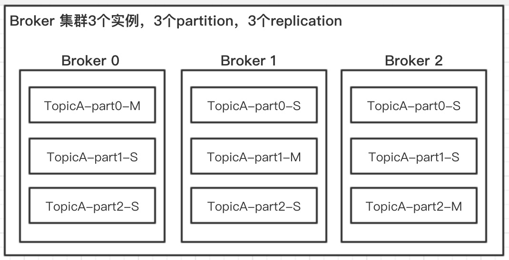
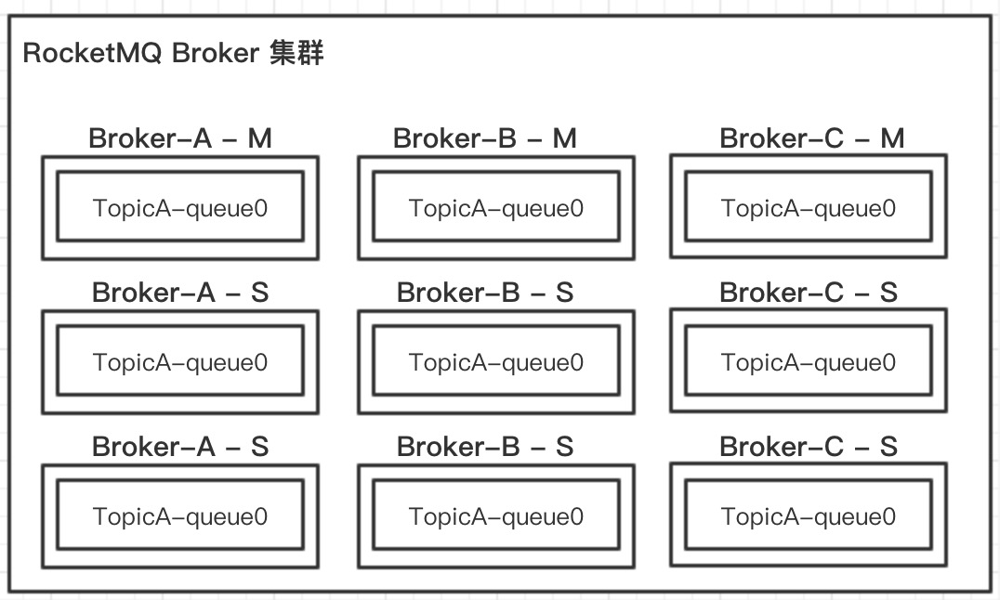
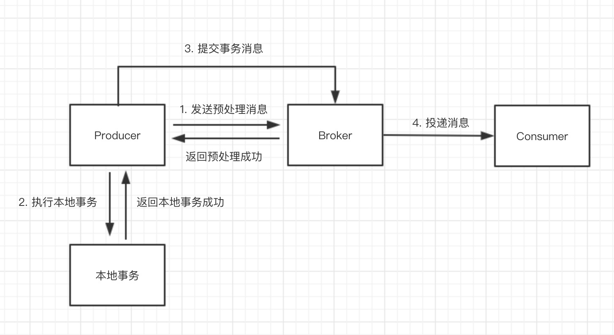
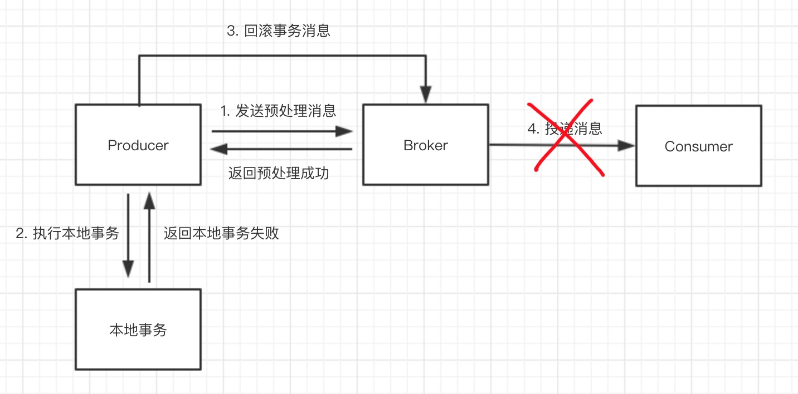
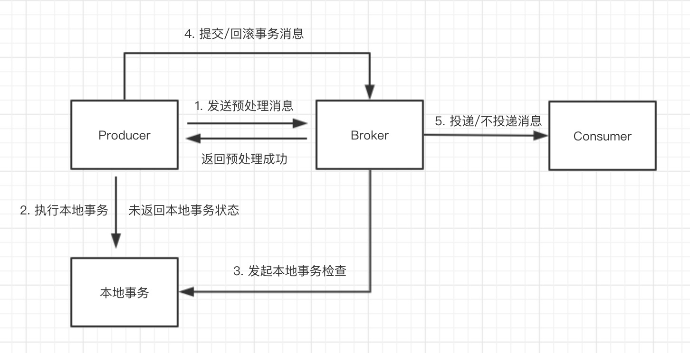
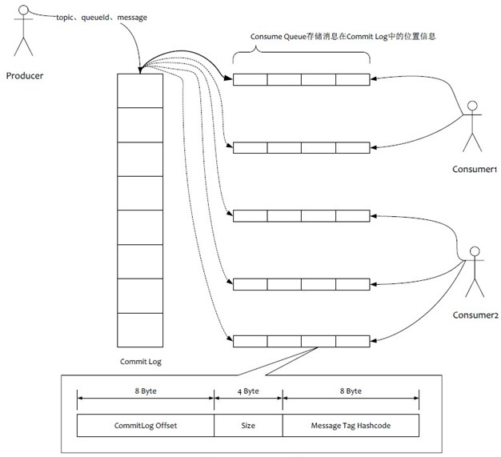

# 消息中间件——RocketMQ

## 9.1 什么是RocketMQ

RocketMQ是一个低延迟、高可靠、可伸缩、易于使用的分布式消息中间件（也称消息队列），经过阿里巴巴多年双11验证，由阿里巴巴开源捐献给Apache的顶级项目。

### 9.1.1 RocketMQ 应用场景

- 削峰填谷

  诸如秒杀、抢红包、企业开门红等大型活动时皆会带来较高的流量脉冲，或因没做相应的保护而导致系统超负荷甚至崩溃，或因限制太过导致请求大量失败而影响用户体验，RocketMQ可提供削峰填谷的服务来解决该问题。

- 异步解耦

  交易系统作为淘宝/天猫主站最核心的系统，每笔交易订单数据的产生会引起几百个下游业务系统的关注，包括物流、购物车、积分、流计算分析等等，整体业务系统庞大而且复杂，RocketMQ可实现异步通信和应用解耦，确保主站业务的连续性。

- 顺序收发

  细数日常中需要保证顺序的应用场景非常多，例如证券交易过程时间优先原则，交易系统中的订单创建、支付、退款等流程，航班中的旅客登机消息处理等等。与先进先出（First In First Out，缩写 FIFO）原理类似，RocketMQ提供的顺序消息即保证消息 FIFO。

- 分布式事务一致性

  交易系统、支付红包等场景需要确保数据的最终一致性，大量引入RocketMQ的分布式事务，既可以实现系统之间的解耦，又可以保证最终的数据一致性。

- 大数据分析

  数据在“流动”中产生价值，传统数据分析大多是基于批量计算模型，而无法做到实时的数据分析，利用RocketMQ与流式计算引擎相结合，可以很方便的实现将业务数据进行实时分析。

- 分布式缓存同步

  天猫双 11 大促，各个分会场琳琅满目的商品需要实时感知价格变化，大量并发访问数据库导致会场页面响应时间长，集中式缓存因为带宽瓶颈限制商品变更的访问流量，通过RocketMQ构建分布式缓存，实时通知商品数据的变化。


### 9.1.2 RocketMQ 安装

RocketMQ依赖 Java 环境，要求 JDK1.8以上版本。RocketMQ 支持四种集群部署模式，本书使用最简单的单机部署演示。

安装方式有两种，一种是源码安装，另一种是已经编译好直接可用的安装包，以下是按源码的方式安装。

* 在`http://rocketmq.apache.org/docs/quick-start/` 下载 RocketMQ 的最新版本 4.6.0。

* 解压源码并编译打包。

  ```
    > unzip rocketmq-all-4.6.0-source-release.zip
    > cd rocketmq-all-4.6.0/
    > mvn -Prelease-all -DskipTests clean install -U
    > cd distribution/target/apache-rocketmq
  ```

* 启动集群管理 NameServer，默认端口是9876

  ```
    > nohup sh bin/mqnamesrv &
    > tail -f ~/logs/rocketmqlogs/namesrv.log
    The Name Server boot success...
  ```

* 启动消息服务器 Broker 

  ```
    > nohup sh bin/mqbroker -n localhost:9876 &
    > tail -f ~/logs/rocketmqlogs/broker.log 
    The broker[%s, 172.30.30.233:10911] boot success...
  ```


### 9.1.3 如何发送消息

Spring Cloud Alibaba 已集成 RocketMQ ，使用 Spring Cloud Stream 对 RocketMQ 发送和接收消息。

- Step1 pom.xml中引入jar包

```xml
<dependency>
  <groupId>com.alibaba.cloud</groupId>
  <artifactId>spring-cloud-stream-binder-rocketmq</artifactId>
</dependency>

<dependency>
  <groupId>org.springframework.boot</groupId>
  <artifactId>spring-boot-starter-web</artifactId>
</dependency>
```


- Step2 配置application.properties

```properties
server.port=8081
spring.cloud.stream.rocketmq.binder.name-server=127.0.0.1:9876
spring.cloud.stream.bindings.output.destination=TopicTest
spring.cloud.stream.rocketmq.bindings.output.producer.group=demo-group
```

`name-server`指定 RocketMQ 的NameServer地址，指定名称为 output 的 Binding 消息发送到TopicTest。


- Step3 使用binder发送消息

```java
@EnableBinding({Source.class})
@SpringBootApplication
public class ProducerApplication {

    public static void main(String[] args) {
        SpringApplication.run(ProducerApplication.class, args);
    }
}

@RestController
public class SendController {

    @Autowired
    private Source source;

    @GetMapping(value = "/send")
    public String send(String msg) {
        MessageBuilder builder = MessageBuilder.withPayload(msg);
        Message message = builder.build();
        source.output().send(message);
        return "Hello RocketMQ Binder, send " + msg;
    }
}
```

@EnableBinding({Source.class}) 表示绑定配置文件中名称为output的 Binding，发送http请求 `http://localhost:8081/send?msg=tcever` 将消息发送到 RocketMQ 中。


### 9.1.4 如何消费消息

- Step1 pom.xml中引入jar包

```xml
<dependency>
  <groupId>com.alibaba.cloud</groupId>
  <artifactId>spring-cloud-stream-binder-rocketmq</artifactId>
</dependency>

<dependency>
  <groupId>org.springframework.boot</groupId>
  <artifactId>spring-boot-starter-web</artifactId>
</dependency>
```


- Step2 配置application.properties

```properties
server.port=8082
spring.cloud.stream.rocketmq.binder.name-server=127.0.0.1:9876
spring.cloud.stream.bindings.input.destination=TopicTest
spring.cloud.stream.bindings.input.group=test-group1
```

`name-server`指定 RocketMQ 的NameServer地址，destination指定Topic名称，指定名称为 input 的 Binding 接收TopicTest的消息。


- Step3 定义消息监听

```java
@EnableBinding({ Sink.class})
@SpringBootApplication
public class ConsumerApplication {

    @StreamListener(value = Sink.INPUT)
    public void receive(String receiveMsg) {
        System.out.println("TopicTest receive: " + receiveMsg + "，receiveTime = " + System.currentTimeMillis());
    }

    public static void main(String[] args) {
        SpringApplication.run(ConsumerApplication.class, args);
    }
}
```

@EnableBinding({Sink.class}) 表示绑定配置文件中名称为input的 Binding，@StreamListener 表示定义一个消息监听器，接收 RocketMQ 中的消息。


## 9.2 Spring Cloud Alibaba RocketMQ

Spring Cloud Stream是 Spring Cloud 体系内的一个框架，用于构建与共享消息传递系统连接的高度可伸缩的事件驱动微服务，其目的是为了简化消息业务在 Spring Cloud 应用程序中的开发。

Spring Cloud Stream 架构图如图9-1 所示，应用程序通过Spring Cloud Stream注入的输入通道inputs和输出通道outputs与消息中间件通信Middleware，消息通道通过特定的中间件绑定器Binder实现连接到外部代理。


<center>图9-1 Spring Cloud Stream 架构图</center>


Spring Cloud Stream 核心由四部分构成：Spring Framework 中的**Spring Messaging**和**Spring Integration**、Spring Cloud Stream中的**Binders**和**Bindings**。

- Spring Messaging：Spring Framework 中统一消息的编程模型，其核心对象如下：
  - Message：消息对象，包含消息头 Header 和消息体 Payload 
  - MessageChannel：消息通道接口，用于接收消息，提供 send 方法可以将消息发送至消息通道
  - MessageHandler：消息处理器接口，用于处理消息逻辑。
- Spring Integration：Spring Framework 中用于支持企业集成的一种扩展机制，作用是提供一个简单的模型来构建企业集成解决方案，对Spring Messaging进行了扩展。
  - MessageDispatcher：消息分发接口，用于分发消息和添加删除消息处理器
  - MessageRouter：消息路由接口，定义默认的输出消息通道
  - Filter：消息的过滤注解，用于配置消息过滤表达式
  - Aggregator：消息的聚合注解，用于多条消息聚合成一条
  - Splitter：消息的分割，用于一条消息拆分成多条
- Binders：目标绑定器，负责与外部消息中间件系统集成的组件。
  - doBindProducer：绑定消息中间件客户端发送消息模块
  - doBindConsumer：绑定消息中间件客户端接收消息模块
- Bindings：外部消息中间件系统与应用程序提供的消息生产者和消费者（由Binders创建）之间的桥梁。


Spring Cloud Stream官方提供了Kafka Binder和RabbitMQ Binder用于集成Kafka和RabbitMQ，Spring Cloud Alibaba中加入了RocketMQ Binder用于集成RocketMQ到Spring Cloud Stream。


### 9.2.1 Spring Cloud Alibaba RocketMQ 架构图

Spring Cloud Alibaba RocketMQ的架构图如图9-2，总体分为四个部分：

- MessageChannel Output ：消息通道，用于发送消息，Spring Cloud Stream的标准接口
- MessageChannel Input：消息通道，用于订阅消息，Spring Cloud Stream的标准接口
- Producer Binder：目标绑定器，对发送通道过来的消息发送到RocketMQ 消息服务器，由Spring Cloud Alibaba团队按照 Spring Cloud Stream的标准协议实现。
- Consumer Binder：目标绑定器，对接收到RocketMQ 消息服务器的消息推送给订阅通道，由Spring Cloud Alibaba团队按照 Spring Cloud Stream的标准协议实现。


<center>图9-2 Spring Cloud Alibaba RocketMQ 架构图</center>


以9.1.3章节和9.1.4章节中代码为例，通过源码深入分析Spring Cloud Alibaba RocketMQ。


### 9.2.1 Spring Cloud Stream 消息发送流程

- 业务代码中调用 MessageChannel 接口的 Send() 方法，例如`source.output().send(message);`

```java
public interface MessageChannel {
			long INDEFINITE_TIMEOUT = -1;
			
			default boolean send(Message<?> message) {
        		return send(message, INDEFINITE_TIMEOUT);
      }
      
      boolean send(Message<?> message, long timeout);
}
```

AbstractMessageChannel 是消息通道的基本实现类，提供发送消息和接收消息的公用方法。

```java
public abstract class AbstractMessageChannel extends IntegrationObjectSupport
		implements MessageChannel, TrackableComponent, ChannelInterceptorAware, 					
    MessageChannelMetrics, ConfigurableMetricsAware<AbstractMessageChannelMetrics> {
		// 省略...
      
		@Override
		public boolean send(Message<?> messageArg, long timeout) {
					// 省略...
					boolean sent = false;
					sent = doSend(message, timeout);
					return sent;
		}
      
    protected abstract boolean doSend(Message<?> message, long timeout);  
}
```


- 消息发送到 AbstractSubscribableChannel 类实现的 doSend() 方法

```java
public abstract class AbstractSubscribableChannel extends AbstractMessageChannel
      implements SubscribableChannel, SubscribableChannelManagement {
  		// 省略...
  
  		@Override
      protected boolean doSend(Message<?> message, long timeout) {
          try {
            return getRequiredDispatcher().dispatch(message);
          }
          catch (MessageDispatchingException e) {
            	// 省略...
          }
      }
}
```


- 通过消息分发类MessageDispatcher把消息分发给MessageHandler

```java
private MessageDispatcher getRequiredDispatcher() {
   MessageDispatcher dispatcher = getDispatcher();
   return dispatcher;
}

protected abstract MessageDispatcher getDispatcher();
```

从 AbstractSubscribableChannel 的实现类 DirectChannel ，拿到MessageDispatcher的实现类UnicastingDispatcher

```java
public class DirectChannel extends AbstractSubscribableChannel {
  	// 省略...
  	@Override
    protected UnicastingDispatcher getDispatcher() {
      	return this.dispatcher;
    }
}
```

调用 dispatch() 方法把消息分发给各个MessageHandler

```java
public class UnicastingDispatcher extends AbstractDispatcher {
  		// 省略...	
  		@Override
      public final boolean dispatch(final Message<?> message) {
          if (this.executor != null) {
              Runnable task = createMessageHandlingTask(message);
              this.executor.execute(task);
              return true;
          }
          return this.doDispatch(message);
      }
  
  		private boolean doDispatch(Message<?> message) {
        		// 省略...
            boolean success = false;
            Iterator<MessageHandler> handlerIterator = this.getHandlerIterator(message);
            while (!success && handlerIterator.hasNext()) {
                MessageHandler handler = handlerIterator.next();
                try {
                    handler.handleMessage(message);
                    success = true; // we have a winner.
                }
                catch (Exception e) {
                  	// 省略...
                }
            }
            return success;
      }
}
```

遍历所有MessageHandler，调用handleMessage() 处理消息。 

```java
private final OrderedAwareCopyOnWriteArraySet<MessageHandler> handlers =
			new OrderedAwareCopyOnWriteArraySet<MessageHandler>();

private Iterator<MessageHandler> getHandlerIterator(Message<?> message) {
   if (this.loadBalancingStrategy != null) {
      return this.loadBalancingStrategy.getHandlerIterator(message, this.getHandlers());
   }
   return this.getHandlers().iterator();
}

protected Set<MessageHandler> getHandlers() {
		return this.handlers.asUnmodifiableSet();
}
```

查看 MessageHandler 从哪里来的，也就是 handlers 列表中的MessageHandler 如何添加的？

```java
public abstract class AbstractSubscribableChannel extends AbstractMessageChannel
			implements SubscribableChannel, SubscribableChannelManagement {
  		// 省略...		
  
  		@Override
      public boolean subscribe(MessageHandler handler) {
          MessageDispatcher dispatcher = getRequiredDispatcher();
          boolean added = dispatcher.addHandler(handler);
          adjustCounterIfNecessary(dispatcher, added ? 1 : 0);
          return added;
      }
}
```

- AbstractMessageChannelBinder 在初始化Binding时，会创建并初始化 SendingHandler ，调用subscribe() 添加到 handlers 列表。

```java
public abstract class AbstractMessageChannelBinder<C extends ConsumerProperties, P extends ProducerProperties, PP extends ProvisioningProvider<C, P>>
      extends AbstractBinder<MessageChannel, C, P> implements
      PollableConsumerBinder<MessageHandler, C>, ApplicationEventPublisherAware {
  		// 省略...
  
  		@Override
      public final Binding<MessageChannel> doBindProducer(final String destination,
            MessageChannel outputChannel, final P producerProperties)
            throws BinderException {
        		// 省略...		
        
        		// 创建Producer的MessageHandler
        		final MessageHandler producerMessageHandler;
        		producerMessageHandler = createProducerMessageHandler(producerDestination,
									producerProperties, outputChannel, errorChannel);
        
        		// 创建SendingHandler并调用subscribe
        		((SubscribableChannel) outputChannel)
									.subscribe(new SendingHandler(producerMessageHandler,
									HeaderMode.embeddedHeaders
                  .equals(producerProperties.getHeaderMode()),
									this.headersToEmbed, useNativeEncoding(producerProperties)));
        		// 省略...	
      }
}
```

Producer的MessageHandler 是由消息中间件 Binder 来完成，Spring Cloud Stream提供了创建 MessageHandler 的规范，接下来会详细讲到 RocketMQ Binder 的具体实现过程。

AbstractMessageChannelBinder 的初始化由AbstractBindingLifecycle 在Spring 容器加载所有bean并完成初始化之后完成。


### 9.2.2 RocketMQ Binder 集成消息发送

AbstractMessageChannelBinder 类中提供了创建 MessageHandler 的规范，createProducerMessageHandler方法在初始化Binder的时候会加载。

```java
public abstract class AbstractMessageChannelBinder<C extends ConsumerProperties, P extends ProducerProperties, PP extends ProvisioningProvider<C, P>>
		extends AbstractBinder<MessageChannel, C, P> implements
		PollableConsumerBinder<MessageHandler, C>, ApplicationEventPublisherAware {
  	// 省略...	
  
    protected abstract MessageHandler createProducerMessageHandler(
          ProducerDestination destination, P producerProperties,
          MessageChannel errorChannel) throws Exception;
}
```

RocketMQMessageChannelBinder 类根据规范完成RocketMQMessageHandler的创建和初始化RocketMQMessageHandler是消息处理器 MessageHandler 的具体实现，RocketMQMessageHandler在RocketMQ Binder中的作用是转化消息格式并发送消息。

```java
public class RocketMQMessageChannelBinder extends
      AbstractMessageChannelBinder<ExtendedConsumerProperties<RocketMQConsumerProperties>, ExtendedProducerProperties<RocketMQProducerProperties>, RocketMQTopicProvisioner>
      implements
      ExtendedPropertiesBinder<MessageChannel, RocketMQConsumerProperties, RocketMQProducerProperties> {
  		// 省略...
  		
  		@Override
      protected MessageHandler createProducerMessageHandler(ProducerDestination destination,
          ExtendedProducerProperties<RocketMQProducerProperties> producerProperties,
          MessageChannel errorChannel) throws Exception {
        
        	RocketMQTemplate rocketMQTemplate;
          rocketMQTemplate = new RocketMQTemplate();
          rocketMQTemplate.setObjectMapper(this.getApplicationContext()
              .getBeansOfType(ObjectMapper.class).values().iterator().next());
          DefaultMQProducer producer;
          producer = new DefaultMQProducer(producerGroup);
          // 初始化DefaultMQProducer  省略... 
          rocketMQTemplate.setProducer(producer);

          RocketMQMessageHandler messageHandler = new RocketMQMessageHandler(
              rocketMQTemplate, destination.getName(), producerGroup,
              producerProperties.getExtension().getTransactional(),
              instrumentationManager);
          messageHandler.setBeanFactory(this.getApplicationContext().getBeanFactory());
          messageHandler.setSync(producerProperties.getExtension().getSync());

          if (errorChannel != null) {
            messageHandler.setSendFailureChannel(errorChannel);
          }
          return messageHandler;
      }
}
```

 RocketMQMessageHandler 中持有 RocketMQTemplate 对象，RocketMQTemplate 是对RocketMQ 客户端API的封装，Spring Boot中已经支持RocketMQTemplate，Spring Cloud Stream对其兼容。

DefaultMQProducer 是由RocketMQ 客户端提供的API，发送消息到RocketMQ 消息服务器都是由它来完成。

```java
DefaultMQProducer producer;
String ak = mergedProperties.getAccessKey();
String sk = mergedProperties.getSecretKey();
if (!StringUtils.isEmpty(ak) && !StringUtils.isEmpty(sk)) {
   RPCHook rpcHook = new AclClientRPCHook(
         new SessionCredentials(ak, sk));
   producer = new DefaultMQProducer(producerGroup, rpcHook,
         mergedProperties.isEnableMsgTrace(),
         mergedProperties.getCustomizedTraceTopic());
   producer.setVipChannelEnabled(false);
   producer.setInstanceName(RocketMQUtil.getInstanceName(rpcHook,
         destination.getName() + "|" + UtilAll.getPid()));
}
else {
   producer = new DefaultMQProducer(producerGroup);
   producer.setVipChannelEnabled(
         producerProperties.getExtension().getVipChannelEnabled());
}
producer.setNamesrvAddr(mergedProperties.getNameServer());
producer.setSendMsgTimeout(
      producerProperties.getExtension().getSendMessageTimeout());
producer.setRetryTimesWhenSendFailed(
      producerProperties.getExtension().getRetryTimesWhenSendFailed());
producer.setRetryTimesWhenSendAsyncFailed(producerProperties
      .getExtension().getRetryTimesWhenSendAsyncFailed());
producer.setCompressMsgBodyOverHowmuch(producerProperties.getExtension()
      .getCompressMessageBodyThreshold());
producer.setRetryAnotherBrokerWhenNotStoreOK(
      producerProperties.getExtension().isRetryNextServer());
producer.setMaxMessageSize(
      producerProperties.getExtension().getMaxMessageSize());
```

RocketMQMessageHandler 消息发送的处理逻辑，解析Message对象头中的参数，调用RocketMQTemplate中不同的发送消息接口。

```java
public class RocketMQMessageHandler extends AbstractMessageHandler implements Lifecycle {
  	// 省略...
  
  	@Override
		protected void handleMessageInternal(org.springframework.messaging.Message<?> message)
      throws Exception {
    		final StringBuilder topicWithTags = new StringBuilder(destination);
      	SendResult sendRes = null;
      	// 发送事务消息
        if (transactional) {
          sendRes = rocketMQTemplate.sendMessageInTransaction(groupName,
              topicWithTags.toString(), message, message.getHeaders()
                  .get(RocketMQBinderConstants.ROCKET_TRANSACTIONAL_ARG));
        }
      	else {
          	// 设置定时消息的参数
          	int delayLevel = 0;
            try {
                Object delayLevelObj = message.getHeaders()
                    .getOrDefault(MessageConst.PROPERTY_DELAY_TIME_LEVEL, 0);
                if (delayLevelObj instanceof Number) {
                  	delayLevel = ((Number) delayLevelObj).intValue();
                }
                else if (delayLevelObj instanceof String) {
                  	delayLevel = Integer.parseInt((String) delayLevelObj);
                }
            }
            catch (Exception e) {
              // ignore
            }
          	boolean needSelectQueue = message.getHeaders()
										.containsKey(BinderHeaders.PARTITION_HEADER);
          	// 同步发送
          	if (sync) {
              		// 顺序消息
                  if (needSelectQueue) {
                    sendRes = rocketMQTemplate.syncSendOrderly(
                        topicWithTags.toString(), message, "",
                        rocketMQTemplate.getProducer().getSendMsgTimeout());
                  }
              		// 普通消息
                  else {
                    sendRes = rocketMQTemplate.syncSend(topicWithTags.toString(),
                        message,
                        rocketMQTemplate.getProducer().getSendMsgTimeout(),
                        delayLevel);
                  }
            } 
          	// 异步发送和回调
          	else {
              	rocketMQTemplate.asyncSend(topicWithTags.toString(), message,
										new SendCallback() {
                    // 省略...
                    }});
            }
        }
      	// 省略...
    }
}
```

发送普通消息、事务消息、定时消息、顺序消息由Message对象的消息头Header中的属性决定，业务代码创建Message对象时设置。


### 9.2.3 RocketMQ Binder 集成消息订阅

AbstractMessageChannelBinder 类中提供了创建 MessageProducer 的协议，createConsumerEndpoint方法在初始化Binder的时候会加载。

```java
public abstract class AbstractMessageChannelBinder<C extends ConsumerProperties, P extends ProducerProperties, PP extends ProvisioningProvider<C, P>>
		extends AbstractBinder<MessageChannel, C, P> implements
		PollableConsumerBinder<MessageHandler, C>, ApplicationEventPublisherAware {
		// 省略...
  	@Override
		public final Binding<MessageChannel> doBindConsumer(String name, String group,
				MessageChannel inputChannel, final C properties) throws BinderException {
      		// 省略...	
      		MessageProducer consumerEndpoint = null;
      		consumerEndpoint = createConsumerEndpoint(destination, group, properties);
					consumerEndpoint.setOutputChannel(inputChannel);
      
      		// 省略...	
    }
  	
		protected abstract MessageProducer createConsumerEndpoint(
      	ConsumerDestination destination, String group, C properties) throws Exception;
}
```

同样由RocketMQMessageChannelBinder 类根据协议完成RocketMQInboundChannelAdapter的创建和初始化。

```java
public class RocketMQMessageChannelBinder extends
		AbstractMessageChannelBinder<ExtendedConsumerProperties<RocketMQConsumerProperties>, ExtendedProducerProperties<RocketMQProducerProperties>, RocketMQTopicProvisioner>
		implements
		ExtendedPropertiesBinder<MessageChannel, RocketMQConsumerProperties, RocketMQProducerProperties> {
  	// 省略...

    @Override
    protected MessageProducer createConsumerEndpoint(ConsumerDestination destination,
          String group,
          ExtendedConsumerProperties<RocketMQConsumerProperties> consumerProperties)
          throws Exception {
      		
         RocketMQListenerBindingContainer listenerContainer = new RocketMQListenerBindingContainer(
               consumerProperties, rocketBinderConfigurationProperties, this);
         // 省略...

         RocketMQInboundChannelAdapter rocketInboundChannelAdapter = new RocketMQInboundChannelAdapter(
               listenerContainer, consumerProperties, instrumentationManager);
         // 省略...
         return rocketInboundChannelAdapter;
    }
}
```

RocketMQInboundChannelAdapter 是适配器，需要适配Spring Framework中的重试和回调机制，它在RocketMQ Binder中的作用是订阅消息并转化消息格式。RocketMQListenerBindingContainer 是对RocketMQ 客户端API的封装，适配器中持有它的对象。

```java
public class RocketMQListenerBindingContainer
      implements InitializingBean, RocketMQListenerContainer, SmartLifecycle {
  		
  		private RocketMQListener rocketMQListener;		
  
  		@Override
      public void afterPropertiesSet() throws Exception {
        initRocketMQPushConsumer();
      }
  
  		private void initRocketMQPushConsumer() throws MQClientException {
          String ak = rocketBinderConfigurationProperties.getAccessKey();
          String sk = rocketBinderConfigurationProperties.getSecretKey();
          if (!StringUtils.isEmpty(ak) && !StringUtils.isEmpty(sk)) {
            RPCHook rpcHook = new AclClientRPCHook(new SessionCredentials(ak, sk));
            consumer = new DefaultMQPushConsumer(consumerGroup, rpcHook,
                new AllocateMessageQueueAveragely(),
                rocketBinderConfigurationProperties.isEnableMsgTrace(),
                rocketBinderConfigurationProperties.getCustomizedTraceTopic());
            consumer.setInstanceName(RocketMQUtil.getInstanceName(rpcHook,
                topic + "|" + UtilAll.getPid()));
            consumer.setVipChannelEnabled(false);
          }
          else {
            consumer = new DefaultMQPushConsumer(consumerGroup,
                rocketBinderConfigurationProperties.isEnableMsgTrace(),
                rocketBinderConfigurationProperties.getCustomizedTraceTopic());
          }

          consumer.setNamesrvAddr(nameServer);
          consumer.setConsumeThreadMax(rocketMQConsumerProperties.getConcurrency());
          consumer.setConsumeThreadMin(rocketMQConsumerProperties.getConcurrency());

          switch (messageModel) {
          case BROADCASTING:
            consumer.setMessageModel(
                org.apache.rocketmq.common.protocol.heartbeat.MessageModel.BROADCASTING);
            break;
          case CLUSTERING:
            consumer.setMessageModel(
                org.apache.rocketmq.common.protocol.heartbeat.MessageModel.CLUSTERING);
            break;
          default:
            throw new IllegalArgumentException("Property 'messageModel' was wrong.");
          }

          switch (selectorType) {
          case TAG:
            consumer.subscribe(topic, selectorExpression);
            break;
          case SQL92:
            consumer.subscribe(topic, MessageSelector.bySql(selectorExpression));
            break;
          default:
            throw new IllegalArgumentException("Property 'selectorType' was wrong.");
          }

          switch (consumeMode) {
          case ORDERLY:
            consumer.setMessageListener(new DefaultMessageListenerOrderly());
            break;
          case CONCURRENTLY:
            consumer.setMessageListener(new DefaultMessageListenerConcurrently());
            break;
          default:
            throw new IllegalArgumentException("Property 'consumeMode' was wrong.");
          }

          if (rocketMQListener instanceof RocketMQPushConsumerLifecycleListener) {
            ((RocketMQPushConsumerLifecycleListener) rocketMQListener)
                .prepareStart(consumer);
          }
      }
}
```

RocketMQ提供了两种消费模式：顺序消费、并发消费，RocketMQ 客户端API 中顺序消费的默认监听器是DefaultMessageListenerOrderly类，并发消费的默认监听器是DefaultMessageListenerConcurrently类，无论是哪种消费模式，监听器收到消息后都会回调RocketMQListener。

```java
public class DefaultMessageListenerConcurrently
      implements MessageListenerConcurrently {

   @SuppressWarnings("unchecked")
   @Override
   public ConsumeConcurrentlyStatus consumeMessage(List<MessageExt> msgs,
         ConsumeConcurrentlyContext context) {
      // 省略...
     
      for (MessageExt messageExt : msgs) {
         try {
            rocketMQListener
                  .onMessage(RocketMQUtil.convertToSpringMessage(messageExt));
         }
         catch (Exception e) {
            context.setDelayLevelWhenNextConsume(delayLevelWhenNextConsume);
            return ConsumeConcurrentlyStatus.RECONSUME_LATER;
         }
      }
      return ConsumeConcurrentlyStatus.CONSUME_SUCCESS;
   }
}
```

RocketMQListener 也是Spring Boot中已支持的RocketMQ 组件，Spring Cloud Stream对其兼容。

在适配器 RocketMQInboundChannelAdapter  中创建和初始化了RocketMQListener的实现类。

```java
public class RocketMQInboundChannelAdapter extends MessageProducerSupport {
  	// 省略...
  
  	@Override
    protected void onInit() {
      	// 省略...
        BindingRocketMQListener listener = new BindingRocketMQListener();
        rocketMQListenerContainer.setRocketMQListener(listener);
    }
  
  	protected class BindingRocketMQListener
			implements RocketMQListener<Message>, RetryListener {

		@Override
		public void onMessage(Message message) {
        boolean enableRetry = RocketMQInboundChannelAdapter.this.retryTemplate != null;
        if (enableRetry) {
          RocketMQInboundChannelAdapter.this.retryTemplate.execute(context -> {
            RocketMQInboundChannelAdapter.this.sendMessage(message);
            return null;
          }, (RecoveryCallback<Object>) 	RocketMQInboundChannelAdapter.this.recoveryCallback);
        }
        else {
          RocketMQInboundChannelAdapter.this.sendMessage(message);
        }
		}
	}
}
```

DefaultMessageListenerOrderly 对象收到RocketMQ 消息，会先回调 BindingRocketMQListener 的onMessage方法，再调用 RocketMQInboundChannelAdapter 父类中的sendMessage方法将消息发送出去DirectChannel。


### 9.2.4 Spring Cloud Stream 消息订阅流程

对于Spring Cloud Stream 的消息模型来说，接收消息中间件的消息也是发布/订阅模型，接收到的消息先发送到MessageChannel ，由订阅的MessageChannel 通过Dispatcher转发到对应的 MessageHandler 进行处理。


- RocketMQInboundChannelAdapter  调用sendMessage() 发送消息

```java
public abstract class MessageProducerSupport extends AbstractEndpoint implements MessageProducer, TrackableComponent,
      SmartInitializingSingleton {
        private final MessagingTemplate messagingTemplate = new MessagingTemplate();
        private volatile MessageChannel outputChannel;
        // 省略...
        
        protected void sendMessage(Message<?> messageArg) {
            // 省略...
            try {
              	this.messagingTemplate.send(getOutputChannel(), message);
            }
            catch (RuntimeException e) {
            }
        }
        
        @Override
        public MessageChannel getOutputChannel() {
            // 省略...
            return this.outputChannel;
        }
}
```

getOutputChannel() 拿到的 MessageChannel 是初始化RocketMQ Binder时传入的DirectChannel，对应例子中的Input通道。

MessagingTemplate 继承了GenericMessagingTemplate 类，实际执行了doSend() 方法发送消息。

```java
public class GenericMessagingTemplate extends AbstractDestinationResolvingMessagingTemplate<MessageChannel>
		implements BeanFactoryAware {
  	// 省略...
  
    @Override
    protected final void doSend(MessageChannel channel, Message<?> message) {
        doSend(channel, message, sendTimeout(message));
    }

    protected final void doSend(MessageChannel channel, Message<?> message, long timeout) {
      	// 省略...
      	boolean sent = (timeout >= 0 ? channel.send(messageToSend, timeout) : channel.send(messageToSend));
    }
}
```

由于MessageChannel 的实例是 DirectChannel 对象，就复用了前面讲Spring Cloud Stream消息发送流程中提到的流程，通过消息分发类MessageDispatcher把消息分发给MessageHandler 。

消息到了DirectChannel 对应的消息处理器是 StreamListenerMessageHandler ，在消息处理器中回调使用了@StreamListener注解的业务方法。

```java
public class StreamListenerMessageHandler extends AbstractReplyProducingMessageHandler {
	 // 省略... 
  
   private final InvocableHandlerMethod invocableHandlerMethod;

   @Override
   protected Object handleRequestMessage(Message<?> requestMessage) {
      try {
         return this.invocableHandlerMethod.invoke(requestMessage);
      }
      catch (Exception e) {
         // 省略...
      }
   }
}
```

InvocableHandlerMethod 中持有BeanFactory、Method、MethodParameter等对象使用Java反射机制完成回调。那么，StreamListenerMessageHandler 怎么和使用@StreamListener注解的业务方法关联上的呢？

```java
public class StreamListenerAnnotationBeanPostProcessor implements BeanPostProcessor,
      ApplicationContextAware, SmartInitializingSingleton {
      // 省略...
        
      @Override
      public final void afterSingletonsInstantiated() {
        	// 省略...
          for (StreamListenerHandlerMethodMapping mapping : mappedBindingEntry.getValue())						{		
            	// 创建InvocableHandlerMethod 
            	final InvocableHandlerMethod invocableHandlerMethod = 				
                 				this.messageHandlerMethodFactory
												.createInvocableHandlerMethod(mapping.getTargetBean(),
													checkProxy(mapping.getMethod(), mapping.getTargetBean()));
            	// 创建StreamListenerMessageHandler
            	StreamListenerMessageHandler streamListenerMessageHandler = 
                  	new StreamListenerMessageHandler(invocableHandlerMethod,
													resolveExpressionAsBoolean(mapping.getCopyHeaders(),
													"copyHeaders"),
                          this.springIntegrationProperties
													.getMessageHandlerNotPropagatedHeaders());
          }
      }
}
```

在Spring 容器管理的所有单例对象初始化完成之后，遍历StreamListenerHandlerMethodMapping 进行StreamListenerMessageHandler 和 InvocableHandlerMethod 的创建和初始化。

StreamListenerHandlerMethodMapping 从类名看显而易见，保存了StreamListener和HandlerMethod的映射关系。根据代码逐渐往上找，创建映射关系也是在StreamListenerAnnotationBeanPostProcessor类。

```java
public class StreamListenerAnnotationBeanPostProcessor implements BeanPostProcessor,
      ApplicationContextAware, SmartInitializingSingleton {
      // 省略...
        
      @Override
      public final Object postProcessAfterInitialization(Object bean, final String beanName)
          throws BeansException {
          Class<?> targetClass = AopUtils.isAopProxy(bean) ? AopUtils.getTargetClass(bean)
              : bean.getClass();
          Method[] uniqueDeclaredMethods = ReflectionUtils
              .getUniqueDeclaredMethods(targetClass);
          for (Method method : uniqueDeclaredMethods) {
              StreamListener streamListener = AnnotatedElementUtils
                  .findMergedAnnotation(method, StreamListener.class);
              if (streamListener != null && !method.isBridge()) {
                  this.streamListenerCallbacks.add(() -> {
                    	// 处理 @StreamListener
                    	this.doPostProcess(streamListener, method, bean);
                  });
              }
          }
          return bean;
      }
}
        
```

StreamListenerAnnotationBeanPostProcessor 找到所有使用@StreamListener的Method，并创建StreamListenerHandlerMethodMapping对象，保存映射关系到集合中。

```java
private void doPostProcess(StreamListener streamListener, Method method,
      Object bean) {
   // 省略... 
   StreamListenerSetupMethodOrchestrator streamListenerSetupMethodOrchestrator = orchestratorOptional
         .get();
   streamListenerSetupMethodOrchestrator
         .orchestrateStreamListenerSetupMethod(streamListener, method, bean);
}

@Override
public void orchestrateStreamListenerSetupMethod(StreamListener streamListener,
      Method method, Object bean) {
  	// 省略... 
  	registerHandlerMethodOnListenedChannel(method, streamListener, bean);
}

private final MultiValueMap<String, StreamListenerHandlerMethodMapping> 	
  	mappedListenerMethods = new LinkedMultiValueMap<>();

private void registerHandlerMethodOnListenedChannel(Method method,
				StreamListener streamListener, Object bean) {
  	// 省略... 
  	// 保存StreamListenerHandlerMethodMapping
		StreamListenerAnnotationBeanPostProcessor.this.mappedListenerMethods.add(
					streamListener.value(),
					new StreamListenerHandlerMethodMapping(bean, method,
							streamListener.condition(), defaultOutputChannel,
							streamListener.copyHeaders()));
}
```


到此，Spring Cloud Stream RocketMQ 相关知识介绍完了，其他内容不再展开，总结一下前面的内容。

- Spring Cloud Stream 提供了简单易用的消息编程模型，内部基于发布/订阅模型实现。
- Spring Cloud Stream 的Binder提供标准协议，不同的消息中间件都可以按照标准协议接入进来。
- Binder 提供 bindConsumer 和 bindProducer 接口协议，分别用于构造生产者和消费者。


接下来笔者将为大家重点讲解RocketMQ的架构设计、RocketMQ中的常见的功能和场景、在Spring Cloud Stream中如何使用，并深入讲解RocketMQ的技术原理。


## 9.3 RocketMQ 集群管理

本章中会介绍 RocketMQ 的整体架构设计、集群管理，涉及到 RocketMQ 中一些重要的概念。

在分布式服务SOA架构中，任何的中间件或者应用都不允许单点存在，服务发现机制是必备的。服务实例有多个，且数量是动态变化的。注册中心会提供服务管理能力，服务调用方在注册中心获取到服务提供者的信息，从而进行远程调用。

### 9.3.1 整体架构设计

介绍RocketMQ的架构设计，不得不说几句与Kafka的渊源。Kafka是一款高性能的消息中间件，在大数据场景中经常被使用，但由于Kafka不支持消费失败重试、定时消息、事务消息，顺序消息也有明显缺陷，难以支撑淘宝交易、订单、充值等复杂业务场景，淘宝中间件团队参考Kafka之后重新设计并用java编写了RocketMQ，所以在RocketMQ中会有一些概念和Kafka相似。

常见的消息中间件Kafka、RabbitMQ、RocketMQ 等都是基于发布/订阅机制，消息发送者（Producer）把消息发送到消息服务器，消息消费者（Consumer）从消息服务器订阅感兴趣的消息。这个过程中消息发送者和消息消费者是客户端，消息服务器是服务端，客户端与服务端双方都需要通过注册中心感知对方的存在。


<center>图9-3 RocketMQ 部署架构图</center>

RocketMQ部署架构上主要分为四部分，如图9-3 所示:

- Producer：消息发布的角色，主要负责把消息发送到Broker，支持分布式集群方式部署。
- Consumer：消息消费者的角色，主要负责从Broker订阅消息消费，支持分布式集群方式部署。
- Broker：消息存储的角色，主要负责消息的存储、投递和查询以及服务高可用保证，支持分布式集群方式部署。
- NameServer：服务管理的角色，主要负责管理Broker集群的路由信息，支持分布式集群方式部署。


NameServer是一个非常简单的Topic路由注册中心，其角色类似dubbo中依赖的Zookeeper，支持Broker的动态注册与发现。主要包括两个功能：

1. 服务注册：NameServer接收Broker集群的注册信息保存下来作为路由信息的基本数据，并提供心跳检测机制，检查Broker是否还存活。

2. 路由信息管理：NameServer保存了Broker集群的路由信息，用于提供给客户端查询Broker的队列信息。Producer和Conumser通过NameServer可以知道Broker集群的路由信息，从而进行消息的投递和消费。


### 9.3.2 基本概念

- Message：消息，系统所传输信息的物理载体，生产和消费数据的最小单位。每条消息必须属于一个Topic，RocketMQ中每个消息拥有唯一的MessageID，且可以携带具有业务标识的Key。
- Topic：主题，表示一类消息的集合，每个主题包含若干条消息，每条消息只能属于一个主题，是RocketMQ进行消息订阅的基本单位。
- Queue：消息队列，组成Topic的最小单元。默认情况下一个Topic会对应多个Queue，Topic是逻辑概念，Queue是物理存储，在Consumer消费Topic消息时底层实际则是拉取Queue的消息。
- Tag：为消息设置的标志，用于同一主题下区分不同类型的消息。来自同一业务单元的消息，可以根据不同业务目的在同一主题下设置不同标签。标签能够有效地保持代码的清晰度和连贯性，并优化RocketMQ提供的查询系统。消费者可以根据Tag实现对不同子主题的不同消费逻辑，实现更好的扩展性。
- UserProperties：用户自定义的属性集合，属于Message的一部分。
- ProducerGroup：同一类Producer的集合，这类Producer发送同一类消息且发送逻辑一致。如果发送的是事物消息且原始生产者在发送之后崩溃，则Broker服务器会联系同一生产者组的其他生产者实例以提交或回溯消费。
- ConsumerGroup：同一类Consumer的集合，这类Consumer通常消费同一类消息且消费逻辑一致。消费者组使得在消息消费方面，实现负载均衡和容错的目标变得非常容易。要注意的是，消费者组的消费者实例必须订阅完全相同的Topic。


### 9.3.2 为什么放弃Zookeeper选择NameServer

在kafka中的服务注册与发现通常是用Zookeeper来完成的，RocketMQ早期也使用了Zookeeper做集群的管理，但后来放弃了转而使用自己开发NameServer。说到这里大家可能会有个疑问，这些能力Zookeeper早就有了，为什么要重复造轮子自己再写一个服务注册中心呢？带着这个疑问我们先来看两者部署拓扑图的对比。

在Kafka中Topic是逻辑概念，分区是物理概念。1个topic可以设置多个分区（partition），每个分区可以设置多个副本（replication），即有1个master分区 + 多个slave分区。

Kafka的部署拓扑图如图9-4：



<center>图9-4 Kafka 拓扑图</center>


例如搭建3个Broker构成一个集群，创建了一个Topic取名为TopicA，分区是3个，副本数是2个。图9-4 中part表示分区，M表示Master，S表示Slave。在Kafka中消息只能发送到Master分区中，消息发送给Topic时会发送到具体某个分区。如果是发送给part0就只会发送到Broker0这个实例，再由Broker0同步到Broker1和Broker2中的part0副本中去；如果是发送给part1就只会发送到Broker1这个实例，再由Broker1同步到Broker0和Broker2中的part1副本中去。


在RocketMQ中Topic也是逻辑概念，队列是物理概念（对应Kafka中的分区）。1个topic可以设置多个队列（queue），每个队列也可以有多个副本，即有1个master队列 + 多个slave队列。

RocketMQ的部署拓扑图如图9-5：



<center>图9-5 RocketMQ 拓扑图</center>

为了方便对比，同样创建了一个Topic取名为TopicA，队列是3个，副本数也是2个，但构成Broker集群的实例有9个。

Kafka 与 RocketMQ 两者在概念上相似，但又有明显的差异：

- 在Kafka中，Master和Slave在同一台Broker机器上，Broker机器上有多个分区，每个分区的Master/Slave身份是在运行过程中选举出来的。Broker机器具有双重身份，既有Master分区，也有Slave分区。
- 在RocketMQ中，Master和Slave不在同一台Broker机器上，每台Broker机器不是Master就是Slave，Broker的Master/Slave身份是在Broker的配置文件中预先定义好的，Broker启动之前就已经决定了。

那这个差异影响在哪呢？Kafka的Master/Slave需要通过Zookeeper选举出来的，而RocketMQ不需要。问题就在这个选举上，Zookeeper具备选举功能，选举机制的原理就是少数服从多数，那么Zookeeper的选举机制必须由Zookeeper集群多个实例来共同完成。Zookeeper集群中的多个实例必须相互通信，如果实例数很多，网络通讯就会变得非常复杂且低效。

NameServer的设计目标是让网络通信变简单，从而使性能得到极大的提升。为了避免单点故障，NameServer也必须以集群的方式部署，但集群中各实例间相互不进行网络通信。NameServer是无状态的，可以任意部署多个实例。Broker向每一台NameServer注册自己的路由信息，所以每一个NameServer实例上面都保存一份完整的路由信息。NameServer与每台Broker机器保持长连接，间隔30秒发心跳包检查Broker是否存活，如果检测到Broker宕机， 则从路由注册表中将故障机器移除。NameServer为了降低实现的复杂度，并不会立刻通知客户端的Producer和Consumer。

集群环境下实例很多，偶尔会出现各种各样的问题，会出现以下几种场景需要大家去思考：

1. 当某个NameServer因宕机或网络问题下线了，Broker如何同步路由信息？ 

   由于Broker会连接NameServer 集群每个实例，Broker仍然可以向其它NameServer同步其路由信息，Produce和Consumer仍然可以动态感知Broker的路由的信息。

2. NameServer如果检测到Broker宕机，并没有立即通知Producer和Consumer，Producer将消息发送到故障的Broker怎么办？Consumer从Broker订阅消息失败怎么办？ 

   RocketMQ 作者为了简化NameServer的设计，这两个问题都是在客户端中进行解决，具体将在后续"高可用设计"的章节中解答。

3. 由于NameServer集群中的实例相互不通讯，在某个时间点不同NameServer实例保存的路由注册信息可能不一致。

   这对发送消息和消费消息并不会有什么影响，原理和问题2是一样的，从这能看出NameServer是CAP中的AP架构。


## 9.4 如何实现顺序消息

### 9.4.1 顺序消息的使用场景

日常中需要保证顺序的应用场景非常多，例如交易系统中的订单创建、支付、退款等流程，先创建订单才能支付，支付完成的订单才能退款，这需要顺序保证先进先出（First In First Out，缩写 FIFO）。例如数据库的BinLog消息，数据库执行新增语句、修改语句，BinLog消息的顺序也必须保证是新增消息、修改消息。


### 9.4.2 如何发送和消费顺序消息

我们使用RocketMQ顺序消息来模拟一下订单的场景，顺序消息分为两部分：顺序发送、顺序消费。

- step1 顺序发消息

```properties
server.port=8081
spring.cloud.stream.rocketmq.binder.name-server=127.0.0.1:9876
spring.cloud.stream.bindings.output.destination=TopicTest
spring.cloud.stream.rocketmq.bindings.output.producer.group=demo-group
# 设置同步发送
spring.cloud.stream.rocketmq.bindings.output.producer.sync=true
```

```java
@RestController
public class OrderlyController {

    @Autowired
    private Source source;

    @GetMapping(value = "/orderly")
    public String orderly() {
        List<String> typeList = Arrays.asList("创建", "支付", "退款");

        for (String type : typeList) {
            MessageBuilder builder = MessageBuilder.withPayload(type)
                    .setHeader(BinderHeaders.PARTITION_HEADER, 0);
            Message message = builder.build();
            source.output().send(message);
        }
        return "OK";
    }
}
```

为了简化代码，模拟按顺序依次发送创建、支付、退款消息到`TopicTest`。

这里发送顺序消息的代码，相比9.1.2章节中发送普通消息，修改了两处地方：

1. spring.propeties配置文件中指定`producer.sync=true`，默认是异步发送，此处改为同步发送。
2. MessageBuilder 设置Header信息头，表示这是一条顺序消息，将消息固定地发送到第0个消息队列。


- step2 顺序收消息

```java
@EnableBinding({ Sink.class})
@SpringBootApplication
public class ConsumerApplication {

    @StreamListener(value = Sink.INPUT)
    public void receive(String receiveMsg) {
        System.out.println("TopicTest receive: " + receiveMsg + "，receiveTime = " + System.currentTimeMillis());
    }

    public static void main(String[] args) {
        SpringApplication.run(ConsumerApplication.class, args);
    }
}
```

```properties
server.port=8082

spring.cloud.stream.rocketmq.binder.name-server=127.0.0.1:9876

spring.cloud.stream.bindings.input.destination=TopicTest
spring.cloud.stream.bindings.input.group=test-group1
# 指定顺序消费
spring.cloud.stream.rocketmq.bindings.input.consumer.orderly=true
```

相比9.1.2章节中消费普通消息，仅修改了spring.properties配置文件`consumer.orderly=true`，默认是并发消费，此处改成顺序消费。

程序运行之后查看控制台日志的输出，也是按顺序打印出来的。

```java
TopicTest receive: 创建，receiveTime = 1581359411181
TopicTest receive: 支付，receiveTime = 1581359411184
TopicTest receive: 退款，receiveTime = 1581359411185
```


### 9.4.3 顺序发送的技术原理

RocketMQ的顺序消息分2种情况，局部有序和全局有序，前面的例子就是局部有序场景。

- 局部有序：指发送同一个队列的消息有序，可以在发送消息时指定队列，在消费消息时也按顺序消费。 例如同一个订单ID的消息要保证有序，不同订单ID的消息可以无序，相互不影响。
- 全局有序：设置topic只有1个队列可以来实现全局有序，创建Topic时手动设置。 此类场景极少，性能差通常不推荐使用。


RocketMQ中消息发送有三种方式：同步、异步、单向。

- 同步：发送网络请求后会同步等待broker服务器的返回结果，支持发送失败重试，适用于较重要的消息通知场景。
- 异步：异步发送网络请求不会阻塞当前线程，不支持失败重试，适用于对响应时间要求更高的场景。
- 单向：单向发送原理和异步一致，但不支持回调。适用于响应时间非常短，对可靠性要求不高的场景，例如日志收集。


顺序消息发送的原理很简单，同一类消息发送到相同的队列即可。为了保证先发送的消息先存储到消息队列，必须使用同步发送的方式。否则可能出现先发消息后到消息队列，此时消息就已经乱序了。

RocketMQ 核心源码如下：

```java
public SendResult syncSendOrderly(String destination, Message<?> message, String hashKey) {
    return syncSendOrderly(destination, message, hashKey, producer.getSendMsgTimeout());
}

private MessageQueueSelector messageQueueSelector = new SelectMessageQueueByHash();

public SendResult syncSendOrderly(String destination, Message<?> message, String hashKey, long timeout) {
    try {
      	// 转成RocketMQ API中的Message对象
        org.apache.rocketmq.common.message.Message rocketMsg = RocketMQUtil.convertToRocketMessage(objectMapper,
            charset, destination, message);
      	// 调用发送消息接口
        SendResult sendResult = producer.send(rocketMsg, messageQueueSelector, hashKey, timeout);
        return sendResult;
    } catch (Exception e) {
        log.error("syncSendOrderly failed. destination:{}, message:{} ", destination, message);
        throw new MessagingException(e.getMessage(), e);
    }
}
```

选择队列的过程由`messageQueueSelector`和`hashKey`在实现类`SelectMessageQueueByHash`完成。

```java
public class SelectMessageQueueByHash implements MessageQueueSelector {

    @Override
    public MessageQueue select(List<MessageQueue> mqs, Message msg, Object arg) {
        int value = arg.hashCode();
        if (value < 0) {
            value = Math.abs(value);
        }
				
        value = value % mqs.size();
        return mqs.get(value);
    }
}
```

1. 根据hashKey计算hash值，hashKey是我们前面例子中的订单ID，所以相同订单ID的hash值相同。
2. 用hash值和队列数`mqs.size()`取模，得到一个索引值，结果是小于队列数。
3. 根据索引值从队列列表中取出一个队列`mqs.get(value)`，hash值相同则队列相同。

队列列表的获取过程：由Producer从NameServer根据Topic查询Broker列表，缓存在本地内存中，以便于下次从缓存中读取。


### 9.4.4 普通发送的技术原理

RocketMQ 中除顺序消息外，还支持事物消息和延迟消息，非这3种特殊的消息外我们称之为普通消息用以区分。日常开发过程中最为常用的是普通消息，这是因为最常用的场景是系统间的异步解耦和流量的削峰填谷，这些场景下尽量保证消息高性能的收发即可。

从普通消息与顺序消息对比来看，普通消息在发送时选择消息队列的策略不同，普通消息发送选择队列有2种机制：轮询机制、故障规避机制（也称故障延迟机制）。默认是使用轮询机制，一个Topic有多个队列，轮询选择其中一个队列。

轮询机制的原理是路由信息`TopicPublishInfo`中维护了一个计数器`sendWhichQueue`，每发送一次消息需要查询一次路由，计算器就进行+1，通过计算器的值index与队列的数量取模计算来实现轮询算法。

```java
// TopicPublishInfo#selectOneMessageQueue
public MessageQueue selectOneMessageQueue(final String lastBrokerName) {
  	// 第一次执行时lastBrokerName = null
    if (lastBrokerName == null) {
        return selectOneMessageQueue();
    } else {
        int index = this.sendWhichQueue.getAndIncrement();
        for (int i = 0; i < this.messageQueueList.size(); i++) {
            int pos = Math.abs(index++) % this.messageQueueList.size();
            if (pos < 0)
                pos = 0;
            MessageQueue mq = this.messageQueueList.get(pos);
          	// 当前选中的Queue所在broker，不是上次发送的broker
            if (!mq.getBrokerName().equals(lastBrokerName)) {
                return mq;
            }
        }
        return selectOneMessageQueue();
    }
}

public MessageQueue selectOneMessageQueue() {
    int index = this.sendWhichQueue.getAndIncrement();
    int pos = Math.abs(index) % this.messageQueueList.size();
    if (pos < 0)
      pos = 0;
    return this.messageQueueList.get(pos);
}
```

轮询算法简单好用，但有个弊端。如果选择的队列是在宕机的broker上会导致消息发送失败，即使消息发送重试的时候重新选择队列也可能还是在宕机的broker上，这样无法规避发送失败的情况，所以有了故障规避机制来解决，后续章节会仔细讲解。


### 9.4.5 顺序消费的技术原理

RocketMQ 支持两种消息模式：集群消费（Clustering）和广播消费（Broadcasting）。两者的区别是广播消费模式时每条消息会被ConsumerGroup的每个Consumer都消费，集群消费是每条消息只会被ConsumerGroup的其中一个Consumer消费。

多数场景都属于集群消费，消息每消费一次代表一次业务处理，集群消费表示每条消息由业务应用集群中任意一个服务实例来处理。少数场景使用广播消费，例如数据发生变化，更新业务应用集群中每个服务的本地缓存，这就需要一条消息整个集群都消费一次。 默认是集群消费，消息模式是前提条件，我们下面也仅分析这种模式下的情况。


顺序消费也称为有序消费，原理是同一个消息队列只允许Consumer中的一个消费线程拉取消费。Consumer中有个消费线程池，多个线程会同时消费消息。在顺序消费的场景下消费线程请求到broker时会先申请独占锁，拿到锁的请求则允许消费。

```java
// ConsumeMessageOrderlyService#ConsumeRequest#run

private final Lock lockConsume = new ReentrantLock();

try {
    this.processQueue.getLockConsume().lock();
    if (this.processQueue.isDropped()) {
        break;
    }
    status = messageListener.consumeMessage(Collections.unmodifiableList(msgs), context);
} catch (Throwable e) {
    hasException = true;
} finally {
    this.processQueue.getLockConsume().unlock();
}
```

消息消费成功的情况下，会向broker提交消费进度更新消费位点信息，避免下次拉取到已消费的消息。 顺序消费中如果消费线程在监听器中进行业务处理时抛出异常，则不会提交消费进度，消费进度会阻塞在当前这条消息，并不会继续消费该队列中后续的消息，从而保证顺序消费。在顺序消费的场景下，特别需要注意对异常的处理，如果重试也失败的话会一直阻塞在当前消息，直到超出最大重试次数，很长一段时间内无法消费后续消息造成队列消息堆积。


### 9.4.6 并发消费的技术原理

RocketMQ 支持两种消费方式：顺序消费、并发消费。 并发消费是默认的消费方式，日常开发过程中最为常用的方式，除了顺序消息的场景就是使用并发消费。

并发消费也称为乱序消费，其原理是同一个消息队列提供给Consumer中的多个消费线程拉取消费。Consumer中会维护一个消费线程池，多个消费线程可以并发去同一个消息队列中拉取消息进行消费。如果某个消费线程在监听器中进行业务处理时抛出异常，当前消费线程拉取的消息会进行重试，不影响其他消费线程和消息队列的消费进度，消费成功的线程正常提交消费进度。

并发消费相比顺序消费没有资源争抢上锁的过程，消费消息的速度比并发消费要快很多。


### 9.4.7 消息幂等性

说到消息消费不得不提消息的幂等性问题，业务代码中通常是收到一条消息进行一次业务逻辑处理，如果相同一条消息重复收到几次，是否会导致业务重复处理？Consumer 能否不重复接收消息？

RocketMQ不保证消息不被重复消费，如果业务对消费重复非常敏感，必须要在业务层面进行幂等性处理，具体实现可以通过分布式锁来完成。

在所有消息系统中消费消息有三种模式，at-most-once最多一次，at-least-once最少一次和exactly-only-once精确仅一次，分布式消息系统都是在三者间取平衡，前两者是可行的并且被广泛使用。

- at-most-once：消息投递后不论消费是否成功，不会再重复投递，有可能会导致消息未被消费，RocketMQ未使用该方式。
- at-least-once：消息投递后，消费完成后，向服务器返回ack，没有消费则一定不会ack消息。由于网络异常、客户端重启等原因，服务器未能收到客户端返回的ack，服务器则会再次投递，这就会导致可能重复消费，RocketMQ通过消费确认机制(ACK)来确保消息至少被消费一次。
- exactly-only-once：必须要两个条件都满足情况下，才能认为消息是“Exactly Only Once”：发送消息阶段，不允许发送重复的消息；消费消息阶段，不允许消费重复的消息。在分布式系统环境下，如果要实现该模式，不可避免要产生巨大的开销。RocketMQ为了追求高性能，并不保证此特性，无法避免消息重复，由业务上进行幂等性处理。


## 9.5 如何实现事务消息

### 9.5.1 事务消息的使用场景

事务消息使用的场景很多，例如在电商系统中用户下单后新增了订单记录，对应的商品库存需要减少，怎么保证新增订单后商品库存减少？又例如红包业务，张三给李四发红包，张三的账户余额需要扣减，李四的账户余额需要增加，怎么保证张三账户扣钱后李四账户加钱？

此类问题都是事务问题，可以简单理解为一个表的数据更新后，如何保证另外一个表的数据也更新成功？如果是使用同一个数据库实例，那问题很简单，可以使用本地事务来解决，spring的`@Transactional`注解就能支持。

```
begin transaction 
	insert into 订单表 values(xxx);
	update 库存表 set xxx where xxx;
end transaction
commit;
```

但实际场景不是这么简单，互联网应用的流量大，系统规模通常比较大，会存在许多数据库实例、分库分表等。我们需要修改的表往往不在同一个数据库实例或同一个数据库中，此时就不能使用本地事务来解决问题，这就需要用到分布式事务。

RocketMQ的一大特点就是支持事务消息，支持一些分布式事务场景，下面我们看下RocketMQ事务消息的具体用法。


### 9.5.2 如何发送事务消息

我们使用RocketMQ事务消息来模拟一下下单减库存的场景

- step1 发送订单的事务消息，预提交

```java
@RestController
public class TransactionalController {

    @Autowired
    private Source source;

    @GetMapping(value = "/transactional")
    public String transactional() {
        Order order = new Order("123", "浙江杭州");

        String transactionId = UUID.randomUUID().toString();
        MessageBuilder builder = MessageBuilder.withPayload(order)
                .setHeader(RocketMQHeaders.TRANSACTION_ID, transactionId);
        Message message = builder.build();
        source.output().send(message);
        return "OK";
    }
}
```

```properties
server.port=8082
spring.cloud.stream.rocketmq.binder.name-server=127.0.0.1:9876
spring.cloud.stream.bindings.input.destination=TopicTest
spring.cloud.stream.bindings.input.group=test-group1
```

Order对象保存了订单信息，随机生成一个ID作为消息的事务ID，定义了一个名为OrderTransactionGroup的事务组，用于下一步接收本地事务的监听。

此时消息已经发送到broker中，但还未投递出去，Consumer暂时还不能消费这条消息。


- step2 执行订单信息入库的事务操作，提交或回滚事务消息

```java
@RocketMQTransactionListener(txProducerGroup = "OrderTransactionGroup")
public class TransactionMsgListener implements RocketMQLocalTransactionListener {

    @Override
    public RocketMQLocalTransactionState executeLocalTransaction(Message message, Object o) 		{
        try {
            // 拿到前面生成的事务ID
            String transactionId = (String) message.getHeaders().get(RocketMQHeaders.TRANSACTION_ID);
            // 以事务ID为主键，执行本地事务
            Order order = (Order) message.getPayload();
            boolean result = this.saveOrder(order, transactionId);
            return result ? RocketMQLocalTransactionState.COMMIT : RocketMQLocalTransactionState.ROLLBACK;
        } catch (Exception e) {
            return RocketMQLocalTransactionState.ROLLBACK;
        }
    }

    private boolean saveOrder(Order order, String transactionId){
      	// 事务ID 设置为 唯一键
        // 调用数据库 insert into 订单表
        return true;
    }

    @Override
    public RocketMQLocalTransactionState checkLocalTransaction(Message message) {
        // 拿到事务ID
        String transactionId = (String) message.getHeaders().get(RocketMQHeaders.TRANSACTION_ID);
        // 以事务ID为主键，查询本地事务执行情况
        if (isSuccess(transactionId)) {
            return RocketMQLocalTransactionState.COMMIT;
        }
        return RocketMQLocalTransactionState.ROLLBACK;
    }

    private boolean isSuccess(String transactionId) {
        // 查询数据库 select from 订单表
        return true;
    }
}
```

实现`RocketMQLocalTransactionListener`接口和使用`@RocketMQTransactionListener`注解用于接收本地事务的监听，txProducerGroup是事务组名称，和前面定义的OrderTransactionGroup保持一致。`RocketMQLocalTransactionListener`接口有2个实现方法：

executeLocalTransaction ：执行本地事务，在step1中消息发送成功会回调执行，一旦事务提交成功之后，下游应用的Consumer是能收到该消息，在这里demo的本地事务就是保存订单信息入库。

checkLocalTransaction：检查本地事务执行状态，如果`executeLocalTransaction`方法中返回的状态是未知`UNKNOWN`或者未返回状态，默认会在预处理发送的1分钟后由broker通知producer检查本地事务，在producer中回调本地事务监听器中的`checkLocalTransaction`方法。检查本地事务时，可以根据事务ID查询本地事务的状态，再返回具体事务状态给broker。


- step3 消费订单消息

```java
@EnableBinding({ Sink.class})
@SpringBootApplication
public class ConsumerApplication {

    @StreamListener(value = Sink.INPUT)
    public void receive(String receiveMsg) {
        System.out.println("TopicTest receive: " + receiveMsg + "，receiveTime = " + System.currentTimeMillis());
    }

    public static void main(String[] args) {
        SpringApplication.run(ConsumerApplication.class, args);
    }
}
```

```properties
server.port=8082
spring.cloud.stream.rocketmq.binder.name-server=127.0.0.1:9876
spring.cloud.stream.bindings.input.destination=TopicTest
spring.cloud.stream.bindings.input.group=test-group1
```

消费事务消息与消费普通消息代码是一样的，无须做任何修改。


### 9.5.3 事务消息的技术原理

RocketMQ采用了2PC的方案来提交事务消息，第一阶段Producer向broker发送预处理消息（也称半消息），此时消息还未被投递出去，Consumer不能消费；第二阶段Producer向broker发送提交或回滚消息，具体流程如下：

发送预处理消息成功后，执行本地事务

本地事务执行成功，发送提交请求消息，消息会投递给Consumer，如图9-6 所示：



<center>图9-6 提交事务消息流程图</center>


本地事务执行失败，发送回滚请求消息，消息不会投递给Consumer，如图9-7所示：



<center>图9-7 回滚事务消息流程图</center>


本地事务状态未知，网络故障或Producer宕机，Broker未收到二次确认的消息。由Broker端发请求给Producer发起消息回查，确认提交或回滚。如果消息状态一直未被确认，需要人工介入处理，如图9-8 所示：



<center>图9-8 回查事务消息状态-流程图</center>


##9.6 高性能设计

RocketMQ的高性能设计体现在三个方面：数据存储设计、动态伸缩的能力、消息实时投递。数据存储设计包括顺序写盘、消费队列设计、消息跳跃读、数据零拷贝。动态伸缩的能力包括消息队列扩容、Broker集群扩容。


RocketMQ以高吞吐量著称，这主要得益于其数据存储方式的设计。而数据存储的核心由两部分组成：commitlog数据存储文件、consumequeue消费队列文件。从Producer将消息发送到broker服务器，broker会把所有消息存储在CommitLog文件，再由CommitLog转发到ConsumeQueue文件提供给各个Consumer消费。

RocketMQ 存储设计如图9-9 所示：



<center>图9-9 RocketMQ 存储设计</center>


### 9.6.1 顺序写盘

commitlog文件是负责存储消息数据的文件，所有Topic的消息都会先存在`{ROCKETMQ_HOME}/store/commitlog`文件夹下的文件中，消息数据写入`commitlog`文件是加锁串行追加写入。

RocketMQ 为了保证消息发送的高吞吐量，使用单个文件存储所有Topic的消息，从而保证消息存储是完全的磁盘顺序写，但这样给文件读取（消费消息）同样带来了困难。

当消息到达`commitlog`文件后，会通过线程异步的几乎实时将消息转发给消费队列文件。每个commitlog文件默认大小是1G，写满1G了再写新的文件，大量数据IO都在顺序写同一个commitlog文件。文件名按照该文件起始的总的字节偏移量offset命名，文件名固定长度20位，不足20位前面补0。

- 第一个文件起始偏移量是0，所以文件名是00000000000000000000
- 第二个文件起始偏移量是1024 * 1024 * 1024 = 1073741824（1GB = 1073741824B ），即文件名是0000000001073741824


<center>图9-10 RocketMQ CommitLog 文件</center>


文件名这样设计的目的是为了在消费消息时能够根据偏移量offset快速定位到消息存储在某个commitlog文件，从而加快消息检索速度。

消息数据文件中每条消息数据具体格式如下：

| **序号** | 消息存储结构                | 备注                                                         | 长度(字节) |
| -------- | --------------------------- | ------------------------------------------------------------ | ---------- |
| **1**    | TOTALSIZE                   | 消息总大小                                                   | 4          |
| **2**    | MAGICCODE                   | 消息magic code，区分数据消息和空消息                         | 4          |
| **3**    | BODYCRC                     | 消息体的CRC，当broker重启时会校验                            | 4          |
| **4**    | QUEUEID                     | 区分同一个topic的不同queue                                   | 4          |
| **5**    | FLAG                        | 未使用                                                       | 4          |
| **6**    | QUEUEOFFSET                 | queue中的消息偏移量，即queue中的消息个数，*20=物理偏移量     | 8          |
| **7**    | PHYSICALOFFSET              | 在commitlog中的物理起始偏移量                                | 8          |
| **8**    | SYSFLAG                     | 消息标志，消息是事务状态等消息特征                           | 4          |
| **9**    | BORNTIMESTAMP               | Producer的时间戳                                             | 8          |
| **10**   | BORNHOST(IP+HOST)           | Producer地址                                                 | 8          |
| **11**   | STORETIMESTAMP              | 存储时间戳                                                   | 8          |
| **12**   | STOREHOST(IP+PORT)          | 消息存储到broker的地址                                       | 8          |
| **13**   | RECONSUMETIMES              | 消息被某个consumer group重新消费次数（consumer group之间独立计数） | 8          |
| **14**   | PREPARED TRANSACTION OFFSET | 表示该消息是prepared状态的事务消息                           | 8          |
| **15**   | BODY Length                 | 前4字节：bodyLength，后bodyLength存放消息体内容              | 4          |
| **16**   | BODY                        | 消息体数据                                                   | 变长       |
| **17**   | TOPIC Length                | 前1字节：topicLength，后topicLength存放topic内容             | 1          |
| **18**   | TOPIC                       | Topic名称                                                    | 变长       |
| **19**   | Properties Length           | 前2字节：propertiesLength，后propertiesLength存放属性数据    | 2          |
| **20**   | Properties                  | 属性数据                                                     | 变长       |


### 9.6.2 消费队列设计

消费broker中存储消息的实际工作就是读取文件，但消息数据文件中是所有Topic的消息数据混合在一起的，消费消息时是区分Topic去消费，这就导致如果消费时也读取CommitLog文件会使得消费消息的性能差吞吐量低。为了解决消息数据文件顺序写难以读取的问题，RocketMQ中设计通过消费队列ConsumeQueue文件来解决。

ConsumeQueue负责存储消费者队列文件，在消息写入到commitlog文件，会异步转发到ConsumeQueue文件，然后提供给consumer消费。 ConsumeQueue文件中并不存储具体的消息数据，只存commitlog的偏移量offset、消息大小size、消息Tag Hashcode。

每个Topic在某个broker下对应多个队列queue，默认是4个消费队列queue。每一条记录的大小是20B，默认一个文件存储30w个记录，文件名同样也按照字节偏移量offset命名，文件名固定长度20位，不足20位前面补0。

- 第一个文件起始偏移量是0，文件名是00000000000000000000，与CommitLog文件一致。
- 第二个文件起始偏移量是20 * 30w=6000000，第二个文件名是00000000000006000000。

| 序号 | 消息存储结构         | 备注                      | 长度(字节) |
| :--- | :------------------- | :------------------------ | :--------- |
| 1    | CommitLog Offset     | 在commitLog里的物理偏移量 | 8          |
| 2    | Size                 | 消息大小                  | 4          |
| 3    | Message Tag Hashcode | 用于订阅时消息过滤        | 8          |

在集群模式下，broker会记录客户端对每个消费队列的消费偏移量，定位到ConsumeQueue里相应的记录，并通过CommitLog Offset定位到commitlog里的该条消息，如图9-11 所示：


<center>图9-11 RocketMQ ConsumeQueue 设计</center>


### 9.6.3 消息跳跃读

消费broker中存储消息的实际工作就是读取文件，前面讲了消息队列文件的设计，这是一种数据结构上的设计。为了高性能读数据，除此之外还使用了操作系统中的page cache机制。RocketMQ读取消息依赖操作系统PageCache，PageCache命中率越高则读性能越高，操作系统会尽量预读数据，使得应用直接访问磁盘的概率降低。消息队列文件的读取流程如下：

1. 检查要读的数据是否在上次预读的cache中；
2. 如果没有命中cache，操作系统从磁盘中读取对应的数据页，并将该数据页之后的连续几页一起读入到cache中，再将应用需要的数据返回给应用，这种方式称之为跳跃读取。
3. 如果命中cache，上次缓存的数据则有效，操作系统认为顺序读盘，则继续扩大缓存的数据范围，将之前缓存的数据页往后几页数据再读取到cache中。

在计算机系统中，CPU、RAM、DISK的速度不相同，按速度高低排列为：CPU>RAM>DISK。CPU与RAM之间、RAM与DISK之间的速度和容量差异是指数级。为了在速度和容量上折中，在CPU与RAM之间使用CPU cache以提高访存速度，在RAM与磁盘之间，操作系统使用page cache提高系统对文件的访问速度。


### 9.6.4 数据零拷贝

通常情况下对文件的读写，要多经历一次数据拷贝，例如写文件数据要从用户态拷贝到内核态，再由内核态写入物理文件。所谓零拷贝，指的是用户态与内核态不存在拷贝。

RocketMQ中的文件读写主要就是通过Java NIO中MappedByteBuffer来进行文件映射。利用了Java NIO中的FileChannel模型，可以直接将物理文件映射到缓冲区PageCache，少了一次数据拷贝过程，提高读写速度。


### 9.6.5 动态伸缩能力

动态伸缩（水平扩容）能力是分布式应用很重要的能力，RocketMQ中动态伸缩能力主要体现在消息队列扩容和集群扩容两个方面，需要根据实际场景进行选择。

- 消息队列扩容

一个Consumer实例，可以同时消费多个消息队列中的消息。假如一个Topic的消息量特别大，但broker集群水位压力还是很低，就可以对该Topic的消息队列进行扩容，Topic的消息队列数跟消费速度成正比。消息队列数在创建Topic时可以指定，也可以在运行中修改。

- Broker集群扩容

同样假如一个Topic的消息量特别大，但broker集群水位很高，此时就需要对Broker机器扩容。扩容方式很简单，直接加机器部署Broker即可。新的Broker启动后会向NameServer注册，Producer和Consumer通过NameServer发现新Broker并更新路由信息。


### 9.6.6 消息实时投递

消息的高性能还体现在消息发送到存储之后，能否立即被客户端消费，这涉及消息的实时投递，Consumer 消费消息的实时性与获取消息的方式有很大关系。

任何一款消息中间件都会有两种获取消息的方式：Push推模式、Pull拉模式。这两种模式各有优缺点，并适用于不同的场景。

- Push推模式：当消息发送到服务端时，由服务端主动推送给客户端Consumer。优点是客户端Consumer能实时的接收到新的消息数据；也有2个缺点，缺点1是如果Consumer消费一条消息耗时很长，消费推送速度大于消费速度时，Consumer消费不过来会缓冲区溢出。缺点2则是一个Topic往往会对应多个ConsumerGroup，服务端一条消息会产生多次推送，可能对服务端造成压力。
- Pull拉模式：由客户端Consumer主动发请求每间隔一段时间轮询去服务端拉取消息。优点是Consumer可以根据当前消费速度选择合适的时机触发拉取；缺点则是拉取的间隔时间不好控制，间隔时间如果很长，会导致消息消费不及时，服务端容易积压消息。间隔时间如果很短，服务端收到的消息少，会导致Consumer可能多数拉取请求都是无效的（拿不到消息），从而浪费网络资源和服务端资源。

这两种获取消息方式的缺点都很明显，单一的方式难以应对复杂的消费场景，所以RocketMQ中提供一种推/拉结合的长轮询机制来平衡推/拉模式各自的缺点。

长轮询本质上是对普通pull模式的优化，即还是客户端Consumer轮询的方式主动发送拉取请求到服务端broker后，broker如果检测到有新的消息就立即返回Consumer，但如果没有新消息则暂时不返回任何信息，挂起当前请求缓存到本地，broker后台有个线程去检查挂起请求，等到新消息产生时再返回Consumer。平常使用的DefaultMQPushConsumer的实现就是推/拉结合的，既能解决资源浪费问题，也能解决消费不及时问题。


## 9.7 高可用设计

计算机系统的可用性用平均无故障时间来度量，系统的可用性越高，则平均无故障时间越长。高可用性也是分布式中间件的重要特性，RocketMQ的高可用设计主要从集群管理、消息发送、消息存储、消息消费四个方面体现。

- 消息发送的高可用

在消息发送时可能会遇到网络问题、broker宕机等情况，而NameServer检测broker是有延迟的，虽然NameServer每间隔10秒会扫码所有Broker信息，但要broker的最后心跳时间超过120秒以上才认为该Broker不可用，所以Producer不能及时感知broker下线。如果在这期间消息一直发送失败，那么消息发送失败率会很高，这在业务上是无法接受的。这里大家可能会有一个疑问，为什么NameServer不及时检查broker和通知Producer？这是因为那样做的话会使得网络通信和架构设计变得非常复杂，而NameServer的设计初衷就是尽可能的简单，所以这块的高可用方案在Producer中来实现。

RocketMQ采用了一些在发送端的高可用方案，来解决发送失败的问题，其中最为重要的两个设计是重试机制与故障延迟机制。


- 消息存储的高可用

在RocketMQ中消息存储的高可用体现在发送成功的消息不能丢、Broker不能发生单点故障，出现broker异常宕机、操作系统crash、机房断电或断网等情况保证数据不丢。

RocketMQ主要通过消息持久化（也称刷盘）、主从复制、读写分离机制来保证。


- 消息消费的高可用

实际业务场景中无法避免消费消息失败的情况，可能是由于网络原因导致，也可能是由于业务逻辑错误导致。但无论发生任何情况，即使消息一直消费失败，也不能丢失消息数据。

RocketMQ主要通过消费重试机制和消息ACK机制来保证。


- 集群管理的高可用

集群管理的高可用主要体现在NameServer的设计上，当部分NameServer节点宕机不会有什么糟糕的影响，只剩一个NameServer节点RocketMQ集群也能正常运行，即使是NameServer全部宕机，也不影响已经运行的Broker、Producer和Consumer。


### 9.7.1 消息发送重试机制

重试机制比较简单，仅支持同步发送方式，不支持异步和单向发送方式。根据发送失败的异常策略略有不同，如果是网络异常RemotingException和客户端异常MQClientException会重试，而broker服务端异常MQBrokerException和线程中断异常InterruptedException则不会再重试且抛出异常。

```java
// DefaultMQProducerImpl#sendDefaultImpl

int timesTotal = communicationMode == CommunicationMode.SYNC ? 1 + this.defaultMQProducer.getRetryTimesWhenSendFailed() : 1;
int times = 0;
for (; times < timesTotal; times++) {
    try {
        sendResult = this.sendKernelImpl(msg, mq, communicationMode, sendCallback, topicPublishInfo, timeout - costTime);
      	endTimestamp = System.currentTimeMillis();
      	this.updateFaultItem(mq.getBrokerName(), endTimestamp - beginTimestampPrev, false);
    } catch (RemotingException e) {
      	endTimestamp = System.currentTimeMillis();
        this.updateFaultItem(mq.getBrokerName(), endTimestamp - beginTimestampPrev, true);
        continue;
    } catch (MQClientException e) {
      	endTimestamp = System.currentTimeMillis();
        this.updateFaultItem(mq.getBrokerName(), endTimestamp - beginTimestampPrev, true);
        continue;
    } catch (MQBrokerException e) {
      	endTimestamp = System.currentTimeMillis();
        this.updateFaultItem(mq.getBrokerName(), endTimestamp - beginTimestampPrev, true);
        throw e;
    } catch (InterruptedException e) {
      	endTimestamp = System.currentTimeMillis();
        this.updateFaultItem(mq.getBrokerName(), endTimestamp - beginTimestampPrev, false);
        throw e;
    }
}
```


### 9.7.2 故障规避机制

默认是不开启的，如果在开启的情况下，消息发送失败的时候会将失败的broker暂时排除在队列选择列表中。规避时间是衰减的，如果broker一直不可用，会被NameServer检测到并在Producer更新路由信息时进行剔除。

在选择查找路由时，选择消息队列的关键步骤如下：

1. 先按轮询算法选择一个消息队列
2. 从故障列表判断该消息队列是否可用

```java
// MQFaultStrategy#selectOneMessageQueue
public MessageQueue selectOneMessageQueue(final TopicPublishInfo tpInfo, final String lastBrokerName) {
    // 故障延迟机制
    if (this.sendLatencyFaultEnable) {
        try {
          	// 轮询选queue
            int index = tpInfo.getSendWhichQueue().getAndIncrement();
            for (int i = 0; i < tpInfo.getMessageQueueList().size(); i++) {
                int pos = Math.abs(index++) % tpInfo.getMessageQueueList().size();
                if (pos < 0)
                    pos = 0;
                MessageQueue mq = tpInfo.getMessageQueueList().get(pos);
              	// 判断queue是否可用
                if (latencyFaultTolerance.isAvailable(mq.getBrokerName())) {
                    if (null == lastBrokerName || mq.getBrokerName().equals(lastBrokerName))
                        return mq;
                }
            }
        } catch (Exception e) {
            log.error("Error occurred when selecting message queue", e);
        }

        return tpInfo.selectOneMessageQueue();
    }
		// 默认轮询机制
    return tpInfo.selectOneMessageQueue(lastBrokerName);
}
```

消息队列是否可用也有2个步骤：

1. 先判断其是否在故障列表，不在故障列表代表可用；
2. 在故障列表`faultItemTable`还需判断当前时间是否大于等于故障规避的开始时间`startTimestamp`，这个时间判断是因为通常故障时间是有限制的，broker宕机之后会有相关运维去恢复。

```java
public boolean isAvailable(final String name) {
    final FaultItem faultItem = this.faultItemTable.get(name);
    if (faultItem != null) {
        return faultItem.isAvailable();
    }
    return true;
}

public boolean isAvailable() {
  	return (System.currentTimeMillis() - startTimestamp) >= 0;
}
```

这部分重点在于故障机器 `FaultItem`是在什么场景下进入到故障列表`faultItemTable`中，相信大家应该也能猜到了，消息发送失败时那就可能是机器故障了。回顾一下前面重试机制中的消息发送代码，可以看到两个情况会调用`updateFaultItem()`，消息发送结束后和发送出现异常时。

只有在开启故障规避机制时才会更新故障机器信息，根据`isolation`计算故障周期时长，故障时长`duration`的单位是毫秒。

```java
public void updateFaultItem(final String brokerName, final long currentLatency, boolean isolation) {
    if (this.sendLatencyFaultEnable) {
        long duration = computeNotAvailableDuration(isolation ? 30000 : currentLatency);
        this.latencyFaultTolerance.updateFaultItem(brokerName, currentLatency, duration);
    }
}

private long computeNotAvailableDuration(final long currentLatency) {
    for (int i = latencyMax.length - 1; i >= 0; i--) {
      if (currentLatency >= latencyMax[i])
        return this.notAvailableDuration[i];
    }
  	return 0;
}

private long[] latencyMax = {50L, 100L, 550L, 1000L, 2000L, 3000L, 15000L};
private long[] notAvailableDuration = {0L, 0L, 30000L, 60000L, 120000L, 180000L, 600000L};
```

`currentLatency`代表响应时间，`computeNotAvailableDuration()`根据响应时间来计算故障周期时长，响应时间越长则故障周期也越长。网络异常、broker异常、客户端异常都是固定响应时长30秒，所以它们的故障周期时长为10分钟。而消息发送成功和线程中断异常如果响应时长咋在100毫秒内，则故障周期时长为0。

```java
public void updateFaultItem(final String name, final long currentLatency, final long notAvailableDuration) {
    FaultItem old = this.faultItemTable.get(name);
    if (null == old) {
        final FaultItem faultItem = new FaultItem(name);
        faultItem.setCurrentLatency(currentLatency);
        faultItem.setStartTimestamp(System.currentTimeMillis() + notAvailableDuration);
				// 加入故障列表
        old = this.faultItemTable.putIfAbsent(name, faultItem);
        if (old != null) {
            old.setCurrentLatency(currentLatency);
            old.setStartTimestamp(System.currentTimeMillis() + notAvailableDuration);
        }
    } else {
        old.setCurrentLatency(currentLatency);
        old.setStartTimestamp(System.currentTimeMillis() + notAvailableDuration);
    }
}
```

FaultItem存储了broker名称、响应时长、故障规避开始时间，最要的是这个故障规避开始时间，前面有提到会用来判断Queue是否可用。那么故障周期时长为0就代表了没有故障，当响应时长超过100毫秒时代表broker可能机器出现问题也会进入故障列表，网络异常、broker异常、客户端异常则设定为故障10分钟。


### 9.7.3 同步刷盘与异步刷盘

- 同步刷盘

同步刷盘的模式下当消息写到内存后，会等待数据写入到磁盘的CommitLog文件。具体实现源码在`CommitLog#handleDiskFlush`，`GroupCommitRequest`是刷盘任务，提交刷盘任务后，会在刷盘队列中等待刷盘，而刷盘线程`GroupCommitService`是每间隔10毫秒写一批数据到磁盘。为什么不直接写呢？主要原因是磁盘IO压力大写入性能低，每间隔10毫秒可以提升磁盘IO效率和写入性能。

```java
// CommitLog#handleDiskFlush
public void handleDiskFlush(AppendMessageResult result, PutMessageResult putMessageResult, MessageExt messageExt) {
    final GroupCommitService service = (GroupCommitService) this.flushCommitLogService;
    GroupCommitRequest request = new GroupCommitRequest(result.getWroteOffset() + result.getWroteBytes());
    service.putRequest(request);
    // 等待刷盘完成
    boolean flushOK = request.waitForFlush(this.defaultMessageStore.getMessageStoreConfig().getSyncFlushTimeout());
    if (!flushOK) {
      putMessageResult.setPutMessageStatus(PutMessageStatus.FLUSH_DISK_TIMEOUT);
    }
}

public static class GroupCommitRequest {
    private final long nextOffset;
    private final CountDownLatch countDownLatch = new CountDownLatch(1);
    private volatile boolean flushOK = false;

    public GroupCommitRequest(long nextOffset) {
        this.nextOffset = nextOffset;
    }

    public long getNextOffset() {
        return nextOffset;
    }

    public void wakeupCustomer(final boolean flushOK) {
        this.flushOK = flushOK;
        this.countDownLatch.countDown();
    }

    public boolean waitForFlush(long timeout) {
        try {
            this.countDownLatch.await(timeout, TimeUnit.MILLISECONDS);
            return this.flushOK;
        } catch (InterruptedException e) {
            log.error("Interrupted", e);
            return false;
        }
    }
}
```

`GroupCommitService`是刷盘线程，内部有两个刷盘任务列表，在`service.putRequest(request)`时仅仅是把提交刷盘任务到任务列表，`request.waitForFlush`会同步等待`GroupCommitService`将任务列表中的任务刷盘完成。

```java
private volatile List<GroupCommitRequest> requestsWrite = new ArrayList<GroupCommitRequest>();
private volatile List<GroupCommitRequest> requestsRead = new ArrayList<GroupCommitRequest>();

public synchronized void putRequest(final GroupCommitRequest request) {
    synchronized (this.requestsWrite) {
        this.requestsWrite.add(request);
    }
    if (hasNotified.compareAndSet(false, true)) {
        waitPoint.countDown(); // notify
    }
}
```

这里有两个队列读写分离，requestsWrite是写队列，用于保存添加进来的刷盘任务，requestsRead是读队列，在刷盘之前会把写队列的数据放到读队列。

```java
private void swapRequests() {
    List<GroupCommitRequest> tmp = this.requestsWrite;
    this.requestsWrite = this.requestsRead;
    this.requestsRead = tmp;
}
```

刷盘的时候依次读取requestsRead中的数据写入到磁盘，写入完成后清空requestsRead。读写分离设计的目的是为了在刷盘时不影响任务提交到列表。

```java
for (GroupCommitRequest req : this.requestsRead) {
  boolean flushOK = false;
  for (int i = 0; i < 2 && !flushOK; i++) {
    // 根据文件offset判断是否已经刷盘
    flushOK = CommitLog.this.mappedFileQueue.getFlushedWhere() >= req.getNextOffset();
    if (!flushOK) {
      CommitLog.this.mappedFileQueue.flush(0);
    }
  }

  req.wakeupCustomer(flushOK);
}

long storeTimestamp = CommitLog.this.mappedFileQueue.getStoreTimestamp();
  if (storeTimestamp > 0) {
// 更新checkpoint
 CommitLog.this.defaultMessageStore.getStoreCheckpoint().setPhysicMsgTimestamp(storeTimestamp);
}
// 清空已刷盘完成的列表
this.requestsRead.clear();
```

`mappedFileQueue.flush(0)`是刷盘操作，通过`MappedFile`映射的`CommitLog`文件写入磁盘。

```java
public boolean flush(final int flushLeastPages) {
    boolean result = true;
    MappedFile mappedFile = this.findMappedFileByOffset(this.flushedWhere, this.flushedWhere == 0);
    if (mappedFile != null) {
        long tmpTimeStamp = mappedFile.getStoreTimestamp();
        int offset = mappedFile.flush(flushLeastPages);
        long where = mappedFile.getFileFromOffset() + offset;
        result = where == this.flushedWhere;
        this.flushedWhere = where;
        if (0 == flushLeastPages) {
            this.storeTimestamp = tmpTimeStamp;
        }
    }
    return result;
}
```


- 异步刷盘

RocketMQ默认是采用异步刷盘，异步刷盘又有两种策略：开启缓冲池、不开启缓冲池。

```java
if (!this.defaultMessageStore.getMessageStoreConfig().isTransientStorePoolEnable()) {
  	// 不开启堆外内存池
    flushCommitLogService.wakeup();
} else {
  	// 开启堆外内存池
    commitLogService.wakeup();
}
```

不开启缓冲池：默认是不开启，刷盘线程`FlushRealTimeService`会每间隔500毫秒尝试去Flush到磁盘。这间隔500毫秒仅仅是尝试，实际去刷盘还得满足一些前提条件，即距离上次刷盘时间超过10秒，或者是写入内存的数据超过4页（16K），这样即使服务器宕机丢失的数据也在10秒内的或是大小在16K内。	

```java
class FlushRealTimeService extends FlushCommitLogService {
    private long lastFlushTimestamp = 0;
    private long printTimes = 0;

    public void run() {
        while (!this.isStopped()) {
            boolean flushCommitLogTimed = CommitLog.this.defaultMessageStore.getMessageStoreConfig().isFlushCommitLogTimed();
						// 每次flush间隔500毫秒
            int interval = CommitLog.this.defaultMessageStore.getMessageStoreConfig().getFlushIntervalCommitLog();
          	// 每次flush最少4页内存数据 (16k)
            int flushPhysicQueueLeastPages = CommitLog.this.defaultMessageStore.getMessageStoreConfig().getFlushCommitLogLeastPages();
						// 距离上次刷盘时间阈值10秒
            int flushPhysicQueueThoroughInterval =
                CommitLog.this.defaultMessageStore.getMessageStoreConfig().getFlushCommitLogThoroughInterval();

            boolean printFlushProgress = false;

            // 判断是否超过10秒没刷盘了，需要强制刷盘
            long currentTimeMillis = System.currentTimeMillis();
            if (currentTimeMillis >= (this.lastFlushTimestamp + flushPhysicQueueThoroughInterval)) {
                this.lastFlushTimestamp = currentTimeMillis;
                flushPhysicQueueLeastPages = 0;
                printFlushProgress = (printTimes++ % 10) == 0;
            }

            try {
              	// 等待flush间隔500毫秒
                if (flushCommitLogTimed) {
                    Thread.sleep(interval);
                } else {
                    this.waitForRunning(interval);
                }
								
              	// 通过MappedFile刷盘
                long begin = System.currentTimeMillis();
                CommitLog.this.mappedFileQueue.flush(flushPhysicQueueLeastPages);
              	// 设置checkPoint文件的刷盘时间点
                long storeTimestamp = CommitLog.this.mappedFileQueue.getStoreTimestamp();
                if (storeTimestamp > 0) {
CommitLog.this.defaultMessageStore.getStoreCheckpoint().setPhysicMsgTimestamp(storeTimestamp);
                }
              	// 超过500毫秒的刷盘记录日志
                long past = System.currentTimeMillis() - begin;
                if (past > 500) {
                    log.info("Flush data to disk costs {} ms", past);
                }
            } catch (Throwable e) {
                CommitLog.log.warn(this.getServiceName() + " service has exception. ", e);
                this.printFlushProgress();
            }
        }

        // broker正常停止前，把内存page中的数据刷盘
        boolean result = false;
        for (int i = 0; i < RETRY_TIMES_OVER && !result; i++) {
            result = CommitLog.this.mappedFileQueue.flush(0);
            CommitLog.log.info(this.getServiceName() + " service shutdown, retry " + (i + 1) + " times " + (result ? "OK" : "Not OK"));
        }
		}
}
```

开启缓冲池：RocketMQ会申请一块和commitlog文件相同大小的堆外内存用来做缓冲池，数据会先写入到缓冲池，提交线程`CommitRealTimeService`也是每间隔500毫秒尝试提交到文件通道等待刷盘，刷盘最终还是由`FlushRealTimeService`来完成，和不开启缓冲池处理一致。使用缓冲池的目的是为了多条消息合并写入，从而提高IO性能。

```java
class CommitRealTimeService extends FlushCommitLogService {
		
    private long lastCommitTimestamp = 0;

    @Override
    public void run() {
        CommitLog.log.info(this.getServiceName() + " service started");
        while (!this.isStopped()) {
          	// 每次提交间隔200毫秒
            int interval = CommitLog.this.defaultMessageStore.getMessageStoreConfig().getCommitIntervalCommitLog();
						// 每次提交最少4页内存数据 (16k)
            int commitDataLeastPages = CommitLog.this.defaultMessageStore.getMessageStoreConfig().getCommitCommitLogLeastPages();
						// 距离上次提交时间阈值200毫秒
            int commitDataThoroughInterval =
CommitLog.this.defaultMessageStore.getMessageStoreConfig().getCommitCommitLogThoroughInterval();
						// 判断是否超过200毫秒没提交了，需要强制提交
            long begin = System.currentTimeMillis();
            if (begin >= (this.lastCommitTimestamp + commitDataThoroughInterval)) {
                this.lastCommitTimestamp = begin;
                commitDataLeastPages = 0;
            }

            try {
              	// 提交到MappedFile，此时还未刷盘
                boolean result = CommitLog.this.mappedFileQueue.commit(commitDataLeastPages);
                long end = System.currentTimeMillis();
                if (!result) {
                    this.lastCommitTimestamp = end; 
        						// 唤醒刷盘线程
                    flushCommitLogService.wakeup();
                }
								
                if (end - begin > 500) {
                    log.info("Commit data to file costs {} ms", end - begin);
                }
                this.waitForRunning(interval);
            } catch (Throwable e) {
                CommitLog.log.error(this.getServiceName() + " service has exception. ", e);
            }
        }
      
				// broker正常停止前，把内存page中的数据提交
        boolean result = false;
        for (int i = 0; i < RETRY_TIMES_OVER && !result; i++) {
            result = CommitLog.this.mappedFileQueue.commit(0);
            CommitLog.log.info(this.getServiceName() + " service shutdown, retry " + (i + 1) + " times " + (result ? "OK" : "Not OK"));
        }
        CommitLog.log.info(this.getServiceName() + " service end");
    }
}
```


### 9.7.4 主从复制

RocketMQ为了提高消息消费的高可用性，避免Broker发生单点故障引起存储在Broker上的消息无法及时消费， RocketMQ采用Broker数据主从复制机制， 当消息发送到Master服务器后会将消息同步到Slave服务器，如果Master宕机后，消息消费者还可以继续从Slave拉取消息。

消息从Master服务器复制到Slave服务器上，有2种复制方式：同步复制`SYNC_MASTER`、异步复制`ASYNC_MASTER`，在配置文件`${ROCKETMQ_HOME}/conf/broker.conf`里的`brokerRole`参数进行设置。

- 同步复制：Master服务器和Slave服务器都写成功后才返回给客户端写成功的状态。优点是如果Master服务器出现故障，Slave服务器上有全部的备份数据，很容易恢复到Master服务器。缺点是同步复制由于多了一次同步等待的步骤，会增加数据写入延迟，并且降低系统吞吐量。
- 异步复制：仅Master服务器写成功即可返回给客户端写成功的状态。优点刚好是同步复制的缺点，由于没有那一次同步等待的步骤，服务器的延迟较低且吞吐量较高。缺点显而易见，如果Master服务器出现故障，有些数据因为没有被写入Slave服务器，未同步的数据有可能会丢失。

在实际应用中需要结合业务场景，合理设置刷盘方式和主从复制方式。不建议使用`SYNC_FLUSH`同步刷盘方式，因为会频繁的触发写磁盘操作，性能下降很明显。高性能是RocketMQ的一个明显特点，所以放弃性能是不合适的选择。通常可以把Master和Slave设置成`ASYNC_FLUSH`异步刷盘、`SYNC_MASTER`同步复制，这样即使有一台服务器出故障，仍然可以保证数据不丢。


### 9.7.5 读写分离

读写分离机制也是高性能、高可用架构中常见的设计。例如MySQL也实现了读写分离机制，Client只能从Master服务器写数据，但可以从Master服务器和Slave服务器都读数据。RocketMQ的设计也是如此，但在实现方式上又有一些区别。

RocketMQ的consumer在拉取消息时，broker会判断Master服务器的消息堆积量来决定consumer是否从Slave服务器拉取消息消费。默认开始是从Master服务器上拉取消息，如果Master服务器的消息堆积超过了物理内存的40%，则会在返回给consumer的消息结果里告知consumer，下次需要从其他Slave服务器上去拉取消息。


### 9.7.6 消费重试机制

实际业务场景中无法避免消费消息失败的情况，消费失败可能是由于业务处理中调用远程服务网络问题失败，不代表消息一定不能被消费，通过重试可以解决。在介绍RocketMQ的消费重试机制之前，需要先介绍下“重试队列”和“死信队列”。

- 重试队列：在Consumer由于业务异常导致消费消息失败时，将消费失败的消息重新发送给Broker保存在重试队列，这样设计的原因是不能影响整体消费进度又必须防止消费失败的消息丢失。重试队列的消息存在一个单独的Topic中，不在原消息的Topic，Consumer自动订阅该Topic。重试队列的Topic名称格式为“%RETRY%+consumerGroup”，每个业务Topic会有多个ConsumerGroup，每个ConsumerGroup消费失败的情况不一样，所以各对应一个重试队列的Topic。
- 死信队列：由于业务逻辑bug等原因，导致Consumer对部分消息长时间消费重试也一直失败，为了保证这部分消息不丢失，同时不能阻塞其它能重试消费成功的消息，超过最大重试消费次数之后的消息会进入到死信队列。消息到死信队列之后就不再自动消费，需要人工干预处理。死信队列也存在一个单独的Topic中，名称格式为“%DLQ%+consumerGroup“，原理和重试队列一致。


通常故障恢复需要一定的时间，如果不间断的重试，重试又失败的情况下会占用并浪费资源，所以RocketMQ的消费重试机制采用时间衰减的方式。首次在10秒后重试消费，如果消费成功则不再重试，如果消费失败则继续重试消费，第二次在30秒后重试消费，依次类推下去，每次重试的间隔时间都会加长，直到超出最大重试次数（默认16次），则进入死信队列不再重试。重试消费过程中的间隔时间使用了定时消息，重试的消息数据并非直接写入重试队列，而是先写入定时消息队列，再通过定时消息的功能转发到重试队列。

RocketMQ 支持定时消息（也称延迟消息），延迟消息是指消息发送之后，等待指定的延迟时间后再进行消费。除了支持消费重试机制以外，延迟消息也适用于一些处理异步任务的场景，例如调用某个服务，调用结果需要异步在1分钟内返回，此时就可以发送一个延迟消息，延迟时间为1分钟，等1分钟后收到该消息去查询上次的调用结果是否返回。

RocketMQ不支持任意时间精确的延迟消息，仅支持1s、5s、10s、30s、1m、2m、3m、4m、5m、6m、7m、8m、9m、10m、20m、30m、1h、2h这个范围内的。


### 9.7.7 ACK机制

广播模式的消费进度保存在客户端本地，集群模式的消费进度保存在broker上。集群模式中RocketMQ中采用ACK机制（即消息确认）确保消息一定被消费。在消息投递过程中，不是消息从broker发送到Consumer就算消费成功了，需要Consumer明确给broker返回消费成功状态才算。如果从broker发送到Consumer后，已经完成了业务处理，但在给broker返回消费成功状态之前，Consumer发生宕机或断电断网等情况，broker未收到反馈则不会保存消费进度。Consumer重启之后，消息会重新投递，此时也会出现重复消费的场景，前面讲过消息幂等性需要业务自行保证。


