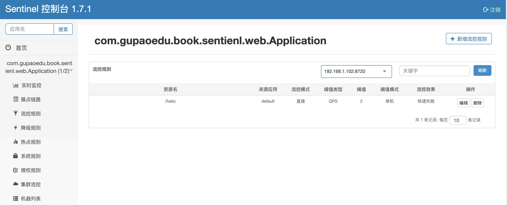
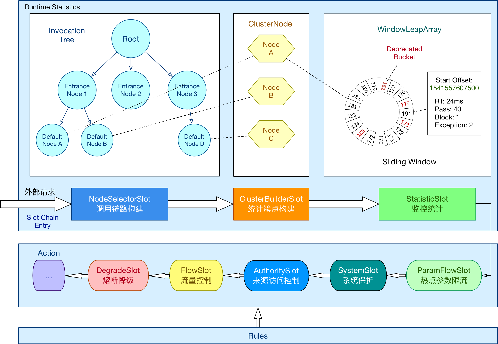

# 第六章 服务限流&熔断

互联网应用的最大特点就是信息传播速度非常快，例如大促活动、秒杀、春运等诸多场景使我们的应用系统每秒需要承受百万级、千万级、甚至是亿级的流量。但是任何系统的处理能力都有限，应该如何应对这些高并发场景？又涉及哪些技术原理？ 我们带着这些疑问来学习本章节的内容。

## 6.1 认识Sentinel

### 6.1.1 Sentinel 是什么

随着微服务的流行，服务和服务之间的稳定性变得越来越重要。Sentinel 是面向分布式服务架构的轻量级流量控制组件，主要以流量为切入点，从限流、流量整形、熔断降级、系统负载保护等多个维度来帮助我们保障微服务的稳定性。


在阿里内部有一句口号“稳定压倒一切”，稳定性是系统的基础能力，稳定性差的系统会出现服务超时/服务不可用，给用户带来糟糕的体验，从而对业务造成恶劣影响。所以系统稳定性这是一条“红线”，任何业务需求或是技术架构升级都不应该越过它。

Sentinel 在阿里内部被广泛使用，为多年双11、双12、年货节、618等大促活动保驾护航，自Sentinel 开源以来被越来越多的互联网企业采用。


### 6.1.1 Sentinel 快速入门

#### 集成在Spring Cloud Alibaba 中使用

- step1  在代码工程的pom.xml中引用jar包

  ```xml
  <dependency>
      <groupId>com.alibaba.cloud</groupId>
      <artifactId>spring-cloud-starter-alibaba-sentinel</artifactId>
  </dependency>
  ```

- step2  提供http接口、定义资源

  ```java
  @SpringBootApplication
  public class Application {
  
      public static void main(String[] args) {
          SpringApplication.run(Application.class, args);
        	initFlowRules();
      }
  }
  
  @RestController
  public class TestController {
  
      @GetMapping(value = "/hello")
      public String hello() {
          return "Hello Sentinel";
      }
  }
  ```

  定义资源只需要使用@SentinelResource，如果不需要处理限流异常，则可以省略`blockHandler`参数和方法。

- step3  定义限流规则

  ```java
  private static void initFlowRules(){
      List<FlowRule> rules = new ArrayList<>();
      FlowRule rule = new FlowRule();
      rule.setResource("/hello");
      rule.setGrade(RuleConstant.FLOW_GRADE_QPS);
      rule.setCount(2);
      rules.add(rule);
      FlowRuleManager.loadRules(rules);
  }
  ```

- step4 查看效果

  Demo 运行之后，当有大量请求访问http://{ip}:{port}/hello能够看到每秒限流2次，日志在 `~/logs/csp/${包名-类名}-metrics.log.xxx` 里看到下面的输出:

  `1579460708000|2020-01-20 03:05:08|/hello|1|0|1|0|2|0|0|0
  1579460709000|2020-01-20 03:05:09|/hello|2|4|2|0|0|0|0|0
  1579460710000|2020-01-20 03:05:10|/hello|1|2|1|0|0|0|0|0`

  具体日志格式：`timestamp|yyyy-MM-dd HH:mm:ss|resource|passQps|blockQps|successQps|exceptionQps|rt|occupiedPassQps|concurrency|classification`

  其中 `passQps` 代表通过的请求， `blockQps` 代表被阻止的请求， `successQps` 代表成功执行完成的请求个数， `exceptionQps` 代表用户自定义的异常， `rt` 代表平均响应时长，`occupiedPassQps`代表优先通过的请求，`concurrency`代表并发量，`classification` 代表资源类型。


通过上面的Demo中可以看到sentinel使用非常简便，并不需要侵入业务代码，在代码pom.xml中引入`spring-cloud-starter-alibaba-sentinel`组件。sentinel组件默认对@RestController的接口定义了资源，只需要对资源设置对应的流控规则即可。


- 自定义资源

在个别场景中，业务需要对流控做异常处理，或者需要配置降级熔断，默认资源定义不满足业务需求，支持通过注解`@SentinelResource`自定义资源。

```java
@GetMapping(value = "/hello")
@SentinelResource(value = "HelloWorld", blockHandler = "blockHandler")
public String hello() {
    return "Hello Sentinel";
}

public String blockHandler(BlockException ex) {
    System.out.println("处理限流异常 !!!");
    return "block !!!";
}
```
修改对应的流控规则配置，资源名称为`@SentinelResource`中的value值。`@SentinelResource`注解具体参数说明如下：

| 参数名             | 参数说明                                                     | 备注                           |
| ------------------ | ------------------------------------------------------------ | ------------------------------ |
| value              | 资源名称                                                     | 必填项                         |
| entryType          | entry 类型                                                   | 可选项（默认为 EntryType.OUT） |
| resourceType       | 资源类型                                                     | 可选项                         |
| blockHandler       | 处理流控异常的方法名称，返回值类型必须与原方法返回值类型一致，参数列表需要和原方法一致，最后加一个额外的类型为BlockException的参数 | 可选项                         |
| blockHandlerClass  | 处理流控异常对应类的Class对象，与blockHandler搭配使用        | 可选项                         |
| fallback           | 处理任何异常的方法名称，返回值类型必须与原方法返回值类型一致，参数列表需要和原方法一致，可以额外多一个Throwable类型的参数用于接收对应的异常 | 可选项                         |
| defaultFallback    | 返回值类型必须与原方法返回值类型一致，但方法参数列表需要为空，可以额外多一个Throwable类型的参数用于接收对应的异常，如果与fallback同时配置仅fallback生效 | 可选项                         |
| fallbackClass      | 处理任何异常对应类的Class对象，与fallback搭配使用            | 可选项                         |
| exceptionsToTrace  | 指定哪些异常被trace跟踪记录                                  | 可选项                         |
| exceptionsToIgnore | 指定哪些异常被忽略掉，不计入异常统计中，也不进入fallback 逻辑 | 可选项                         |

blockHandler和fallback的区别在于限流降级时抛出的BlockException时只会进入blockHandler处理，fallback可处理业务异常。如果blockHandler、blockHandlerClass、fallback、defaultFallback、fallbackClass都未配置，限流降级时BlockException会直接抛出给调用方。


```java
private static void initFlowRules(){
    List<FlowRule> rules = new ArrayList<>();
    FlowRule rule = new FlowRule();
    rule.setResource("HelloWorld");
    rule.setGrade(RuleConstant.FLOW_GRADE_QPS);
    rule.setCount(2);
    rules.add(rule);
    FlowRuleManager.loadRules(rules);
}
```

到此，可能大家会发现有个小问题，如果需要修改流控规则怎么办，总不可能每次都去修改代码吧？ 对的，确实可以不需要每次去修改代码的方式来修改流控规则，sentinel提供控制台界面修改，无需在代码中设置。



- sentinel控制台安装步骤
  1. 到sentinel官网下载sentinel-dashboard的jar包
  2. 启动sentinel控制台，默认端口是8080，端口可以自定义，启动命令：`java -Dserver.port=7777 -Dcsp.sentinel.dashboard.server=localhost:7777 -Dproject.name=sentinel-dashboard -jar sentinel-dashboard.jar`
  3. 访问sentinel控制台：http://localhost:7777/  账号和密码默认都是sentinel

- 应用中配置控制台

  1. 在application.yml中加入配置

     ```yml
     spring:
       cloud:
         sentinel:
           transport:
             port: 8719
             dashboard: localhost:7777
     ```

  2. 删除原代码中的`initFlowRules()`，使用控制台配置规则。需要注意的是demo中限流规则未持久化，重启后就没有了，线上使用sentinel需要实现持久化，在此不过多介绍，详情可参考sentinel官网介绍。


#### 集成在非Spring Cloud 应用中使用

Sentinel在Spring Cloud Alibaba之前就已经诞生了，所以Sentinel也可以作为独立工具使用。

- step1  在代码工程的pom.xml中引用jar包

```xml
<dependency>
    <groupId>com.alibaba.csp</groupId>
    <artifactId>sentinel-core</artifactId>
    <version>1.7.1</version>
</dependency>
```

- step2  定义限流规则

对资源名为HelloWorld的限流qps设置为20，即每秒仅允许通过20个请求。当然，这里也可以通过控制台设置流控规则。

```java
private static void initFlowRules(){
    List<FlowRule> rules = new ArrayList<>();
    FlowRule rule = new FlowRule();
    rule.setResource("HelloWorld");
    rule.setGrade(RuleConstant.FLOW_GRADE_QPS);
    // Set limit QPS to 20.
    rule.setCount(20);
    rules.add(rule);
    FlowRuleManager.loadRules(rules);
}
```

- step3  定义资源

doSomething()是业务逻辑方法，需要对收到的请求流量进行控制，使用API中的SphU.entry("HelloWorld")即可用到step2中定义的限流规则。

```java
private static void doSomething() {
    try (Entry entry = SphU.entry("HelloWorld")) {
      // 业务逻辑处理
      System.out.println("hello world  " + System.currentTimeMillis());
    } catch (BlockException ex) {
      // 处理被流控的逻辑
    }
}

public static void main(String[] args) {
    initFlowRules();
    while (true) {
      doSomething();
    }
}
```

- step4 查看效果

Demo 运行之后，我们可以在日志 `~/logs/csp/${包名-类名}-metrics.log.xxx` 里看到下面的输出:

```
1578725383000|2020-01-11 14:49:43|HelloWorld|20|489173|20|0|0|0|0|0
1578725384000|2020-01-11 14:49:44|HelloWorld|20|486784|20|0|0|0|0|0
1578725385000|2020-01-11 14:49:45|HelloWorld|20|481406|20|0|0|0|0|0
```

可以看到，这个程序每秒稳定输出 "hello world" 20 次，和规则中预先设定的阈值是一样的，而被拒绝的请求达到每秒40多万次。


通过这两个demo相信大家已经掌握了sentinel的基本用法，并且接触到了其中的一些概念，例如资源、规则等，接下来我们先学习Sentinel中有哪些重要的概念，对于我们后续理解其整体设计和核心模块有较大的帮助。


### 6.1.2 Sentinel 基本概念

我们使用Sentinel的核心目的如果用一句话概括，那就是通过一切办法来做流量控制。

流量控制在网络传输中是一个常用的概念，它用于调整网络包的发送数据。然而，从系统稳定性角度考虑，在处理请求的速度上，也有非常多的讲究。任意时间到来的请求往往是随机不可控的，而系统的处理能力是有限的。我们需要根据系统的处理能力对流量进行控制。Sentinel 作为一个调配器，可以根据需要把随机的请求调整成合适的形状，如下图所示：


流量控制有以下几个角度:

- 资源的调用关系，例如资源的调用链路，资源和资源之间的关系；

- 运行指标，例如 QPS、线程池、系统负载等；
- 控制的效果，例如直接限流、冷启动、排队等。

Sentinel 的设计理念是让您自由选择控制的角度，并进行灵活组合，从而达到想要的效果。

围绕着这一核心目标，我们来了解Sentinel 中以下这些重要的基本概念

- Entry

资源Entry是 Sentinel 的关键概念。它可以是 Java 应用程序中的任何内容，例如，由应用程序提供的服务，或由应用程序调用的其它应用提供的服务，甚至可以是一段代码。只要通过 Sentinel API 定义的代码，就是资源，能够被 Sentinel 保护起来。

- Metric

指标Metric是描述系统运行过程中对流量的统计情况，表示系统的实时状态，在限流或降级时就是根据指标和规则进行判断。具体指标数据有例如前面我们才能从日志中看到的`passQps`通过的请求、`blockQps`拒绝的请求、`rt`响应时长。

- Rule

围绕资源的实时状态设定的规则，可以包括流量控制规则、熔断降级规则以及系统保护规则。所有规则可以动态实时调整。 例如，前面demo中我们所使用的就是流量控制规则。

- Node

Sentinel中统计数据是按Node节点概念，根据不同场景的统计需求细化了4种Node的具体实现。具体场景有根据调用链路限流、根据来源应用限流等。

​		StatisticNode：最为基础的统计节点，包含秒级和分钟级两个滑动窗口结构。

​		DefaultNode：链路节点，用于统计调用链路上某个资源的数据，维持树状结构。

​		ClusterNode：簇点，用于统计每个资源全局的数据。 

​		EntranceNode：入口节点，特殊的链路节点，对应某个 Context 入口的所有调用数据。

- Context

Context 代表调用链路上下文，几乎每个组件中都能见到Context 的身影，Context 中会存储运行时的重要信息。Sentinel中的Context贯穿一次调用链路中的所有Entry，持有入口节点（entranceNode）、本次调用链路的 curEntry、调用来源（origin）等信息。

- Slot

Slot是功能插槽，Sentinel存在多个不同的Slot，每个Slot承担了不同的职责。例如LogSlot负责记录日志、StatisticSlot负责统计指标数据、FlowSlot负责限流等。这是一种职责分离的设计，每个模块更聚焦于实现某个功能。


到此，相信大家对Sentinel已经有了一个全面的基本了解，接下来笔者将为大家讲述其中的核心部分的源码，源码取自1.7.1版本。


## 6.2 Sentinel核心功能

接下来笔者将带大家深入源码来学习其核心功能的实现，涉及3部分的内容：工作流程、数据结构、限流算法。过程中会忽略一些参数校验、非重要方法等代码。

下图引自sentinel官网，图上面部分是数据结构相关，图中间部分是工作流程，图底部的Rules会涉及限流算法。




### 6.2.1 工作流程——核心骨架

从上图可以看出来，调用链路是 Sentinel 的工作主流程，是由各个Slot插槽组成，将不同的 Slot 按照顺序串在一起（责任链模式），从而将不同的功能（限流、降级、系统保护）组合在一起。 

启用 Sentinel 时会加载`ProcessorSlotChain`调用链，支持通过SPI机制扩展，用户可以实现自定义的`Slot`，也可以自定义执行顺序。

```java
public final class SlotChainProvider {

    private static volatile SlotChainBuilder slotChainBuilder = null;

    public static ProcessorSlotChain newSlotChain() {
        // Resolve the slot chain builder SPI.
        slotChainBuilder = SpiLoader.loadFirstInstanceOrDefault(SlotChainBuilder.class, DefaultSlotChainBuilder.class);
        return slotChainBuilder.build();
    }
}
```

`SpiLoader#loadFirstInstanceOrDefault`表示优先使用SPI用户自定义流程，如果用户未自定义，则其默认实现是`DefaultSlotChainBuilder`，`SlotChainBuilder#build`即构建好调用链`ProcessorSlotChain`

```java
public class DefaultSlotChainBuilder implements SlotChainBuilder {

    @Override
    public ProcessorSlotChain build() {
        ProcessorSlotChain chain = new DefaultProcessorSlotChain();
        chain.addLast(new NodeSelectorSlot());
        chain.addLast(new ClusterBuilderSlot());
        chain.addLast(new LogSlot());
        chain.addLast(new StatisticSlot());
        chain.addLast(new AuthoritySlot());
        chain.addLast(new SystemSlot());
        chain.addLast(new FlowSlot());
        chain.addLast(new DegradeSlot());
        return chain;
    }
}
```

各个Slot的职责

- NodeSelectorSlot 负责收集资源的调用路径，以树状结构存储调用栈，用于根据调用路径来限流降级
- ClusterBuilderSlot 负责创建以资源名维度统计的ClusterNode，以及创建每个ClusterNode下按调用来源origin的StatisticNode
- LogSlot 仅出现限流、熔断、系统保护时负责记录日志
- AuthoritySlot 权限控制，支持黑名单和白名单2种策略
- SystemSlot 控制总的入口流量，限制条件依次是总qps、总线程数、RT阈值、操作系统当前load1、操作系统当前cpu利用率
- FlowSlot 根据限流规则和各个Node中统计数据进行限流判断
- DegradeSlot 根据熔断规则和各个Node中统计数据进行熔断降级
- StatisticSlot 统计不同纬度的请求数、通过数、限流数、线程数等runtime信息，这些数据存储在DefaultNode、OriginNode、ClusterNode中


接下来笔者将根据执行顺序依次详细讲解各个Slot


#### 调用链路构建

Sentinel支持按调用链路配置流控规则，所以需要收集资源的调用路径。NodeSelectorSlot是执行的第一个Slot，仅负责构建一个树形结构的请求链。

```java
private volatile Map<String, DefaultNode> map = new HashMap<String, DefaultNode>(10);

@Override
public void entry(Context context, ResourceWrapper resourceWrapper, Object obj, int count, boolean prioritized, Object... args)
    throws Throwable {
    // 根据资源name查询DefaultNode
    DefaultNode node = map.get(context.getName());
    if (node == null) {
        synchronized (this) {
            node = map.get(context.getName());
            if (node == null) {
                // node为null时根据资源resource创建
                node = new DefaultNode(resourceWrapper, null);
                HashMap<String, DefaultNode> cacheMap = new HashMap<String, DefaultNode>(map.size());
                cacheMap.putAll(map);
                cacheMap.put(context.getName(), node);
                map = cacheMap;
                // 构建一个调用链保存在context中
                ((DefaultNode) context.getLastNode()).addChild(node);
            }
        }
    }

    context.setCurNode(node);
  	// 执行下一个Slot
    fireEntry(context, resourceWrapper, node, count, prioritized, args);
}
```
执行结果如下图所示

```
                   machine-root
                   /         \
                  /           \
          EntranceNode1   EntranceNode2
                /               \
               /                 \
       DefaultNode(nodeA)   DefaultNode(nodeA)
              |                    |
              +- - - - - - - - - - +- - - - - - -> ClusterNode(nodeA);
```
EntranceNode是入口节点，每一种入口都会在上下文Context中创建。将调用链构建成这样的树形结构是为了满足不同维度的数据统计使用。
- 按DefaultNode统计，统计当前请求的runtime信息

- 按EntranceNode统计，可以统计这个入口下所有资源的runtime信息

- 按ClusterNode统计，可以统计一个资源在不同入口下的所有runtime信息

  

#### 统计簇点构建

ClusterBuilderSlot 负责创建以资源名维度统计的ClusterNode，以及创建每个ClusterNode下按调用来源origin的StatisticNode。如果从调用链的角度看，ClusterNode是一个横向的切面，ClusterBuilderSlot和NodeSelectorSlot一样也是为后续统计runtime信息做准备工作。

```java
private static volatile Map<ResourceWrapper, ClusterNode> clusterNodeMap = new HashMap<>();

private static final Object lock = new Object();

private volatile ClusterNode clusterNode = null;

@Override
public void entry(Context context, ResourceWrapper resourceWrapper, DefaultNode node, int count, boolean prioritized, Object... args)
    throws Throwable {
    if (clusterNode == null) {
        synchronized (lock) {
            if (clusterNode == null) {
                // 根据资源名和资源类型创建ClusterNode
                clusterNode = new ClusterNode(resourceWrapper.getName(), resourceWrapper.getResourceType());
                HashMap<ResourceWrapper, ClusterNode> newMap = new HashMap<>(Math.max(clusterNodeMap.size(), 16));
                newMap.putAll(clusterNodeMap);
                newMap.put(node.getId(), clusterNode);

                clusterNodeMap = newMap;
            }
        }
    }
    node.setClusterNode(clusterNode);
    
    // 根据来源origin创建OriginNode
    if (!"".equals(context.getOrigin())) {
        Node originNode = node.getClusterNode().getOrCreateOriginNode(context.getOrigin());
        context.getCurEntry().setOriginNode(originNode);
    }

    fireEntry(context, resourceWrapper, node, count, prioritized, args);
}
```
ClusterNode的作用前面讲过了，这里不再复述。那OriginNode是什么？实际是没有OriginNode这种类型，它是一个StatisticNode，用于统计调用来源的runtime信息。
例如用户服务，会被订单和交易系统调用，这时候用户服务resouce的origin就有订单和交易。对不同来源的请求设置不同限流规则时就会用到，这个业务中很常见，不同来源的请求重要程度不一样，需要区分对待。


#### 日志记录

LogSlot 仅出现限流、熔断、系统保护时负责记录日志

```java
@Override
public void entry(Context context, ResourceWrapper resourceWrapper, DefaultNode obj, int count, boolean prioritized, Object... args)
    throws Throwable {
    try {
        // 正常情况什么都不需要做
        fireEntry(context, resourceWrapper, obj, count, prioritized, args);
    } catch (BlockException e) {
        EagleEyeLogUtil.log(resourceWrapper.getName(), e.getClass().getSimpleName(), e.getRuleLimitApp(), context.getOrigin(), count);
        throw e;
    } catch (Throwable e) {
        RecordLog.warn("Unexpected entry exception", e);
    }
}
```
LogSlot类的代码就是这么简单，正常情况下不需要做任何事情，有异常时则记录日志。 大家仅需知道Sentinel有记录哪些日志，而这些日志又记录在哪，方便在排查线上问题时能快速找到帮助定位问题。
- BlockException则把日志记录到sentinel-block.log，BlockException（子类）包含以下几种异常
    - AuthorityException 权限异常
    - FlowException 限流异常
    - DegradeException 熔断异常
    - ParamFlowException 参数限流异常
    - SystemBlockException 系统保护异常
- 其他业务异常则记录到sentinel-record.log


#### 来源访问控制

来源访问控制属于权限控制，权限控制也几乎是任何系统必备的。哪些流量允许请求被保护的资源，哪些流量又不允许请求被保护的资源，从这开始就会涉及到规则配置（rule）。AuthoritySlot 用于做权限控制，支持黑名单和白名单2种策略。

```java
@Override
public void entry(Context context, ResourceWrapper resourceWrapper, DefaultNode node, int count, boolean prioritized, Object... args)
    throws Throwable {
    checkBlackWhiteAuthority(resourceWrapper, context);
    fireEntry(context, resourceWrapper, node, count, prioritized, args);
}

void checkBlackWhiteAuthority(ResourceWrapper resource, Context context) throws AuthorityException {
    // 从缓存中拿到所有黑白名单规则
    Map<String, Set<AuthorityRule>> authorityRules = AuthorityRuleManager.getAuthorityRules();
    // 拿到该资源的黑白名单规则列表
    Set<AuthorityRule> rules = authorityRules.get(resource.getName());
    for (AuthorityRule rule : rules) {
        // 如果不符合规则抛出AuthorityException
        if (!AuthorityRuleChecker.passCheck(rule, context)) {
            throw new AuthorityException(context.getOrigin(), rule);
        }
    }
}
```
所以关键代码在AuthorityRuleChecker.passCheck(rule, context)

```java
static boolean passCheck(AuthorityRule rule, Context context) {
    // 从上下文context中拿到当前来源origin
    String requester = context.getOrigin();
    // 来源为空或者规则未配置直接返回通过
    if (StringUtil.isEmpty(requester) || StringUtil.isEmpty(rule.getLimitApp())) {
        return true;
    }

    // contain指当前来源是否在规则中，规则中设置的多个来源系统名称用逗号分隔的
    int pos = rule.getLimitApp().indexOf(requester);
    boolean contain = pos > -1;
    if (contain) {
        boolean exactlyMatch = false;
        String[] appArray = rule.getLimitApp().split(",");
        for (String app : appArray) {
            if (requester.equals(app)) {
                exactlyMatch = true;
                break;
            }
        }
        contain = exactlyMatch;
    }
    
    // 黑名单策略，如果当前来源在黑名单中返回不通过
    int strategy = rule.getStrategy();
    if (strategy == RuleConstant.AUTHORITY_BLACK && contain) {
        return false;
    }
    
    // 白名单策略，如果当前来源不在白名单中返回不通过
    if (strategy == RuleConstant.AUTHORITY_WHITE && !contain) {
        return false;
    }
    
    // 都没命中则就是通过了
    return true;
}
```
AuthoritySlot的代码总结如下：
- 一个资源可以对应有多个规则；
- 一个规则可以配置多个限制来源（应用名称），用逗号分隔；
- 规则策略分为2种，白名单和黑名单；
    - 白名单策略，当前请求的来源必须在规则中，否则不通过
    - 黑名单策略，当前请求的来源必须不在规则中，否则不通过
- 任意一个规则不满足则不通过，抛出AuthorityException，则请求中断不会继续执行其他Slot。


#### 系统保护

我们通常会设置一些限流或降级熔断规则，这些规则都是根据线上实际情况，或者是我们的经验和其他方法预估出来的。但由人来主观设置的规则往往不是绝对的可靠，原因是可能因为误操作规则中的阈值写错了，可能是突发流量超出我们的预估，也可能是操作系统或物理机不稳定等。在这些场景下原有配置好的规则不足以保护我们的服务，Sentinel采用了自动保护机制来应对。自动保护机制是当发现系统不稳定时优先进行流控，来达到保护系统的目的。具体实现在`SystemSlot`类，`SystemSlot`控制总的入口流量，限制的指标依次是总qps、总线程数、RT阈值、操作系统当前load1、操作系统当前cpu利用率

```java
@Override
public void entry(Context context, ResourceWrapper resourceWrapper, DefaultNode node, int count, boolean prioritized, Object... args) throws Throwable {
    SystemRuleManager.checkSystem(resourceWrapper);
    fireEntry(context, resourceWrapper, node, count, prioritized, args);
}
```
实际干活的代码在SystemRuleManager.checkSystem(resourceWrapper)

```java
public static void checkSystem(ResourceWrapper resourceWrapper) throws BlockException {
    // 开关没打开则不需要检查
    if (!checkSystemStatus.get()) {
        return;
    }
    // 只检查入口流量
    if (resourceWrapper.getEntryType() != EntryType.IN) {
        return;
    }

    // 当单台机器上所有入口流量的QPS达到阈值即触发系统保护
    double currentQps = Constants.ENTRY_NODE == null ? 0.0 : Constants.ENTRY_NODE.successQps();
    if (currentQps > qps) {
        throw new SystemBlockException(resourceWrapper.getName(), "qps");
    }

    // 当单台机器上所有入口流量的并发线程数达到阈值即触发系统保护
    int currentThread = Constants.ENTRY_NODE == null ? 0 : Constants.ENTRY_NODE.curThreadNum();
    if (currentThread > maxThread) {
        throw new SystemBlockException(resourceWrapper.getName(), "thread");
    }
    
    // 当单台机器上所有入口流量的平均RT达到阈值即触发系统保护
    double rt = Constants.ENTRY_NODE == null ? 0 : Constants.ENTRY_NODE.avgRt();
    if (rt > maxRt) {
        throw new SystemBlockException(resourceWrapper.getName(), "rt");
    }

    // 操作系统当前的load1，大于阈值则抛异常
    if (highestSystemLoadIsSet && getCurrentSystemAvgLoad() > highestSystemLoad) {
        if (!checkBbr(currentThread)) {
            throw new SystemBlockException(resourceWrapper.getName(), "load");
        }
    }

    // 操作系统当前的cpu利用率，大于阈值则抛异常
    if (highestCpuUsageIsSet && getCurrentCpuUsage() > highestCpuUsage) {
        throw new SystemBlockException(resourceWrapper.getName(), "cpu");
    }
}
```
SystemSlot的代码总结如下：
- SystemSlot是系统自动保护机制，目的是防止用户设置规则不合理时，大量异常流量把系统打挂；
- SystemSlot默认没有开启，用户可以自己选择是否启用；
- Load自适应：系统的 load1 作为启发指标，进行自适应系统保护。当系统 load1 超过设定的启发值，且系统当前的并发线程数超过估算的系统容量时才会触发系统保护（BBR 阶段）。系统容量由系统的 maxQps * minRt 估算得出。设定参考值一般是 CPU cores * 2.5；
- CPU使用率：当系统 CPU 使用率超过阈值即触发系统保护（取值范围 0.0-1.0），设定参考值一般是 0.4~0.6（笔者线上经验）


#### 流量控制（限流）

FlowSlot是Sentinel整个流程的重点代码，根据限流规则和各个Node中统计数据进行限流判断。
```java
private final FlowRuleChecker checker;

@Override
public void entry(Context context, ResourceWrapper resourceWrapper, DefaultNode node, int count, boolean prioritized, Object... args) throws Throwable {
    checkFlow(resourceWrapper, context, node, count, prioritized);
    fireEntry(context, resourceWrapper, node, count, prioritized, args);
}

void checkFlow(ResourceWrapper resource, Context context, DefaultNode node, int count, boolean prioritized)
    throws BlockException {
    // 限流检查
    checker.checkFlow(ruleProvider, resource, context, node, count, prioritized);
}

private final Function<String, Collection<FlowRule>> ruleProvider = new Function<String, Collection<FlowRule>>() {
    @Override
    public Collection<FlowRule> apply(String resource) {
        // 执行限流检查
        Map<String, List<FlowRule>> flowRules = FlowRuleManager.getFlowRuleMap();
        return flowRules.get(resource);
    }
};
```
根据资源名拿到所有限流规则，遍历每个限流规则，其中一个规则触发限流则抛出限流异常

```java
public void checkFlow(Function<String, Collection<FlowRule>> ruleProvider, ResourceWrapper resource, Context context, DefaultNode node, int count, boolean prioritized) throws BlockException {
    // 拿到所有限流规则
    Collection<FlowRule> rules = ruleProvider.apply(resource.getName());
    if (rules != null) {
        for (FlowRule rule : rules) {
            // 检查是否通过每个限流规则
            if (!canPassCheck(rule, context, node, count, prioritized)) {
                throw new FlowException(rule.getLimitApp(), rule);
            }
        }
    }
}

public boolean canPassCheck(/*@NonNull*/ FlowRule rule, Context context, DefaultNode node, int acquireCount, boolean prioritized) {
    String limitApp = rule.getLimitApp();
    // 集群模式
    if (rule.isClusterMode()) {
        return passClusterCheck(rule, context, node, acquireCount, prioritized);
    }
    // 单机模式
    return passLocalCheck(rule, context, node, acquireCount, prioritized);
}
```
单机模式的限流是在本机独立完成，不需要依赖集群环境，也是最常用的场景。

```java
private static boolean passLocalCheck(FlowRule rule, Context context, DefaultNode node, int acquireCount, boolean prioritized) {
    // 根据来源和策略获取Node，从而为了拿到统计的runtime信息                                     
    Node selectedNode = selectNodeByRequesterAndStrategy(rule, context, node);
    if (selectedNode == null) {
        return true;
    }
    // 使用流量控制器检查是否通过
    return rule.getRater().canPass(selectedNode, acquireCount, prioritized);
}
```
先看下selectNodeByRequesterAndStrategy的具体逻辑

```java
static Node selectNodeByRequesterAndStrategy(/*@NonNull*/ FlowRule rule, Context context, DefaultNode node) {
    // limitApp是限流规则中设置的流量来源应用，默认是default，用户也可以对指定的应用设置
    String limitApp = rule.getLimitApp();
    // strategy是限流规则中设置的策略
    int strategy = rule.getStrategy();
    // 当前流量的来源
    String origin = context.getOrigin();

    // 场景1. 限流规则设置了具体应用，当前流量就是如果也是该应用，则命中场景1
    if (limitApp.equals(origin) && filterOrigin(origin)) {
        if (strategy == RuleConstant.STRATEGY_DIRECT) {
            // 匹配中了来源，返回OriginNode
            return context.getOriginNode();
        }
        return selectReferenceNode(rule, context, node);
    }
    // 场景2. 限流规则未指定任何具体应用，默认default，则当前流量直接命中场景2
    else if (RuleConstant.LIMIT_APP_DEFAULT.equals(limitApp)) {
        if (strategy == RuleConstant.STRATEGY_DIRECT) {
            // 未匹配中来源，返回ClusterNode
            return node.getClusterNode();
        }
        return selectReferenceNode(rule, context, node);
    }
    // 场景3. 限流规则设置的是other，当前流量未命中前2种场景
    else if (RuleConstant.LIMIT_APP_OTHER.equals(limitApp)
        && FlowRuleManager.isOtherOrigin(origin, rule.getResource())) {
        if (strategy == RuleConstant.STRATEGY_DIRECT) {
            return context.getOriginNode();
        }
        return selectReferenceNode(rule, context, node);
    }
    return null;
}
```
先解释一下3种场景，假设我们对接口UserService配置限流1000 QPS
- 第1种，目的是优先保障重要的来源流量。我们需要区分调用来源，将限流规则细化。对A应用配置500 QPS，对B应用配置200 QPS，此时会产生2条规则。A应用请求的流量限制在500，B应用请求的流量限制在200
- 第2种，没有特别重要的来源流量。我们不想区分调用来源，所有入口调用UserService的共享这一个规则，所有client加起来总流量只能通过1000 QPS。
- 第3种，配合第1种场景使用，长尾应用多的情况不想对每个应用进行设置，没有具体设置的应用都将命中这里。

限流的策略有3种
- 直接： 默认方式，不和其他流量有关系
- 链路： 对同一个入口（EntranceNode）限流，适用于同一个入口下多个资源构成的调用链路。
- 关联： 可与其他资源关联同一个规则，适用于多个资源会相互影响的场景。例如读DB和写DB是两个资源，相互会影响，读DB流量太高时会影响写DB，写DB流量太高时也会读DB。

限流算法有4种，后续章节会给大家详细介绍
- DefaultController  快速拒绝
- RateLimiterController 匀速
- WarmUpController 预热（冷启动）
- WarmUpRateLimiterController 匀速+预热


#### 降级熔断
降级熔断机制是避免服务调用链路出现雪崩效应的一种保护机制。

除了流量控制以外，对调用链路中不稳定的资源进行降级熔断也是保障高可用的重要措施之一。由于调用关系的复杂性，如果调用链路中的某个资源（服务）不稳定，最终会导致请求发生堆积。Sentinel 熔断降级会在调用链路中某个资源出现不稳定状态时（例如调用超时或异常比例升高），对这个资源的调用进行限制，让请求快速失败，避免影响到其它的资源而导致级联错误。当资源被降级后，在接下来的降级时间窗口之内，对该资源的调用都自动熔断。

举个例子说明，有2条调用链路，A服务-->B服务 和 A服务-->C服务，如果C服务不稳定出现大量超时，如果不做降级熔断处理的情况下，C服务的请求发生堆积可能会导致A服务也发生堆积。A服务-->C服务这条链路肯定是服务不可用了，但另外一条链路A服务-->B服务是无辜的，也由于A服务发生堆积导致不可用，这就容易造成大量调用链路出现雪崩。而如果采用降级熔断处理，当发现C服务不稳定时，掐断A服务-->C服务的链路，保护A服务不受影响，从而保护了另外一条调用链路不受影响。

熔断降级有3种策略，在创建规则可以设置
- RT (response time)
- 秒级异常比例
- 分钟异常数


```java
@Override
public void entry(Context context, ResourceWrapper resourceWrapper, DefaultNode node, int count, boolean prioritized, Object... args)
    throws Throwable {
    // 降级检查
    DegradeRuleManager.checkDegrade(resourceWrapper, context, node, count);
    // 调用下一个Slot
    fireEntry(context, resourceWrapper, node, count, prioritized, args);
}

## DegradeRuleManager.checkDegrade
public static void checkDegrade(ResourceWrapper resource, Context context, DefaultNode node, int count)
    throws BlockException {
    // 拿到所有降级规则
    Set<DegradeRule> rules = degradeRules.get(resource.getName());
    if (rules == null) {
        return;
    }
    // 遍历所有降级规则, 只要有一个规则不通过则抛异常
    for (DegradeRule rule : rules) {
        if (!rule.passCheck(context, node, count)) {
            throw new DegradeException(rule.getLimitApp(), rule);
        }
    }
}
```

具体实现在DegradeRule类的passCheck方法
```java
// 计数器
private AtomicLong passCount = new AtomicLong(0);
// RT阈值，或异常比例阈值，规则中设置
private double count;
// 降级策略
private int grade = RuleConstant.DEGRADE_GRADE_RT;
// 时间窗口，规则中设置
private int timeWindow;
// 异常RT次数阈值，默认5
private int rtSlowRequestAmount = RuleConstant.DEGRADE_DEFAULT_SLOW_REQUEST_AMOUNT;
// 最低请求次数阈值，默认5
private int minRequestAmount = RuleConstant.DEGRADE_DEFAULT_MIN_REQUEST_AMOUNT;

public boolean passCheck(Context context, DefaultNode node, int acquireCount, Object... args) {
    // 开关
    if (cut.get()) {
        return false;
    }
    // 从context中获取ClusterNode，为了下面获取本次请求资源的runtime信息
    ClusterNode clusterNode = ClusterBuilderSlot.getClusterNode(this.getResource());
    if (clusterNode == null) {
        return true;
    }
    // 阈值类型：RT
    if (grade == RuleConstant.DEGRADE_GRADE_RT) {
        // 最近1秒的平均RT
        double rt = clusterNode.avgRt();
        // 平均RT小于RT阈值则清空计数器, 并返回通过
        if (rt < this.count) {
            passCount.set(0);
            return true;
        }
        
        // 平均RT大于等于RT阈值，计数器+1
        // 如果计数器小于计数阈值则返回通过，这阈值是为了忽略偶尔一两次波动大的毛刺
        if (passCount.incrementAndGet() < rtSlowRequestAmount) {
            return true;
        }
    } 
    // 阈值类型：秒级异常比例
    else if (grade == RuleConstant.DEGRADE_GRADE_EXCEPTION_RATIO) {   
        // 最近1秒异常数
        double exception = clusterNode.exceptionQps();
        // 最近1秒成功数
        double success = clusterNode.successQps();
        // 最近1秒请求数
        double total = clusterNode.totalQps();
        // 如果请求数小于阈值，返回通过。这阈值是为了避免请求量低时统计不准确的情况
        if (total < minRequestAmount) {
            return true;
        }

        // 如果成功数小于等于异常数，且异常数小于阈值时则通过
        double realSuccess = success - exception;
        if (realSuccess <= 0 && exception < minRequestAmount) {
            return true;
        }
        
        // 如果异常比例小于阈值时通过
        if (exception / success < count) {
            return true;
        }
    } 
    // 阈值类型：分钟异常数 
    else if (grade == RuleConstant.DEGRADE_GRADE_EXCEPTION_COUNT) {   
        // 最近1分钟的异常总数
        double exception = clusterNode.totalException();
        // 如果异常总数小于阈值则通过
        if (exception < count) {
            return true;
        }
    }
    
    // 所有不通过要降级都在这处理
    // 如果是未降级则开启降级, 如果已经是降级中则不处理
    if (cut.compareAndSet(false, true)) {
        // 启动定时任务，时间窗口后降级取消，并重新开始计数
        ResetTask resetTask = new ResetTask(this);
        pool.schedule(resetTask, timeWindow, TimeUnit.SECONDS);
    }
    // 返回不通过，外部抛出降级异常
    return false;
}
```
DegradeSlot总结
- 创建熔断降级规则时，可以设置资源名称、降级策略、阈值、时间窗口等。 
- 触发降级后，在一个时间窗口后降级会恢复继续提供服务。例如时间窗口设置是3分钟，触发降级3分钟后会自动恢复。原因是通常情况下系统不稳定只是暂时的，过完这段时间需要自动恢复。
- rtSlowRequestAmount和minRequestAmount排除了小概率的毛刺，让降级判断更为准确。


#### 实时指标统计

StatisticSlot是用来统计实时指标，例如请求次数、成功次数、RT、线程数、拒绝次数等。在进入entry和退出entry时分别统计不同指标，具体见下面代码分析。

先看进入entry方法
```java
@Override
public void entry(Context context, ResourceWrapper resourceWrapper, DefaultNode node, int count, boolean prioritized, Object... args) throws Throwable {
    try {
        // 先执行后续Slot检查，再统计数据
        fireEntry(context, resourceWrapper, node, count, prioritized, args);

        // 增加线程数和请求通过数
        node.increaseThreadNum();
        node.addPassRequest(count);
        
        // 如果存在来源节点，对来源节点增加线程数和请求通过数
        if (context.getCurEntry().getOriginNode() != null) {
            context.getCurEntry().getOriginNode().increaseThreadNum();
            context.getCurEntry().getOriginNode().addPassRequest(count);
        }
        
        // 如果是入口流量, 对全局节点增加线程数和请求通过数
        if (resourceWrapper.getEntryType() == EntryType.IN) {
            Constants.ENTRY_NODE.increaseThreadNum();
            Constants.ENTRY_NODE.addPassRequest(count);
        }

        // 执行事件通知和回调函数
        for (ProcessorSlotEntryCallback<DefaultNode> handler : StatisticSlotCallbackRegistry.getEntryCallbacks()) {
            handler.onPass(context, resourceWrapper, node, count, args);
        }
    } 
    // 处理优先级等待异常
    catch (PriorityWaitException ex) {
        // 这里只增加线程数
        node.increaseThreadNum();
        
        // 如果有来源节点, 对来源节点增加线程数
        if (context.getCurEntry().getOriginNode() != null) {
            context.getCurEntry().getOriginNode().increaseThreadNum();
        }
        
        // 如果是入口流量, 对全局节点增加线程数
        if (resourceWrapper.getEntryType() == EntryType.IN) {
            Constants.ENTRY_NODE.increaseThreadNum();
        }
        
        // 执行事件通知和回调函数
        for (ProcessorSlotEntryCallback<DefaultNode> handler : StatisticSlotCallbackRegistry.getEntryCallbacks()) {
            handler.onPass(context, resourceWrapper, node, count, args);
        }
    } 
    // 处理限流、降级等异常，BlockException在LogSlot章节中有介绍
    catch (BlockException e) {
        // 对当前entry添加错误信息
        context.getCurEntry().setError(e);

        // 增加拒绝数
        node.increaseBlockQps(count);
        
        // 如果有来源节点, 对来源节点增加拒绝数
        if (context.getCurEntry().getOriginNode() != null) {
            context.getCurEntry().getOriginNode().increaseBlockQps(count);
        }
        
        // 如果是入口流量, 对全局节点增加拒绝数
        if (resourceWrapper.getEntryType() == EntryType.IN) {
            Constants.ENTRY_NODE.increaseBlockQps(count);
        }

        // 执行事件通知和回调函数
        for (ProcessorSlotEntryCallback<DefaultNode> handler : StatisticSlotCallbackRegistry.getEntryCallbacks()) {
            handler.onBlocked(e, context, resourceWrapper, node, count, args);
        }

        throw e;
    } 
    // 处理业务异常
    catch (Throwable e) {
        // 对当前entry添加错误信息
        context.getCurEntry().setError(e);

        // 增加异常数
        node.increaseExceptionQps(count);
        
        // 如果有来源节点, 对来源节点增加异常数
        if (context.getCurEntry().getOriginNode() != null) {
            context.getCurEntry().getOriginNode().increaseExceptionQps(count);
        }

        // 如果是入口流量, 对全局节点增加异常数
        if (resourceWrapper.getEntryType() == EntryType.IN) {
            Constants.ENTRY_NODE.increaseExceptionQps(count);
        }
        
        // 统计完数据最后抛出异常 
        throw e;
    }
}
```

entry时退出也需要统计数据，看下exit方法

```java
@Override
public void exit(Context context, ResourceWrapper resourceWrapper, int count, Object... args) {
    DefaultNode node = (DefaultNode)context.getCurNode();
    // 没有错误的情况才统计
    if (context.getCurEntry().getError() == null) {
        // 计算RT, RT = 当前时间 - entry创建时间
        long rt = TimeUtil.currentTimeMillis() - context.getCurEntry().getCreateTime();
        if (rt > Constants.TIME_DROP_VALVE) {
            rt = Constants.TIME_DROP_VALVE;
        }

        // 增加RT和成功数
        node.addRtAndSuccess(rt, count);
        
        // 如果有来源节点, 对来源节点增加RT和成功数
        if (context.getCurEntry().getOriginNode() != null) {
            context.getCurEntry().getOriginNode().addRtAndSuccess(rt, count);
        }
        
        // 减少线程数
        node.decreaseThreadNum();
        
        // 如果有来源节点, 对来源节点减少线程数
        if (context.getCurEntry().getOriginNode() != null) {
            context.getCurEntry().getOriginNode().decreaseThreadNum();
        }
        
        // 如果是入口流量, 对全局节点减少线程数，并增加RT和成功数
        if (resourceWrapper.getEntryType() == EntryType.IN) {
            Constants.ENTRY_NODE.addRtAndSuccess(rt, count);
            Constants.ENTRY_NODE.decreaseThreadNum();
        }
    }

    // 执行事件通知和回调函数
    Collection<ProcessorSlotExitCallback> exitCallbacks = StatisticSlotCallbackRegistry.getExitCallbacks();
    for (ProcessorSlotExitCallback handler : exitCallbacks) {
        handler.onExit(context, resourceWrapper, count, args);
    }
    
    // 执行下一个Slot的exit方法
    fireExit(context, resourceWrapper, count);
}
```


### 6.2.2 数据结构

本章节将介绍Sentinel具体是如何统计数据，以及Sentinel的数据结构和滑动窗口实现。

通过前面执行链路ProcessorSlotChain的介绍，我们知道了统计数据是在StatisticSlot中完成的，而StatisticSlot中又是由Node对象具体实现的。

#### StatisticNode

StatisticNode部分核心代码如下

```java
public class StatisticNode implements Node {    
    // 最近1秒滑动计数器 (默认1秒)
    private transient volatile Metric rollingCounterInSecond = new ArrayMetric(SampleCountProperty.SAMPLE_COUNT,
        IntervalProperty.INTERVAL);
    
    // 最近1分钟滑动计数器 (默认1分钟)
    private transient Metric rollingCounterInMinute = new ArrayMetric(60, 60 * 1000, false);
    
    // 加通过数
    public void addPassRequest(int count) {
        rollingCounterInSecond.addPass(count);
        rollingCounterInMinute.addPass(count);
    }
    
    // 加RT和成功数
    public void addRtAndSuccess(long rt, int successCount) {
        rollingCounterInSecond.addSuccess(successCount);
        rollingCounterInSecond.addRT(rt);
    
        rollingCounterInMinute.addSuccess(successCount);
        rollingCounterInMinute.addRT(rt);
    }
}    
```
从上面代码可以看到StatisticNode持有2个计数器Metric对象，统计行为是通过Metric完成。


#### Metric

Metric是一个指标行为接口，定义了资源的各个指标的统计方法和获取方法。

```java
public interface Metric extends DebugSupport {
    // 获取成功数
    long success();
    
    // 获取最大成功数
    long maxSuccess();
    
    // 获取异常数
    long exception();
    
    // 获取拒绝数
    long block();
    
    // 获取通过数
    long pass();
    
    // 获取RT
    long rt();
    
    // 获取最小RT
    long minRt();
    
    // 获取聚合指标
    List<MetricNode> details();
    
    // 获取聚合指标（支持带条件）
    List<MetricNode> detailsOnCondition(Predicate<Long> timePredicate);
    
    // 获取所有窗口
    MetricBucket[] windows();
    
    // 添加异常数
    void addException(int n);
    
    // 加拒绝数
    void addBlock(int n);
    
    // 加成功数
    void addSuccess(int n);
    
    // 加通过数
    void addPass(int n);
    
    // 加RT
    void addRT(long rt);
    
    // 获取滑动窗口的长度
    double getWindowIntervalInSec();
    
    // 获取滑动窗口的采样个数
    int getSampleCount();
    
    // 获取通过数 (根据指定时间)
    long getWindowPass(long timeMillis);
    
    // 加已占用通过数
    void addOccupiedPass(int acquireCount);
    
    // 加已占用数
    void addWaiting(long futureTime, int acquireCount);
    
    // 获取已占用数
    long waiting();
    
    // 获取已占用通过数
    long occupiedPass();
    
    // 获取上一个窗口的拒绝数
    long previousWindowBlock();
    
    // 获取上一个窗口的通过数
    long previousWindowPass();
}
```


#### ArrayMetric

Metric接口的具体实现是ArrayMetric类，StatisticNode中的统计行为是由滑动计数器ArrayMetric完成，ArrayMetric的部分核心代码如下

```java
public class ArrayMetric implements Metric {
    // 数据存储
    private final LeapArray<MetricBucket> data;
    
    // 最近1秒滑动计数器用的是OccupiableBucketLeapArray
    public ArrayMetric(int sampleCount, int intervalInMs) {
        this.data = new OccupiableBucketLeapArray(sampleCount, intervalInMs);
    }
    
    // 最近1分钟滑动计数器用的是BucketLeapArray
    public ArrayMetric(int sampleCount, int intervalInMs, boolean enableOccupy) {
        if (enableOccupy) {
            this.data = new OccupiableBucketLeapArray(sampleCount, intervalInMs);
        } else {
            this.data = new BucketLeapArray(sampleCount, intervalInMs);
        }
    }
    
    // 加成功数
    public void addSuccess(int count) {
        WindowWrap<MetricBucket> wrap = data.currentWindow();
        wrap.value().addSuccess(count);
    }
    
    // 加通过数
    public void addPass(int count) {
        WindowWrap<MetricBucket> wrap = data.currentWindow();
        wrap.value().addPass(count);
    }
    
    // 加RT
    public void addRT(long rt) {
        WindowWrap<MetricBucket> wrap = data.currentWindow();
        wrap.value().addRT(rt);
    }
}
```

#### LeapArray

ArrayMetric中持有LeapArray对象，所有方法都是对LeapArray进行操作。LeapArray是一个环节结构，这是为了节约内存，只保存最近一段时间的数据，新增的时间窗口会覆盖历史最早的时间窗口。

**processon有图说明，待copy**

LeapArray的核心代码如下

```java
public abstract class LeapArray<T> {

    // 单个窗口的长度（1个窗口多长时间）
    protected int windowLengthInMs;
    // 采样窗口的个数
    protected int sampleCount;
    // 全部窗口的长度（全部窗口多长时间）
    protected int intervalInMs;
    // 存储所有窗口（支持原子读取和写入）
    protected final AtomicReferenceArray<WindowWrap<T>> array;
    // 重置窗口数据时用的锁
    private final ReentrantLock updateLock = new ReentrantLock();
    
    public LeapArray(int sampleCount, int intervalInMs) {
        // 计算单个窗口的长度
        this.windowLengthInMs = intervalInMs / sampleCount;
        this.intervalInMs = intervalInMs;
        this.sampleCount = sampleCount;
        this.array = new AtomicReferenceArray<>(sampleCount);
    }
    
    // 获取当前窗口
    public WindowWrap<T> currentWindow() {
        // 这里参数就是当前时间
        return currentWindow(TimeUtil.currentTimeMillis());
    }
    
    // 获取指定时间窗口
    public WindowWrap<T> currentWindow(long timeMillis) {
        if (timeMillis < 0) {
            return null;
        }
        // 根据时间计算索引
        int idx = calculateTimeIdx(timeMillis);
        // 根据时间计算窗口开始时间
        long windowStart = calculateWindowStart(timeMillis);
    
        /*
         * 从array中获取窗口. 有3种情况
         * 
         * (1) array中窗口不存在，创建一个并CAS写入array.
         * (2) array中窗口开始时间 = 当前窗口开始时间，直接返回
         * (3) array中窗口开始时间 < 当前窗口开始时间，表示old窗口已过期，重置窗口数据并返回
         */
        while (true) {
            // 从array中获取窗口
            WindowWrap<T> old = array.get(idx);
            // 第1种情况
            if (old == null) {
                // 创建一个窗口
                WindowWrap<T> window = new WindowWrap<T>(windowLengthInMs, windowStart, newEmptyBucket(timeMillis));
                // CAS将新窗口写到array中并返回
                if (array.compareAndSet(idx, null, window)) {
                    return window;
                } 
                // 并发写失败，释放cpu资源，避免有线程长时间占用cpu，一般下次来的时候array中有数据了会走第2种情况
                else {
                    Thread.yield();
                }
            } 
            // 第2种情况
            else if (windowStart == old.windowStart()) {
                // 在第1种或第3种情况下，多数并发失败会走到这
                return old;
            } 
            // 第3种情况
            else if (windowStart > old.windowStart()) {
                // 加锁去重置
                if (updateLock.tryLock()) {
                    try {
                        // 拿到锁的线程才重置窗口
                        return resetWindowTo(old, windowStart);
                    } finally {
                        // 释放锁
                        updateLock.unlock();
                    }
                } 
                // 并发加锁失败，释放cpu资源，避免有线程长时间占用cpu，一般下次来的时候因为old对象时间更新了会命中第2种情况
                else {
                    Thread.yield();
                }
            } 
            // 理论上不会出现的情况
            else if (windowStart < old.windowStart()) {
                return new WindowWrap<T>(windowLengthInMs, windowStart, newEmptyBucket(timeMillis));
            }
        }
    }
    
    // 计算索引
    private int calculateTimeIdx(long timeMillis) {
        // timeId把时间降精度
        long timeId = timeMillis / windowLengthInMs;
        // 取模计算索引值，取值在 [0, array.length()-1]
        return (int)(timeId % array.length());
    }
    
    // 计算窗口开始时间
    protected long calculateWindowStart(/*@Valid*/ long timeMillis) {
        // 按窗口长度降精度，让1个窗口长度内任意时间点的开始时间都相同
        return timeMillis - timeMillis % windowLengthInMs;
    }   
}

```
总结一下这段代码精髓的几个地方
- 并发CAS失败的时候通过Thread.yield()释放cpu资源
- calculateWindowStart方法按窗口长度降精度
- array中old窗口已过期的情况，重置窗口数据并且复用，使LeapArray保持环形结构。


#### WindowWrap

这里有几个关键的方法，calculateTimeIdx方法计算索引，calculateWindowStart方法计算窗口开始时间，最终返回WindowWrap。

```java
public class WindowWrap<T> {

    // 窗口长度
    private final long windowLengthInMs;

    // 窗口开始时间
    private long windowStart;

    // 窗口的数据
    private T value;
}    
```

WindowWrap是窗口对象，从名字上就可以看出它是一个包装类，而包装的对象则是MetricBucket。为什么是MetricBucket呢，这是在前面提到的ArrayMetric类中定义的。

```java
public class MetricBucket {
    /**
     * 存储指标的计数器
     * counters[0]  PASS 通过数
     * counters[1]  BLOCK 拒绝数
     * counters[2]  EXCEPTION 异常数
     * counters[3]  SUCCESS 成功数
     * counters[4]  RT 响应时长
     * counters[5]  OCCUPIED_PASS 预分配通过数
     */
    private final LongAdder[] counters;
    // 最小RT
    private volatile long minRt;
    
    // 构造方法中初始化
    public MetricBucket() {
        MetricEvent[] events = MetricEvent.values();
        this.counters = new LongAdder[events.length];
        for (MetricEvent event : events) {
            counters[event.ordinal()] = new LongAdder();
        }
        initMinRt();
    }
    
    // 覆盖指标
    public MetricBucket reset(MetricBucket bucket) {
        for (MetricEvent event : MetricEvent.values()) {
            counters[event.ordinal()].reset();
            counters[event.ordinal()].add(bucket.get(event));
        }
        initMinRt();
        return this;
    }

    private void initMinRt() {
        this.minRt = Constants.TIME_DROP_VALVE;
    }

    // 重置指标为 0
    public MetricBucket reset() {
        for (MetricEvent event : MetricEvent.values()) {
            counters[event.ordinal()].reset();
        }
        initMinRt();
        return this;
    }
    
    // 获取指标值，从counters中返回
    public long get(MetricEvent event) {
        return counters[event.ordinal()].sum();
    }
    
    // 获取指标值，从counters中返回
    public MetricBucket add(MetricEvent event, long n) {
        counters[event.ordinal()].add(n);
        return this;
    }

    public long pass() {
        return get(MetricEvent.PASS);
    }

    public long occupiedPass() {
        return get(MetricEvent.OCCUPIED_PASS);
    }

    public long block() {
        return get(MetricEvent.BLOCK);
    }

    public long exception() {
        return get(MetricEvent.EXCEPTION);
    }

    public long rt() {
        return get(MetricEvent.RT);
    }

    public long minRt() {
        return minRt;
    }

    public long success() {
        return get(MetricEvent.SUCCESS);
    }

    public void addPass(int n) {
        add(MetricEvent.PASS, n);
    }

    public void addOccupiedPass(int n) {
        add(MetricEvent.OCCUPIED_PASS, n);
    }

    public void addException(int n) {
        add(MetricEvent.EXCEPTION, n);
    }

    public void addBlock(int n) {
        add(MetricEvent.BLOCK, n);
    }

    public void addSuccess(int n) {
        add(MetricEvent.SUCCESS, n);
    }

    public void addRT(long rt) {
        add(MetricEvent.RT, rt);
        if (rt < minRt) {
            minRt = rt;
        }
    }

    @Override
    public String toString() {
        return "p: " + pass() + ", b: " + block() + ", w: " + occupiedPass();
    }
}
```
从上面可以看到指标数据存在LongAdder[] counters中，LongAdder是JDK1.8中新增的类，用于在高并发场景下代替AtomicLong，用空间换时间的方式降低了CAS的失败从而提高性能。


### 6.2.3 限流算法

#### 6.2.3.1 限流算法TrafficShapingController

Sentinel 中提供了4种限流算法，其接口定义是`TrafficShapingController`，具体使用哪种算法由限流规则中的设置决定。 在加载限流规则时会进行限流算法初始化，实现代码在`FlowRuleUtil#generateRater`

```java
private static TrafficShapingController generateRater(/*@Valid*/ FlowRule rule) {
    // 限流规则中设置流控效果，若限流阈值类型为线程模式，则只支持直接拒绝模式
    if (rule.getGrade() == RuleConstant.FLOW_GRADE_QPS) {
        switch (rule.getControlBehavior()) {
            // 预热模式（“冷启动模式”）
            case RuleConstant.CONTROL_BEHAVIOR_WARM_UP:
                return new WarmUpController(rule.getCount(), rule.getWarmUpPeriodSec(),
                    ColdFactorProperty.coldFactor);
            // 排队等待
            case RuleConstant.CONTROL_BEHAVIOR_RATE_LIMITER:
                return new RateLimiterController(rule.getMaxQueueingTimeMs(), rule.getCount());
            // 预热且排队等待
            case RuleConstant.CONTROL_BEHAVIOR_WARM_UP_RATE_LIMITER:
                return new WarmUpRateLimiterController(rule.getCount(), rule.getWarmUpPeriodSec(),
                    rule.getMaxQueueingTimeMs(), ColdFactorProperty.coldFactor);
            case RuleConstant.CONTROL_BEHAVIOR_DEFAULT:
            default:
                // Default mode or unknown mode: default traffic shaping controller (fast-reject).
        }
    }
    // 直接拒绝模式
    return new DefaultController(rule.getCount(), rule.getGrade());
}
```


#### 6.2.3.2 快速拒绝 DefaultController

DefaultController是快速拒绝策略，并且支持请求设置优先级（默认false）。 优先级的概念是在被流控的情况下优先占用下个窗口的token。如果当前窗口没有被流控则和正常请求一样，如果当前窗口被流控了使得有优先级的请求在下个窗口优先通过。

使用方式：前面我们在demo中使用的`SphU#entry`是表示非优先级请求，而`SphU#entryWithPriority`则表示有优先级请求。

```java
public class DefaultController implements TrafficShapingController {

    private static final int DEFAULT_AVG_USED_TOKENS = 0;
    // 限流规则里设置的阈值
    private double count;
    // 限流规则里设置的类型（QPS或线程数）
    private int grade;

    @Override
    public boolean canPass(Node node, int acquireCount, boolean prioritized) {
        // 获取当前窗口的令牌数
        int curCount = avgUsedTokens(node);

        // 如果令牌数 + 要获取令牌数 超过阈值，则进行优先级判断
        if (curCount + acquireCount > count) {
            // 如果是QPS模式，并且请求是优先的。虽然当前窗口令牌已经用完了，有优先级的请求可以尝试提起占用下个窗口的令牌
            if (prioritized && grade == RuleConstant.FLOW_GRADE_QPS) {
                long currentTime;
                long waitInMs;
                currentTime = TimeUtil.currentTimeMillis();
                // 根据当前时间和令牌数，计算要等待的时间
                waitInMs = node.tryOccupyNext(currentTime, acquireCount, count);
                // 如果等待时间 < 超时时间阈值，则占用下个窗口的令牌，否则还是返回不通过
                if (waitInMs < OccupyTimeoutProperty.getOccupyTimeout()) {
                    // 添加通过数和占用通过数
                    node.addWaitingRequest(currentTime + waitInMs, acquireCount);
                    node.addOccupiedPass(acquireCount);
                    // 按等待时间休眠一会
                    sleep(waitInMs);

                    // 抛出PriorityWaitException
                    throw new PriorityWaitException(waitInMs);
                }
            }
            // 如果不是QPS模式或请求不是优先的，直接返回不通过
            return false;
        }
        // 如果令牌数 + 要获取令牌数 未超过阈值，则返回通过
        return true;
    }

    // 获取当前窗口的令牌数
    private int avgUsedTokens(Node node) {
        if (node == null) {
            return DEFAULT_AVG_USED_TOKENS;
        }
        // 如果是线程数模式则取当前线程数
        // 如果是QPS模式取当前窗口的通过数
        return grade == RuleConstant.FLOW_GRADE_THREAD ? node.curThreadNum() : (int)(node.passQps());
    }
}
```
总结一下DefaultController的核心逻辑
1. 请求分为有优先级和非优先级的。如果当前窗口令牌数未超过阈值，无论哪种请求都直接返回通过，如果超过阈值则有以下两种情况
    2. 非优先级的请求直接返回不通过
    3. 有优先级的请求，尝试占用下个窗口的令牌。下个窗口的令牌也是有限制的，如果被占满同样还是会返回失败，未占满则返回PriorityWaitException
4. 等待时长是根据下个窗口的已被令牌数计算而来
5. PriorityWaitException在StatisticSlot中被catch，但未计算成异常，而是新增线程数后，正常返回通过


#### 6.2.3.3 匀速 RateLimiterController

RateLimiterController是匀速限流，以固定的间隔时间让请求通过。当请求到来的时候，如果当前请求距离上个通过的请求通过的时间间隔不小于预设值，则让当前请求通过；否则，计算当前请求的预期通过时间，如果该请求的预期通过时间小于规则预设的 timeout 时间，则该请求会等待直到预设时间到来通过（排队等待处理）；若预期的通过时间超出最大排队时长，则直接拒接这个请求。

这种方式适合用于请求以突刺状来到，这个时候我们不希望一下子把所有的请求都通过，这样可能会把系统压垮；同时我们也期待系统以稳定的速度，逐步处理这些请求，以起到“削峰填谷”的效果，而不是拒绝所有请求。


```java
public class RateLimiterController implements TrafficShapingController {

    // 最大排队时长阈值，默认500ms
    private final int maxQueueingTimeMs;
    // 限流规则中设置的阈值
    private final double count;
    // 上次已通过请求的时间
    private final AtomicLong latestPassedTime = new AtomicLong(-1);

    public RateLimiterController(int timeOut, double count) {
        this.maxQueueingTimeMs = timeOut;
        this.count = count;
    }

    @Override
    public boolean canPass(Node node, int acquireCount) {
        return canPass(node, acquireCount, false);
    }

    @Override
    public boolean canPass(Node node, int acquireCount, boolean prioritized) {
        // 参数校验
        if (acquireCount <= 0) {
            return true;
        }
        if (count <= 0) {
            return false;
        }

        long currentTime = TimeUtil.currentTimeMillis();
        // 计算花费时间，通过当前请求需要花费多少时间
        long costTime = Math.round(1.0 * (acquireCount) / count * 1000);
        // 计算期望时间，当前请求花费时间 + 上次已通过请求的时间
        long expectedTime = costTime + latestPassedTime.get();
        // 如果期望时间 <= 当前时间，说明有一段时间没有通过请求了，可以允许当前请求通过
        if (expectedTime <= currentTime) {
            latestPassedTime.set(currentTime);
            return true;
        }
        // 如果期望时间 > 当前时间，说明最近一段时间有请求通过，需要二次判断看是否可以等待
        else {
            // 计算等待时间，期望时间 - 当前时间
            long waitTime = costTime + latestPassedTime.get() - TimeUtil.currentTimeMillis();
            // 如果等待时间超过了阈值，直接返回不通过，不能让请求一直阻塞在这
            if (waitTime > maxQueueingTimeMs) {
                return false;
            }
            // 如果等待时间未超过阈值，还可以尝试抢救一下
            else {
                // 将花费时间累计到上次已通过请求的时间
                long oldTime = latestPassedTime.addAndGet(costTime);
                try {
                    // 再次判断等待时间是否超过阈值，超过则latestPassedTime减去花费时间，并返回不通过
                    waitTime = oldTime - TimeUtil.currentTimeMillis();
                    if (waitTime > maxQueueingTimeMs) {
                        latestPassedTime.addAndGet(-costTime);
                        return false;
                    }
                    // 还是未超过阈值，表示可以等待一段时间，则进行休眠后返回通过
                    if (waitTime > 0) {
                        Thread.sleep(waitTime);
                    }
                    return true;
                } catch (InterruptedException e) {
                }
            }
        }
        // 如果出现线程休眠异常返回不通过
        return false;
    }
}
```
总结一下上面这段代码的重点
1. long costTime = Math.round(1.0 * (acquireCount) / count * 1000)，计算花费时间让请求以固定的间隔时间让请求通过。
2. 允许排队等待通过，但必须在maxQueueingTimeMs时间内，否则会阻塞当前请求容易引发其他问题。
3. long oldTime = latestPassedTime.addAndGet(costTime); 使用AtomicLong解决并发计数问题，在高并发情况下latestPassedTime值也安全累加。
4. 二次判断等待时间是否大于等待阈值，也是避免高并发下第一次判断失效的情况。


#### 6.2.3.4 预热 WarmUpController

预热（热启动）是将请求随着时间推移逐步增加通过量，防止系统在短时间内收到比较大的流量冲击（脉冲流量），从而保护系统稳定。

实际场景中一些系统在运行一段时间后，系统如果处在空闲阶段，脉冲流量进来时未命中缓存需要大量访问DB，或者远程服务未建立需要大量建立连接。此时系统是容易被脉冲流量导致宕机，但如果是运行一段时间后，相同脉冲流量再进来会命中缓存，此时则不会给系统带来压力而导致宕机。所以往往在像双11这种大促活动前，系统都会进行预热也是这个原因。

Sentinel的预热算法是借鉴了guava的思想，只是区别在于Guava的实现侧重于调整请求间隔，类似于漏桶算法。Sentinel更注重在不计算其间隔的情况下控制每秒传入请求的数量，类似于令牌桶算法。

bucket（桶）中的剩余令牌数用于测量系统能力。假设一个系统每秒可以处理b个请求，每秒钟都会将b标记添加到bucket中，直到bucket满为止。当系统处理一个请求时，它从bucket中获取一个令牌。存储桶中的令牌越多，系统的利用率就越低；当令牌存储桶中的令牌超过某个阈值时，我们将其称为“饱和”状态。

在Sentinel中预热模式的算法是由WarmUpController实现，接下来逐步讲解其代码具体实现，其涉及公式参考图片更好理解。


```java
public class WarmUpController implements TrafficShapingController {
    // 限流规则中设置的阈值
    protected double count;
    // 冷却因子
    private int coldFactor;
    // 警戒线令牌数，每秒count个令牌 * 热身秒数 = 热启动期间所有令牌数 / 冷却因子 - 1，计算得出警戒值
    protected int warningToken = 0;
    // 最大令牌数
    private int maxToken;
    // 斜率
    protected double slope;
    // 当前存储的token令牌，当storeTokens越小，则系统的使用率是越高的
    protected AtomicLong storedTokens = new AtomicLong(0);
    // 记录最近一次更新storeToken的时间
    protected AtomicLong lastFilledTime = new AtomicLong(0);

    public WarmUpController(double count, int warmUpPeriodInSec, int coldFactor) {
        construct(count, warmUpPeriodInSec, coldFactor);
    }

    public WarmUpController(double count, int warmUpPeriodInSec) {
        construct(count, warmUpPeriodInSec, 3);
    }

    private void construct(double count, int warmUpPeriodInSec, int coldFactor) {

        if (coldFactor <= 1) {
            throw new IllegalArgumentException("Cold factor should be larger than 1");
        }

        this.count = count;

        this.coldFactor = coldFactor;
        // warmUpPeriodInSec预热时长(秒)
        // thresholdPermits = 0.5 * warmupPeriod / stableInterval.
        warningToken = (int)(warmUpPeriodInSec * count) / (coldFactor - 1);
        // maxPermits = thresholdPermits + 2 * warmupPeriod / (stableInterval + coldInterval)
        maxToken = warningToken + (int)(2 * warmUpPeriodInSec * count / (1.0 + coldFactor));
        // slope = (coldIntervalMicros - stableIntervalMicros) / (maxPermits - thresholdPermits);
        slope = (coldFactor - 1.0) / count / (maxToken - warningToken);
    }
}
```

在WarmUp算法中，storedTokens在超过maxToken值时表示系统最“冷”，允许通过的QPS最少。随着时间推移，按着斜率slope的方向逐渐减小storedTokens，使得获取令牌的interval时间也缩短，从而通过QPS逐渐增高。


```java
public boolean canPass(Node node, int acquireCount, boolean prioritized) {
    // 获取当前窗口通过数
    long passQps = (long) node.passQps();
    // 获取上个窗口通过数
    long previousQps = (long) node.previousPassQps();
    // 更新storedTokens和lastFilledTime
    syncToken(previousQps);

    // 获取存储令牌数
    long restToken = storedTokens.get();
    // 系统最初有请求进来时会超过警戒值，随着时间推移storedTokens会越来越小
    // 离警戒线越接近，代表当前系统越“热”，从而逐步释放QPS
    if (restToken >= warningToken) {
        // 超过警戒值的令牌数，通过计算当前的restToken和警戒线的距离来计算下面的warningQps
        long aboveToken = restToken - warningToken;

        // 当前允许达到的最高QPS，当storedTokens越小则当前允许的QPS越大
        // current interval = restToken*slope+1/count
        double warningQps = Math.nextUp(1.0 / (aboveToken * slope + 1.0 / count));
        if (passQps + acquireCount <= warningQps) {
            return true;
        }
    }
    // 小于警戒值了，说明已经预热完毕了
    else {
        if (passQps + acquireCount <= count) {
            return true;
        }
    }
    return false;
}
```
canPass方法重点如下
1. 斜率slope、限流阈值count、warningToken警戒值是固定不变的，所以storedTokens的值决定了当前请求是否通过。
2. 当前允许通过的qps阈值由storedTokens、warningToken、slope、count共同决定。
2. storedTokens是在syncToken(previousQps);   中根据上个窗口通过QPS计算并更新，接下来看下syncToken的具体实现。


```java
protected void syncToken(long passQps) {
    // 当前时间降精度到秒整数，去除了毫秒。例如从1577525847566到1577525847000
    long currentTime = TimeUtil.currentTimeMillis();
    currentTime = currentTime - currentTime % 1000;
    // 取最近一次填充时间
    long oldLastFillTime = lastFilledTime.get();
    // 同一秒直接返回，每秒只刷新一次storedTokens
    if (currentTime <= oldLastFillTime) {
        return;
    }

    long oldValue = storedTokens.get();
    // 计算新的令牌数量
    long newValue = coolDownTokens(currentTime, passQps);

    if (storedTokens.compareAndSet(oldValue, newValue)) {
        // storedTokens减掉上个窗口的通过数，storedTokens逐渐变小
        long currentValue = storedTokens.addAndGet(0 - passQps);
        if (currentValue < 0) {
            storedTokens.set(0L);
        }
        lastFilledTime.set(currentTime);
    }
}
```
syncToken方法重点如下
1. 通过消除当前时间精度，使得每秒只更新一次storedTokens和lastFilledTime
2. storedTokens.compareAndSet(oldValue, newValue) 并发情况下，更新成功的请求才会扣减storedTokens，保证storedTokens不会瞬间变0
3. 计算令牌数的代码在long newValue = coolDownTokens(currentTime, passQps); 


```java
private long coolDownTokens(long currentTime, long passQps) {
    long oldValue = storedTokens.get();
    long newValue = oldValue;

    // 令牌数低于警戒值
    if (oldValue < warningToken) {
        newValue = (long)(oldValue + (currentTime - lastFilledTime.get()) * count / 1000);
    }
    // 令牌数高于警戒值
    else if (oldValue > warningToken) {
        // 如果qps较低，说明系统利用率低，需要增加一些token令牌来保证通过流量小
        // count / coldFactor 指冷却速度
        if (passQps < (int)count / coldFactor) {
            newValue = (long)(oldValue + (currentTime - lastFilledTime.get()) * count / 1000);
        }
    }
    return Math.min(newValue, maxToken);
}
```
coolDownTokens方法重点如下
1. storedTokens最大时控制在等于maxToken值，保证最低也能过一些QPS。

2. storedTokens低于warningToken警戒值时又需要增大，这是因为当系统变“热”之后需要把storedTokens维持在warningToken附近，从而保证通过QPS是稳定在限流阈值count左右的。

   

我们总共介绍讲解了Sentinel中3种限流算法
- DefaultController是快速拒绝，优点是简单并且支持优先级请求，缺点是如果阈值设置很大时脉冲流量有宕机风险。
- RateLimiterController是匀速限流，WarmUpController是预热限流，共同点是都可以解决脉冲流量的问题。区别是RateLimiter采用漏桶算法原理，通过流量稳定匀速；而WarmUp根据系统当前流量情况来动态调整限流值。
- WarmUpRateLimiterController是匀速+预热限流，结合了前两种算法的特点，代码简单，读者感兴趣可以自行查看源码。


## 6.3 本章小结

本章我们分析了Sentinel 的整体设计和核心源码，大家在使用过程中需要多注意结合实际业务场景，配置合适的限流或降级规则。

